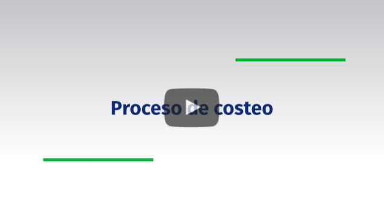
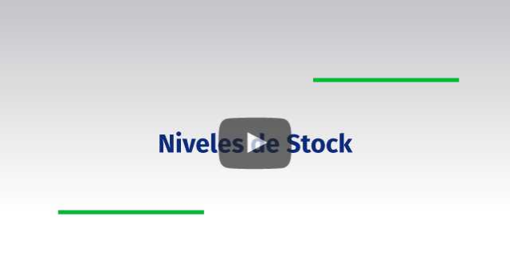

# CURSO DE PROCESO DE INVENTARIOS

## Inventario Cíclico

Definición:  

Inventario Cíclico, es un conteo de ciertos productos existentes en una organización para identificarlos y confrontarlos contra la existencia registrada en los libros. Este conteo no se realiza a todos los productos de una vez sino que se realiza a ciertos de acuerdo a la rotación de los mismos, esto con el fin de no detener la facturación de los mismos y que el tiempo de conteo se disminuya notoriamente con respecto al inventario físico.  

## Costeo

Definición:

Costeo, es un proceso especial que se debe ejecutar en aquellas compañías que no llevan su información en línea, es decir, cuando se registran entradas y salidas en fechas diferentes entre la operación real y la registrada en los movimientos del sistema. Este proceso se recomienda ejecutar todos los días en horas no laborales dado que sirve para recalcular el costo con el método de promedio ponderado, en el cual el sistema ordena las transacciones por la fecha de registro y va asignando el costo del producto en las salidas tomando como base las entradas, y en general todas las transacciones que deban afectar dicho costo, con el fin de poder tener correctamente el costo asociado a cada uno de los productos, ver margen de rentabilidad en porcentaje y valores por producto respecto al precio de venta y tomar esta información como referencia en la toma de decisiones.

## Niveles de Stock

Definición:

Niveles de stock, es la cantidad de existencias de un producto almacenado en un momento dado.  

Los niveles de stock y el cálculo de los mismos permiten a la empresa saber cómo se comporta  la mercancía, los niveles de rotación y consumo para tener unas políticas más eficientes en la labor de ventas, por ejemplo, saber con certeza como mover mercancía entre diferentes ubicaciones.  

Con el fin de garantizar la presencia de stock suficiente para satisfacer la demanda de los productos con un almacenamiento rentable, se debe realizar un correcto cálculo de los niveles mínimos y máximos:  
El stock mínimo hace referencia a la cantidad mínima que se puede mantener en stock de una existencia o referencia determinada.  
El stock máximo es la cantidad máxima de productos que un negocio puede almacenar de forma continuada.

## Inventario Periódico

Definición:

Inventario Físico o Periódico, es un conteo de todos los productos existentes en una organización para identificarlos y confrontarlos contra la existencia registrada en los libros. Se debe tener en cuenta que mientras se realiza el conteo físico de los productos se debe detener la facturación de venta de los mismos. Es por esto, que en empresas de gran cantidad de productos este inventario no se realiza frecuentemente, generalmente lo realizan de 1 a 3 veces al año.

