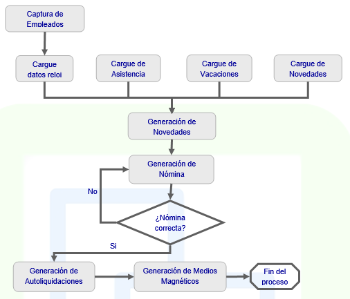

# NÓMINA

Nómina es una solución que administra los pagos, bonificaciones y retenciones de la empresa o por ley que se genera a los empleados.  

Orientada a cualquier sector empresarial permite el manejo de cualquier tipo de nómina así como la periodicidad con que se quiera liquidar: semanal, quincenal, mensual, entre otras.  

Este módulo al igual que los otros, es completamente flexibles y parametrizable, garantizando adaptarse a las necesidades de cualquier empresa de Colombia o el mundo y también a los cambios de legislación, adicionalmente:  

* Permite parametrizar las variables fijas de nómina que se incrementan anualmente, así como los porcentajes de participación del empleado y empleador.  

* Permite realizar dentro del proceso de nómina las novedades que se generen para cada empleado y que afecten su pago neto o sumen y resten por diferentes conceptos.  

* Permite la generación de medios magnéticos que requieran distintas entidades como el seguro social o los bancos en que los empleados tengan cuenta de nómina.  

* Permite la generación de las nóminas o novedades correspondientes al pago de las primas de navidad (regalía pascual) o medio año y de las bonificaciones que normalmente entregue la empresa.  

* Integración con el módulo de tesorería para realizar el pago a sus empleados por medio de cheques.  

#### Nómina en detalle

* Integración con todos los módulos de OASIS ERP.  
* Manejo de consecutivo general o por oficina.  
* Filtros personalizables para consultar solo la información de interés.  
* El usuario final no necesita memorizar el Plan de Cuentas Contables.  
* Cumplimiento de la normatividad local.  
* Configuración y definición de reglas para la generación de la nómina.  
* Permite la ejecución de los cierres periódicos necesarios para actualizar los acumulados de ingresos, retenciones, seguro socia y demás.  
* Permite la carga de los datos del reloj para el control de asistencia.  
* Exportación de datos a Excel.  

### Parametrización del módulo

* Permite la parametrización de variables que año tras año se van modificando, estos son: valor de salario mínimo, subsidio de transporte, porcentaje de aporte en salud y pensión del total del salario, porcentaje de salud y pensión que aporta el empleador y el empleado, porcentaje de aporte de riesgos profesionales, fondo de solidaridad, máximo porcentaje de fondo de solidaridad, días de vacaciones, porcentajes de SENA, caja de compensación, ICBF, fondo de salud, fondo de ARP, salario integral, intereses mora, salarios máximos asegurados, entre otras.  

* Parametrización de retención en la fuente, definiendo el porcentaje y valor de la retención estimado sobre montos definidos en el sistema.  

* Parametrización de tipos de retención, por país, estableciendo el valor del deducible.  

* Parametrización de los motivos de liquidación o despido.  

* Definición de turnos por días, estableciendo horas de entrada y salida, valor del incentivo y tiempos de almuerzo.  

* Definición de conceptos de nómina, asociando periodicidad, forma de calcularlo y cuenta contable que afectara.  

* Parametrización de tipos de nómina, estableciendo periodos y conceptos que afectara cada una.  

* Cargue de empleados, estableciendo para cada uno los datos necesarios para este módulo así como información básica del empleado en caso de no adquirir el módulo de Recursos Humanos. Así mismo la definición de entidades que el empleado a escogido para que administre sus aportes de salud, pensiones y cesantías.  

### Control de asistencia

* Esta aplicación está orientada al control de la asistencia de los empleados a la empresa. Parte de la lectura del reloj electrónico, en el cual los empleados marcan las entradas y salidas.  

* Este módulo es especialmente importante en empresas industriales donde se tienen turnos rotativos, y donde dependiendo de esto se otorgan primas especiales, tales como alimentación y transporte.  

* Permite el control de permisos y licencias de los empleados, así como registra las ausencias para los posibles descuentos.  

* Genera las novedades asociadas con la asistencia de los empleados.  

### Novedades

* Permite el registro de las diferentes novedades de nómina de cada uno de los diferentes empleados. Estas se refieren a horas extras, descuentos especiales, bonificaciones, licencias, incapacidades, cambios de salario, entre otras.  

* Permite el cargue de múltiples novedades a través de un archivo plano.  

* Genera el periodo de vacaciones para cada empleado, mostrando el periodo de disfrute, periodo causado, días de vacaciones y valor a pagar.  

* Permite la generación de la nómina con los periodos correspondientes (semanales, quincenales, mensuales).  

* Calcula los conceptos básicos de nómina, adiciona las novedades y deja lista la nómina para su revisión.  

* Cuando la nómina está correcta se debe confirmar, lo cual genera el comprobante contable automáticamente y genera las órdenes de pago correspondientes (solicitudes de cheques).  

* Permite así mismo el pago en efectivo y a través de cuenta bancaria (transferencia electrónica).  

* Permite observar el acumulado de retención de impuesto a la renta practicado a cada uno de los empleados y de los aportes hechos al seguro social.  

### Autoliquidaciones

* Permite la elaboración de las autoliquidaciones a las diferentes entidades externas que tengan relación con la empresa.  

* El pago de las autoliquidaciones se hace con la generación de la orden de pago al módulo de cuentas por pagar o tesorería.  

### Consultas

Ágil consulta de:  

* Movimiento Contable

Es posible personalizar el contenido de las consultas del sistema para visualizar la información que sea de mayor interés a la empresa.  

### Reportes

Cuenta con gran variedad de reportes para que usted emita. Estos cuentan con filtros y ordenamiento dinámico.  

* Empleados
* Planilla de Nomina
* Otros Ingresos y Descuentos
* Descuentos por Tercero
* Impuesto sobre la Renta
* Seguridad Social
* Planilla de Novedades
* Resumen por Concepto
* Asistencia
* Excepciones
* Resumen de Horas
* Planilla de Vacaciones
* Resumen de Ingresos
* Autoliquidación
* Aportes Fondo de Empleados
* Aportes Parafiscales
* Planilla de Parafiscales
* Comprobantes de Pago
* Cumpleaños
* Listado de Nomina
* Planilla por Concepto
* Planilla resumida
* Vacaciones
* Formato de Vacaciones
* Autoliquidación Resumido
* Planilla por Entidad
* Carnets
* Novedades Repetitivas
* Planilla de Horas Extras

Nomina esta completamente integrada con OASIS ERP. Esta integración significa que los datos de diversas áreas como contabilidad, tesorería, cuentas por pagar, entre otras, quedan completamente integrados al sistema, sin tener que duplicar la información o realizar entradas duplicadas de la misma.  Esto permite el control de todas las áreas del proceso contable.  

