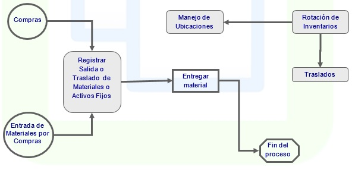

# INVENTARIOS

El módulo de control de inventario mantiene los datos de todos los productos inventariados manteniendo las existencias adecuadas de productos en las bodegas y optimizar su operación con el fin de no entorpecer las operaciones de ventas y logísticas de la empresa.  

El módulo cuenta con algunas características adicionales que le permitirán conocer el estado de sus productos terminados, trabajo en proceso y materias primas; entre estas:  

* Mantiene el registro actualizado de los saldos de los productos en las diferentes bodegas,  así como las localizaciones dentro de cada una de las bodegas.

* Permite el manejo de varios sustitutos por productos. 

* Permite el control de las diferentes características que maneja un producto. Por ejemplo color y talla. De la misma forma controla las diferentes presentaciones que puedan tener los productos.

* Lleva un control de las fechas de vencimiento para los productos que lo requieran y permite además controlar un número serial o de lote para los productos que lo ameriten.

* Permite el registro de los diferentes tipos de movimientos que defina la empresa, los cuales se pueden agrupar en los tres principales: entradas, salidas y traslados.

* Facilita la preparación, ejecución y análisis del inventario físico que realiza la empresa sobre sus existencias. Permite generar los ajustes correspondientes a las diferencias encontradas.

* Permite la definición y control, de los niveles mínimos y máximos de inventario para cada producto, identificando aquellos con niveles críticos acordes a la política de administración de inventarios.  Es posible obtener también las cantidades pendientes por despachar y pendientes por recibir de compras.

* Permite la captura del inventario físico leyendo las localizaciones y referencias, permitiendo varios conteos con dispositivos móviles.

* Realiza el costeo de inventarios de acuerdo al sistema (Promedio, LIFO, FIFO) y al método (Permanente o Periódico) que defina la empresa permitiendo obtener los reportes de valorización de inventarios y costo de ventas para su registro contable.

#### Inventarios en detalle

* Integración con todos los módulos de OASIS ERP
* Manejo de consecutivo general o por oficina.
* Filtros personalizables para consultar solo la información de interés.
* El usuario final no necesita memorizar el Plan de Cuentas Contables.
* Captura y registro de Artículos, Servicios, Combos y Ensambles, indicando datos Número de serie, Almacén y Localidad, entre otros.
* Manejo de Costos
* Manejo de Máximos, Mínimos, Reorden
* Cambio de precios por % o cantidad
* Lectura e impresión de código de barras
* Calculo de rotación ABC
* Traspaso y actualización entre Almacenes
* Capacidades de consulta para acceso inmediato a los registros de control de inventario. 
* Localización óptima para cada producto en situaciones de recepción, reposición y transferencia
* Infinidad de reportes como Catalogo de Artículos, Lista de Precios, Existencias y Costos, Movimientos al inventario e Historial de existencias, movimientos y Estadísticas.
* Exportación de datos a Excel

### Parametrización del módulo

* Permite la parametrización de conceptos personalizables, asignándole a cada concepto la naturaleza, y las cuentas contables que se afectan.

* Definición de motivos por cada concepto parametrizando la afectación de cuentas contables y asignándole información como precio, días, modulo con el que tenga vinculación y si afecta los saldos de entregada y/o separada.

* Definición de localizaciones ABC y de zonas francas.

* Parametrización de Ciclos de inventario físico.

### Saldos

* Mantiene una consulta en línea de los saldos o existencias actuales de los productos en las bodegas. Todos los movimientos afectan en línea los saldos, por tanto cualquier consulta tendrá los datos actualizados.

* Los saldos se obtiene a varios niveles: a nivel producto en toda la empresa, a nivel bodega o ubicación, a nivel localización.

* Es posible además consultar existencias por característica (color, talla, sabor), por presentación (1000 cc, 500 cc,.), por fecha de vencimiento o por número de control o serial.

* Permite una consulta de las existencias al cierre de cada uno de los meses.

* Estas consultas arrojan los saldos iniciales y finales y los movimientos consolidados. Permite observar el detalle de los movimientos en pantalla.

### Movimientos

* Permite la ejecución de los principales movimientos que afectan el inventario, tales como entradas por compra, salidas por remisiones, salidas por consumo, traslados, entre otras.

* Los movimientos están parametrizados para hacer la validación de datos en el momento de su confirmación y generar los correspondientes movimientos en los otros módulos del sistema (Ventas, Facturación, Cartera).

* Permite la recepción de productos originados en las órdenes de compra por medio de terminales portátiles, las cuales leerán los productos recibidos con lectores de códigos de barras.  

* Permite el proceso de almacenamiento, haciendo un traslado de la localización pendiente por almacenar (recepción) a la localización definitiva de almacenamiento.

* Permite el proceso de alistamiento (recolección y empaque) de pedidos previamente priorizados, actualizando la información en los registros de los códigos SSCC.

* Como en todos los sistemas, los movimientos se pueden reversar, anular e imprimir de acuerdo a las políticas establecidas por la empresa.

* Permitir ejecutar el despacho de los pedidos previamente alistados, capturando información adicional del despacho como placas del vehículo y sellos de seguridad.

### Inventario físico

* Esta aplicación permite llevar a cabo las labores correspondientes a la ejecución y control del inventario físico. La toma de inventario físico sirve para comparar las existencias de los productos físicamente contra las cantidades que deberían estar (real) en el inventario.

* El inventario físico puede tomarse en cualquier momento, y obtenerse las diferencias desde que los movimientos estén completos en el sistema. 

* El sistema incluye la funcionalidad del inventario perpetuo, cuya teoría propone la realización de inventarios aleatorios diariamente diferenciando por el costo de los productos su frecuencia. 

* Obedece a la Ley de Pareto, la cual aconseja tener un control más estricto sobre aquellas referencias o códigos que representen el mayor valor.

### Niveles de Stock

* Se encarga de calcular y controlar los niveles de inventario que hacen que su administración sea eficiente, manteniendo los niveles adecuados para no entorpecer las labores de ventas o de producción y manteniendo los costos financieros más favorables.

* El cálculo de los niveles óptimos de inventarios es automático de acuerdo a los datos históricos que mantiene el sistema, pero puede ser modificado manualmente, para los casos que lo ameriten.

* Este módulo es el encargado de hacer interfaces con el sistema de compras y el sistema de producción, por medio de la elaboración de los requerimientos correspondientes.

### Costeo de inventarios

* Esta aplicación maneja todo lo referente al costeo de inventarios, operación que se hace periódicamente para obtener los costos de ventas, los consumos, necesarios para obtener los resultados contables.

* La aplicación permite ejecutar el costeo posteriormente al cierre de inventarios, cuando ya no se permite adicionar ningún movimiento en el periodo a costear.

* Maneja los sistemas periódico (un solo costo mensual) y permanente (costeo día a día). Al finalizar el costeo el sistema emite el comprobante contable, estableciendo el costo de ventas y los costos por consumo y demás movimientos del inventario. 

* Permite la ejecución del los ajustes por inflación, generando el correspondiente comprobante.

### Consultas

Ágil consulta de:

* Ajustes por Inflación
* Kardex
* Kardex por Ubicación
* Diferencias
* Consulta de Movimientos
* Movimiento Contable
* Disponible
* Productos
* Consultas por Atributos
* Saldos por Localización
* Saldos por Localizacion2
* Saldos Periódicos por Bodega
* Saldo Periódico por Localización
* Saldo Periódico por Producto
* Saldos por Bodega
* Saldos por Producto
* Saldos y precios por Ubicación

Es posible personalizar el contenido de las consultas del sistema para visualizar la información que sea de mayor interés a la empresa.

### Reportes

Cuenta con gran variedad de reportes para que usted emita. Estos cuentan con filtros y ordenamiento dinámico.

* Ajuste al Costo de Ventas
* Ajustes por Inflación
* Análisis de Movimientos
* Movimientos Consolidados por Concepto (Rango fecha)
* Movimiento Contable por Concepto
* Saldos Periódicos por Ubicación
* Movimientos por Cuenta
* Diferencias de Inventario
* Consolidado diario por Concepto
* Diferencias de Inventario
* Movimientos por Producto
*	Etiquetas de Productos
*	Etiquetas de Tramos
*	Planilla para Conteo Físico
*	Kardex
*	Packing List
*	Lista de Empaque
*	Movimientos Detallados por Concepto
*	Movimientos Detallados por Concepto y Ubicación Destino
*	Movimientos Detallados por Concepto y Documento
*	Movimientos por Genérico
*	Movimiento Contable Consolidado
*	Movimientos por Concepto
*	Movimientos por Producto
*	Movimientos consolidado por producto
*	Movimientos Consolidado por Ubicación
*	Valores Periódicos por Ubicación
*	Niveles de Stock
*	Niveles de Stock por Ubicación
*	Movimientos Consolidado por Concepto (Código Antiguo)
*	Movimientos Consolidados por Concepto (Periodo)
*	Saldos Valorizados a Precio
*	Saldos Valorizados periódicamente por Producto
*	Rotación de Inventarios
*	Saldos Valorizados Periódicamente por Clasificación
*	Saldos en Línea por Ubicación -  Atributo
*	Saldos valorizados por Localización y Clasificación
*	Saldos y valores Periódico por Ubicación
*	Saldos valorizados costo estándar
*	Saldos en Línea por Clasificación
*	Saldos Línea por Ubicación y Genérico
*	Saldos Línea por Ubicación Geográfica, Canal y Genérico
*	Saldos Periódicos por Producto
*	Saldos y Movimientos Valorizados
*	Tiempos de Entrega
*	Saldos valorizados por Clasificación y Genérico
*	Saldos valorizados por Clasificación
*	Valorización Periódica por Ubicación
*	Auxiliar por Estado
*	Auxiliar por Cuenta
*	Auxiliar por Ubicación
*	Ubicaciones – Localizaciones ABC por rotación.

Inventarios esta completamente integrada con OASIS ERP. Esta integración significa que los datos de diversas áreas como contabilidad, activos fijos, alimentos y bebidas, entre otras, quedan completamente integrados al sistema, sin tener que duplicar la información o realizar entradas duplicadas de la misma.  Esto permite el control de todas las áreas del proceso contable.  

