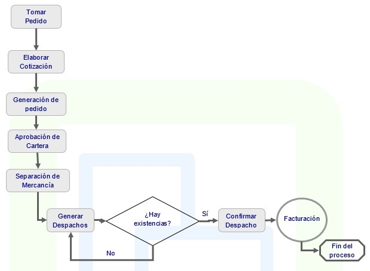

# VENTAS

El gestor del ciclo de ventas tiene como objetivo el control de los clientes, los pedidos y las cotizaciones garantizando una adecuada atención de estos y un seguimiento oportuno, para ello cuenta con el registro de los clientes, la definición de sus características principales y las condiciones comerciales pactadas con la empresa tales como los diferentes tipos de descuentos (comercial, por volumen, por productos, por zonas) y permite la asignación de listas de precios según la calidad o clasificación de los clientes (Mayoristas, temporales, empleados, fondos y cooperativas, minoristas.) 

Sus funciones clave incluyen:

* Facilita la operación en temporadas o promociones con base en los históricos de comportamiento y con unos pocos comandos se puede incrementar a partir de determinada fecha o por un periodo determinado.  

* Registra los pedidos hechos por los clientes a la empresa, teniendo un control de los pendientes por despachar y los despachados parcialmente. Los productos no despachados y disponibilidad posterior son reservados en inventario. Al igual que fácilmente permite adicionar, cambiar o eliminar productos a ordenes en proceso, sí así lo desean los clientes.  

* Efectúa la generación de cotizaciones tanto a nuevos o posibles clientes como a los ya existentes, desde su registro, su envío y su seguimiento, hasta la terminación, ya sea para convertirla en pedido o la generación de una nueva con condiciones más favorables para el cliente.  

* La labor de cotizar es evaluada y así poder determinar el grado de efectividad de ellas, o la identificación de las causas de no compra para tomar los correctivos necesarios.  

* La gestión de los vendedores también deja huella en el sistema permitiendo evaluar el cumplimiento de metas y facilitando su presupuesto de ventas en periodos futuros. La integración con el resto de la aplicación asegura al usuario una herramienta comercial y administrativa que enlazada con las áreas financieras y de producción, dotaran a la empresa de una ventaja competitiva.  

#### Ventas en detalle

* Integración con todos los módulos de OASIS ERP.  
* Manejo de consecutivo general o por oficina.  
* Filtros personalizables para consultar solo la información de interés.  
* El usuario final no necesita memorizar el Plan de Cuentas Contables.  
* Facturas de materiales y varios tipos de pedidos de venta.  
* Gestión de órdenes de producción y de ensamblaje para productos.  
* Revisión de límites de crédito y seguimiento y control de la situación de riesgo y crédito disponible.  
* Proporcionar descuentos por volumen o cliente específico mediante la aplicación de matrices de precios.  
* Capacidad de configuración de impuestos.  
* Visualizar el estado de la consolidación del cliente y su historial.  
* Gestión completa del ciclo de ventas mediante  procesos de autorización configurables.  
* Permite cargar un pedido a través de un archivo EDI.  
* Las condiciones comerciales se arrastran desde la ficha del cliente pero pueden ser modificadas para cada operación.  
* Cualquier operación puede reversarse siempre que se tengan los permisos adecuados, reflejándose automáticamente en el documento anterior de la cadena (presupuesto, pedido, factura).  
* Exportación de datos a Excel.  

### Parametrización del módulo

Definición de prioridades de despacho, temporadas, productos por canal, productos por vendedor y motivos de pendientes.  

### Cotizaciones

* La aplicación de cotizaciones esta orientada a registrar cotizaciones con destino a clientes actuales y a clientes potenciales de la empresa. En la cotización se definen las condiciones ofrecidas para una venta y se estipula la vigencia del ofrecimiento.  

* La liquidación de la cotización contiene los mismos pasos del pedido, de acuerdo a los descuentos y precios ofrecidos.  

* Para las cotizaciones es posible efectuar un seguimiento mediante contactos telefónicos o visitas, lo que permite obtener una estadística de efectividad de las cotizaciones e información del mercado, siendo este procedimiento ágil y la fuente para evaluar la labor de la empresa.  

### Pedidos

* Registra todos los pedidos que hacen los clientes a la empresa. En este punto se validan las condiciones de crédito y las existencias de inventario. Es el punto de consulta de los pedidos pendientes por producto y por cliente.  

* Los pedidos pueden ser originados por las cotizaciones elaboradas, caso en el cual se obtienen automáticamente las condiciones y productos solicitados.  

* Este módulo es de vital importancia en la operación comercial de la empresa, pues es donde se establecen los datos que garantizan la seriedad del negocio que se pretende hacer. Por esta razón si los pedidos tienen los controles necesarios, la operación sucesiva no presentará inconvenientes.  

* Estos controles se refieren a las existencias de inventarios, la disponibilidad de crédito, los descuentos ofrecidos, entre otros.  

### Despachos

* La aplicación cuenta con un generador de despachos, que crea automáticamente los documentos de despacho de uno o varios pedidos. Estos se pueden generar para un cliente determinado o para todos en general.  

* El documento de cada despacho indicara el transportador, de que bodega se obtendrán los productos y el detalle de los productos a ser despachados.  Del mismo modo el porcentaje de despacho de cada pedido, permitiendo hacer despachos parciales.  

### Consultas

Ágil consulta de:

* Consulta de Pedidos
* Pedidos Pendientes

Es posible personalizar el contenido de las consultas del sistema para visualizar la información que sea de mayor interés a la empresa.

### Reportes

Cuenta con gran variedad de reportes para que usted emita. Estos cuentan con filtros y ordenamiento dinámico.

* Clientes
* Cotizaciones Pendientes
* Listado de Pendientes
* Pedidos por producto
* Pedidos pendientes por bodega
* Pedidos Pendientes por Vendedor
* Pedidos pendientes por Producto
* Rótulos de Clientes
* Informe de pendientes

Ventas esta completamente integrada con OASIS ERP. Esta integración significa que los datos de diversas áreas como inventarios, cartera, entre otras, quedan completamente integrados al sistema, sin tener que duplicar la información o realizar entradas duplicadas de la misma.  Esto permite el control de todas las áreas del proceso contable.  

# Presupuesto de Ventas

El buen empresario debe planear en forma inteligente tanto sus ingresos y gastos como sus   operaciones con el objeto de obtener utilidades, las cuales se logran de manera más eficiente si se coordinan o relacionan sistemáticamente todas las actividades de la empresa.  

El sistema permite crear el presupuesto de ventas de acuerdo a datos históricos, permitiendo la definición de ingresos por ventas de contado y ventas a crédito para el flujo de caja.  

Este módulo facilita no sólo el cálculo de cifras, es un sistema integral donde se presta particular atención a la fijación de unos objetivos con base en los cuales se planifican y controlan las diferentes actividades que puede realizar una administración.  Así mismo permite la planeación de la producción, asegurando una perfecta planificación de compras, la cual origina los desembolsos necesarios en el flujo de caja.  

En general el sistema permite un cómputo anticipado de los costos e ingresos para una adecuada gestión de la empresa.  

Sus funciones clave incluyen:

* Puede crear y mantener presupuesto de venta para artículos estándar, nuevos y configurados. 
* Los presupuestos pueden ser opcionales. 
* Se mantiene un histórico que le ayuda a analizar su rentabilidad y tasa de éxito sobre sus competidores. 
* Para un mejor control y seguimiento de las ofertas se pueden agrupar por tipos para su posterior análisis, pudiéndose establecer un control jerárquico de aprobación. 

#### Presupuesto de ventas en detalle

* Integración con todos los módulos de OASIS ERP
* Manejo de consecutivo general o por oficina.
* Filtros personalizables para consultar solo la información de interés.
* El usuario final no necesita memorizar el Plan de Cuentas Contables.
* Creación de ofertas a clientes o a clientes potenciales 
* Control de las fechas de validez de la oferta 
* Los presupuestos se pueden dirigir tanto a clientes habituales como a clientes potenciales. 
* Exportación de datos a Excel.

### Parametrización del módulo

* Permite la parametrización de los conceptos que afectan el presupuesto de ventas, definiendo para cada uno la operación que se ejecutara en el presupuesto, reserva y en ejecutado (sumo o resta)
* Definición de los porcentajes de cantidad, valor y bonificaciones por unidad de negocio. 
* Definición de los porcentajes de cantidad y valor para cada canal por unidad de negocio.
* Definición de los porcentajes de cantidad y valor para cada canal por unidad de negocio para cada marca por canal
* Parametrización de el porcentaje de cantidad y valor que debe alcanzar cada empresa, en caso de que la organización sea multiempresa.
* Definición de los porcentajes de cantidad y valor para cada colección por punto venta
* Definición de la marca para cada producto. 
* Definición de los porcentajes de cantidad y valor para cada colección y marca por vendedor de acuerdo al canal.

### Presupuesto de ventas

* Esta aplicación permite la elaboración, ejecución y control del presupuesto de ventas.  

* Permite la elaboración del presupuesto partiendo de los datos históricos de ventas. Se pueden estimar las ventas por clasificaciones de productos, por productos, por cliente, por punto de venta, o de acuerdo a lo definido en la parametrización del modulo. Luego del proceso de generación, el presupuesto puede ser ajustado de acuerdo a las decisiones de la empresa.  

* Permite el control de la ejecución del presupuesto de acuerdo a los parámetros de verificación establecidos (diario, semanal, mensual).

### Consultas

Ágil consulta de:

* Presupuesto de Ventas Diarias por Empresa
* Presupuesto de Ventas Diarias por Punto de Venta
* Presupuesto de Ventas Diarias por Producto
* Presupuesto de Ventas Diarias por Punto de Venta-Producto
* Presupuesto de Ventas Empresa
* Presupuesto de Ventas Producto
* Presupuesto de Ventas Zona
* Presupuesto de Ventas Zona - Producto
* Presupuesto de Ventas Vendedor
* Presupuesto de Ventas Vendedor-Producto
* Presupuesto de Ventas Vendedor - Clasificación
* Presupuesto de Ventas Vendedor - Marca
* Presupuesto de Ventas Canal
* Presupuesto de Ventas Canal - Producto
* Presupuesto de Ventas Canal - Clasificación
* Presupuesto de Ventas Canal - Marca
* Presupuesto de Ventas Cliente
* Presupuesto de Ventas Cliente - Clasificación
* Presupuesto de Ventas Cliente - Producto
* Presupuesto de Ventas Clasificación
* Presupuesto de Ventas Punto de Venta
* Presupuesto de Ventas Punto de Venta - Producto
* Presupuesto de Ventas Dirección
* Presupuesto de Ventas Punto Venta - Clasificación
* Presupuesto de Ventas Vendedor - Colección
* Presupuesto de Ventas Punto Venta – Colección

Es posible personalizar el contenido de las consultas del sistema para visualizar la información que sea de mayor interés a la empresa.  

### Reportes

Cuenta con gran variedad de reportes para que usted emita. Estos cuentan con filtros y ordenamiento dinámico.  

* Presupuesto de Ventas por Ciudad
* Presupuesto de Ventas por Segmento
* Presupuesto de Ventas por Colección
* Presupuesto de Ventas por Marca
* Presupuesto de Ventas por Canal - Zona
* Presupuesto de Ventas por Canal - Marca
* Presupuesto de Ventas por Canal - Producto
* Presupuesto de Ventas por Canal - Genérico
* Presupuesto de Ventas por Canal - Marca - Genérico
* Presupuesto de Ventas por Canal - Clasificación
* Presupuesto de Ventas por Canal por Ciclo
* Presupuesto de Ventas por Cliente por Ciclo
* Presupuesto de Ventas por Producto por Ciclo
* Presupuesto de Ventas por Empresa por Ciclo
* Presupuesto de Ventas por Vendedor - Producto por Ciclo
* Presupuesto de Ventas por Vendedor - Producto
* Presupuesto de Ventas por Punto Venta - Producto
* Presupuesto de Ventas por Punto Venta - Genérico
* Presupuesto de Ventas por Genérico por Ciclo
* Presupuesto de Ventas por Canal - Producto por Ciclo
* Presupuesto de Ventas por Presupuesto Vendedor
* Presupuesto de Ventas Diario
* Presupuesto de Ventas por Marca
* Presupuesto de Ventas Diario por Ubicación
* Presupuesto de Ventas Diario por Canal

Presupuesto de Ventas está completamente integrada con OASIS ERP. Esta integración significa que los datos de diversas áreas como ventas, facturación, entre otras, quedan completamente integrados al sistema, sin tener que duplicar la información o realizar entradas duplicadas de la misma.  Esto permite el control de todas las áreas del proceso contable.

