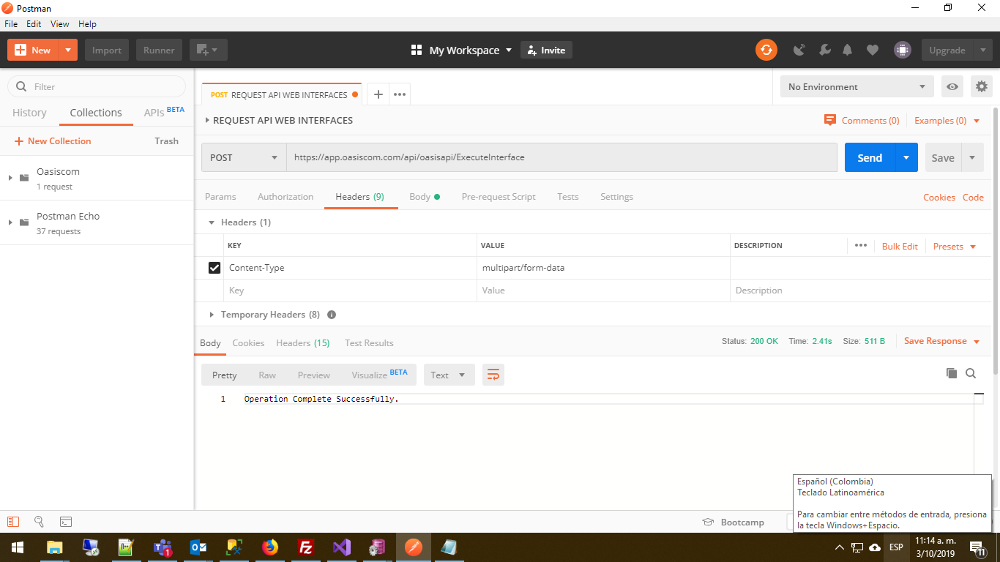
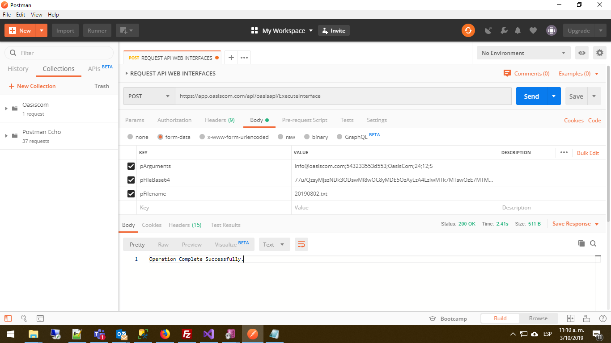
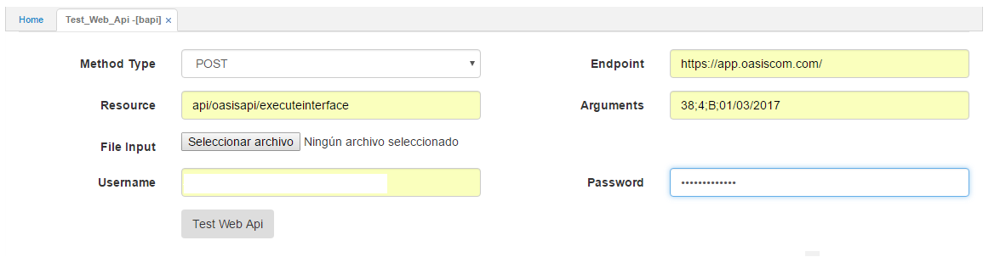
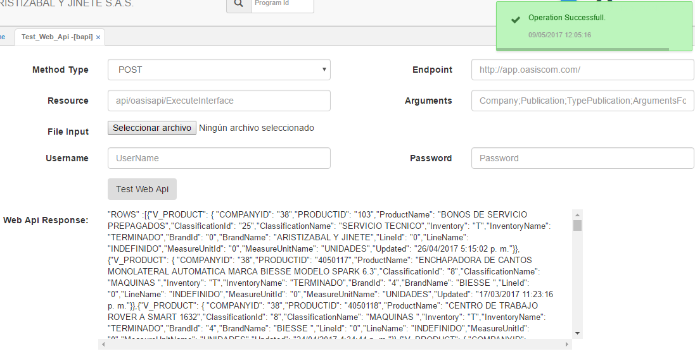

---

layout: default  

title: Integración a OasisCom con API  

permalink: /Desarrollo/Integracionoasiscom  

editable: si  

---

# INTEGRACIÓN A OASISCOM POR MEDIO DE API  

La interfaz de conexión es un servicio RESTful web api 2 de tipo POST, el cual proporciona un conjunto fácil de usar de puntos finales HTTP quee recibe sus parámetros por medio de un objeto Content tipo  “_MultipartFormDataContent_”, incluidos usuarios, publicaciones y más, además de que permite recuperar o actualizar datos.  

Dicho objeto consta de los siguientes parámetros:  

**IMPORTANTE:** Los paramétros descritos a continuación, son insumos proporcionados por OasisCom para la realización de la respectiva integración.  
*  **pArguments:** Estos parametros pueden ser: informacion sobre la empresa, la publicación, el tipo de publicación y los argumentos requeridos por dicha publicación para arrojar un resultado idóneo.  
Se ingresan de la siguiente manera:  
•	**Usuario:** nombre de usuario definido en oasiscom, con permisos de ejecución de las interfaces a ejecutar.  
•	**Contraseña:** contraseña de usuario, en formato hexadecimal.  
•	**Nombre de Conexión:** El valor de este campo es “OasisCom”.  
•	**Compañía:** el cual corresponde a un Id de dato tipo entero.  
•	**Publicación:** la cual se parametriza desde la opción BARC (Archivos) y puede ser 		 visualizada desde la opción BINT (Interfaces).  
•	**Tipo de publicación:** la cual puede ser subida (S) o bajada (B).  
Adicionalmente, se agregan los parámetros de la publicación, los cuales dependerán de la debida parametrización, por ejemplo el código del producto, o bien, el número del tercero pueden considerarse parámetros de entrada.  
**Ejemplo pArguments:** 
**usuario;contraseña_hexadecimal;Conexion;companyid;publicationid;tipo_publicacion;parametro1;parametro2;...;parametroN**
        

* **pFileBase64**: Si se requiere subir un archivo, este campo almacenará el archivo en forma de cadena base 64 de la siguiente forma; se carga el archivo como un arreglo de bytes (byte[]) y luego a dicho arreglo se le aplica  una conversión a base 64, la cadena resultante en base 64 es el dato asignado a dicho parametro.

* **pFilename**: Corresponde al nombre del archivo a ser subido con su respectiva extensión.

## EJEMPLO DE CONEXIÓN EN C# (VISUAL STUDIO 2017)

Inicialmente se ingresa una variable de tipo _HttpClient_, donde dentro de ella se declara el objeto _MultipartFormDataContent_ con sus respectivos argumentos y el archivo Base64 correspondiente. _**Nota:**_ Debe tener en cuenta que en este ejemplo al ser un tipo de publicación de bajada (B) los parametros de los archivos estarán vacíos _StringContent("")_.

        
**EJEMPLO C# - VISUAL STUDIO**

//-----------CODIGO FUENTE------------------------

***ESTE CODIGO ES SOLO UN EJEMPLO DE LA CONEXIÓN AL SERVICIO Y NO ES PARA USO FUNCIONAL,
MUESTRA LA CONEXIÓN A OASISCOM MEDIANTE EL USO DE CLASES RECOMENDADAS DE C#.**

     //CONEXIÓN A OASISCOM VIA HTTPCLIENT()
     string pCompanyId,
     string pFileContent,
            string pFileName,
     string pPublicationId,
            string pPublicationType = "S",
            string pURI = "https://app.oasiscom.com/api/oasisapi/ExecuteInterface",
            string puserid = “correousuario@company.com”,
     string pass = “Clavedeusuario”,
     string connexion = "OasisCom"

            HttpResponseMessage response = null;
            string ParamsWebApi = pCompanyId + ";" + pPublicationId + ";" + pPublicationType;
            string XmlDocumentWebApi = pFileContent;
            byte[] toBytes = Encoding.ASCII.GetBytes(XmlDocumentWebApi);
            string base64Encoded = Convert.ToBase64String(toBytes);
            string returnMessage = string.Empty;

            using (var client = new HttpClient())
            {
                //SE CONCATENA EL USUARIO Y CONTRASEÑA O PALABRA ESPECIAL PARA INTIFICAR DE DONDE LLEGA LA PETICION. 
                ParamsWebApi = puserid + ";" + ConvertStringToHexadecimal(pass, Encoding.UTF8) + ";" + connexion + ";" + ParamsWebApi;
                var requestUri = pURI;
                //specify to use TLS 1.2 as default connection
                System.Net.ServicePointManager.SecurityProtocol = SecurityProtocolType.Tls12 | SecurityProtocolType.Tls11 | SecurityProtocolType.Tls;
                var content = new MultipartFormDataContent();
                content.Add(new StringContent(ParamsWebApi.Trim()), "pArguments");
                content.Add(new StringContent(base64Encoded), "pFileBase64");
                content.Add(new StringContent(pFileName), "pFilename");
                response = await client.PostAsync(requestUri, content);

                if (response.IsSuccessStatusCode)
                {
                    string messageresp = await response.Content.ReadAsStringAsync();
                    returnMessage = MessageType.Success.ToString() + " - " + messageresp;
                }
                else
                {
                    string messageresp = await response.Content.ReadAsStringAsync();
                    returnMessage = MessageType.Error.ToString() + " - " + messageresp;
                }
            }
            return returnMessage;
        
//-----------FINAL DE CODIGO FUENTE-----------

**EJEMPLO CON SOFTWARE POSTMAN** 

* CONFIGURACION POSTMAN - CABECERAS.

* CONFIGURACION POSTMAN - PARAMETROS.

## WEB API 

A continuación se describirá una prueba ejecución del API desde la plataforma **OasisCom** 

Por medio de la opción _BAPI_ se realizan pruebas de servicios creados en OasisCom mostrando la respuesta en formatos _.XML_ y _.JSON_: 

* En el campo _**Method Type**_ se debe seleccionar la opción _POST_.
* En el campo _**Resource**_ debe ingresarse lo siguiente: _api/oasisapi/executeinterface_, lo cual indica el recurso a consumir por el API.
* En el campo _**File Input**_, dependiendo del tipo de la publicación, si corresponde a _Bajada_ no se adjuntará ningun archivo. De lo contrario, si corresponde a _Subida_ si será necesario subir el archivo correspondiente.
* En el campo _**EndPoint_**, se deberá ingresar la dirección proviente del servicio, en este caso, _https://app.oasiscom.com_.
* En el campo _**Arguments**_, se ingresarán los parámetros de la manera descrita previamente.
* En el campo _**UserName**_, de debe ingresar el nombre de usuario.
* En el campo _**Password**_, se deberá ingresar la contraseña correspondiente.

Posteriormente, se dará clic en el botón _Test Web Api_:

Se puede ver el resultado al ejecutar el API.

Así pues de esta manera se realiza la integración a OasisCom a través de un API.
