# Actualizar versión de OasisCom

Los siguientes son los pasos necesarios para realizar una correcta actualización de versión de la aplicación OasisCom.  

**1.** Inicie sesión en el equipo servidor Web como administrador.  

**2.** Descargue el archivo con la versión actualizada desde el servidor OasisIT.  

**3.** Una vez descargado el archivo de versión, debe descomprimirlo en una carpeta temporal. Esto creará en ésta carpeta los archivos y la estructura de carpetas necesarias para OasisCom.  

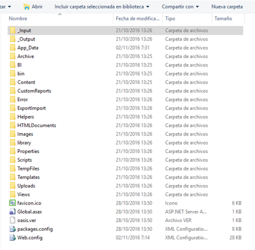

**4.** Debe detener las ejecuciones del sitio en IIS. Esto se realiza con el programa Administrador de Internet Information Services (IIS).  

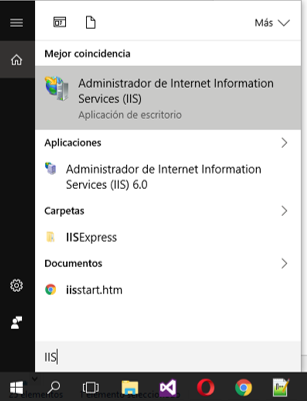

**5.** Ingrese al sitio web y detenga la ejecución.  

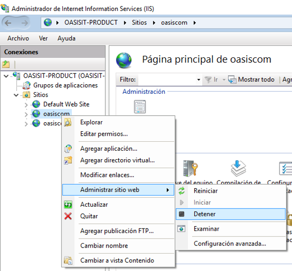

**6.** Verifique que se encuentre detenido.  

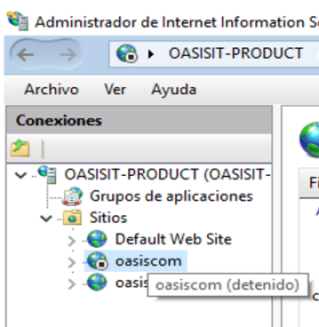

El navegador no deberá poder mostrar el sitio.  

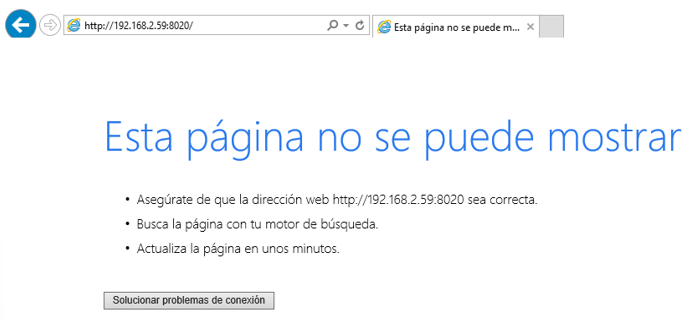

**7.** Realice una copia de seguridad de la aplicación. Es importante copiar todas las carpetas y subcarpetas con sus archivos a un sitio seguro como respaldo ante cualquier eventualidad.  

**8.** Reemplace los archivos actuales con los que tiene en la carpeta temporal. La estructura de carpetas debe quedar similar a la que se encontraba anteriormente.  

**9.** Por cada una de las actualizaciones que se realicen es prioritario y relevante actualizar cada uno de los objetos de la base de datos (procedimientos, tablas, triggers, vistas, funciones etc.). Se precisa de un Servidor FTP y un cliente FTP. Desde este sitio puede acceder con las siguientes credenciales:  

 _**Dirección:**_ ftp://ftp.oasiscom.com  
 _**Usuario:**_ invitado  
 _**Clave:**_ OASIS1nv1t@d0  

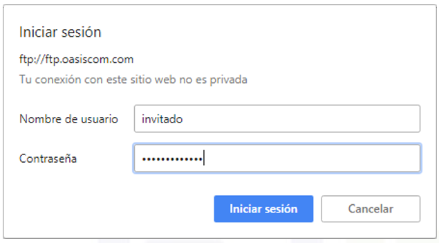

Allí existirá una carpeta llamada **_Objects_BD(Ambiente)_**. Dependiendo del ambiente donde vaya a ser ejecutado el script, será llamado **_Objects_BD_Sql_** u **_Objects_BD_Oracle_** según corresponda. Dentro de dicha carpeta se encontrará con un archivo llamado **_Script_Update_**.  

Este archivo contiene un conjunto de objetos segmentados por versiones en donde deben ser ejecutados uno a uno a partir de la versión en la que su sitio esté actualmente. Por ejemplo:  

En el caso que el sitio se encuentre actualmente en la versión 4.03.32, debe verificarse la versión y tomar cada sentencia para ser ejecutada hasta que se llegue a la versión actual, que supongamos será hasta la versión 4.03.39.  

Para llevar este paso a cabo, se debe realizar conexión al motor de base de datos, considerando también que depende de la instancia que maneje el sitio, es decir, SQL u ORACLE.  

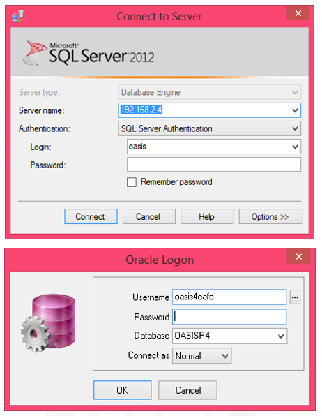

Y proceder a ejecutar cada objeto del script, el cual tendrá la siguiente estructura:  

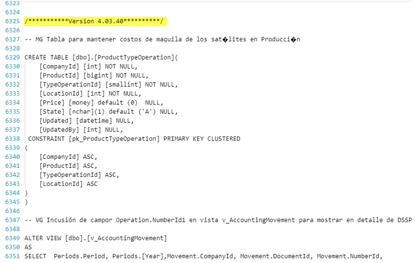

**_Nota:_** Dicha actualización puede ser realizada en la instancia que considere necesaria, es decir, si se cuenta con múltiples ambientes (Pruebas, Pre – Producción, Producción), cada objeto debe ser ejecutado de igual manera como se indica en el paso anterior.  

Además del FTP, en nuestro portal web [www.oasiscom.com](www.oasiscom.com) también existirá el archivo de actualización anteriormente mencionado para cada uno de los motores Oracle, SQL. La ruta de descarga es **Soporte/descargas**.  

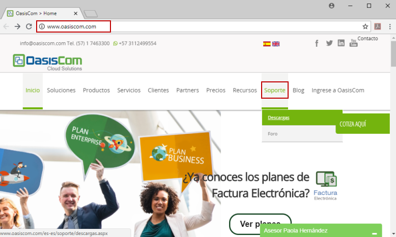

**10.** Una vez se hayan actualizado los archivos, se procede a iniciar la ejecución del sitio en IIS. Esto se realiza con el programa Administrador de Internet Information Services (IIS).  

**11.** Ingrese al sitio e inicie la ejecución.  

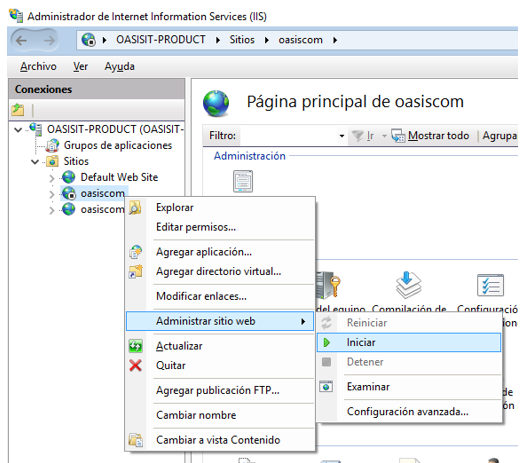

**12.** Verificar funcionamiento.  

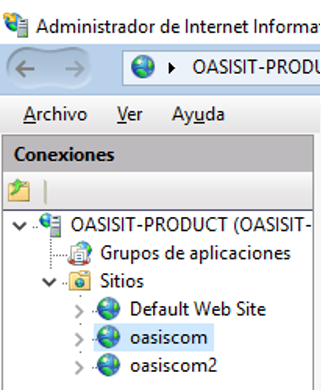

**13.** El navegador deberá mostrar el sitio.  

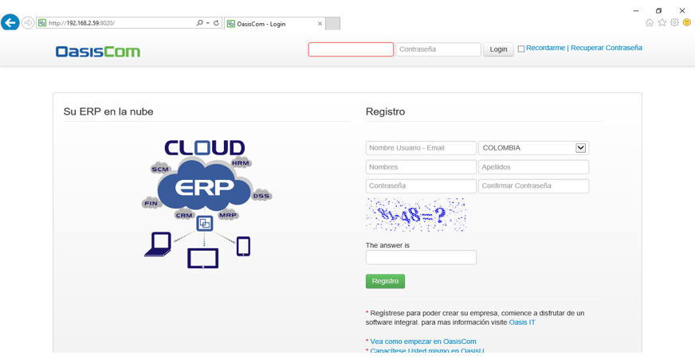

**_Nota:_** Es recomendable limpiar cache del navegador después de actualizar la versión de OasisCom, con la finalidad de asegurar la correcta actualización.  