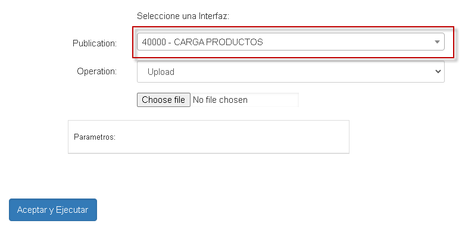
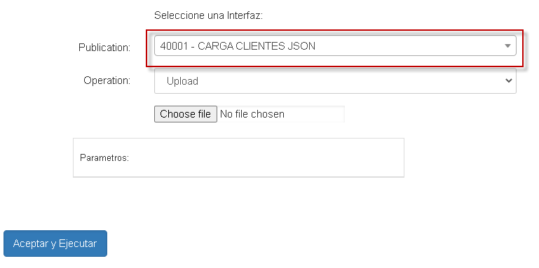
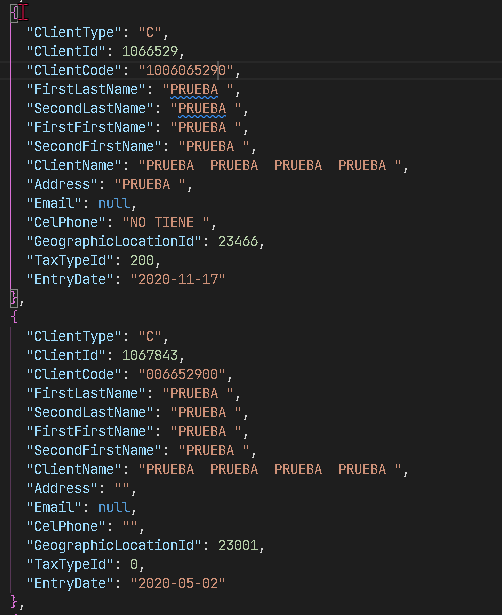
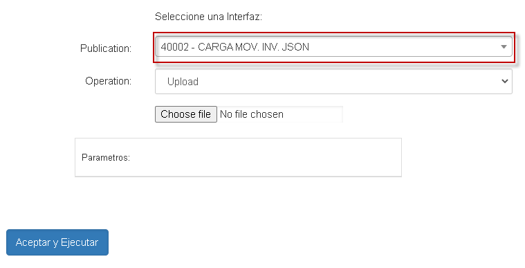
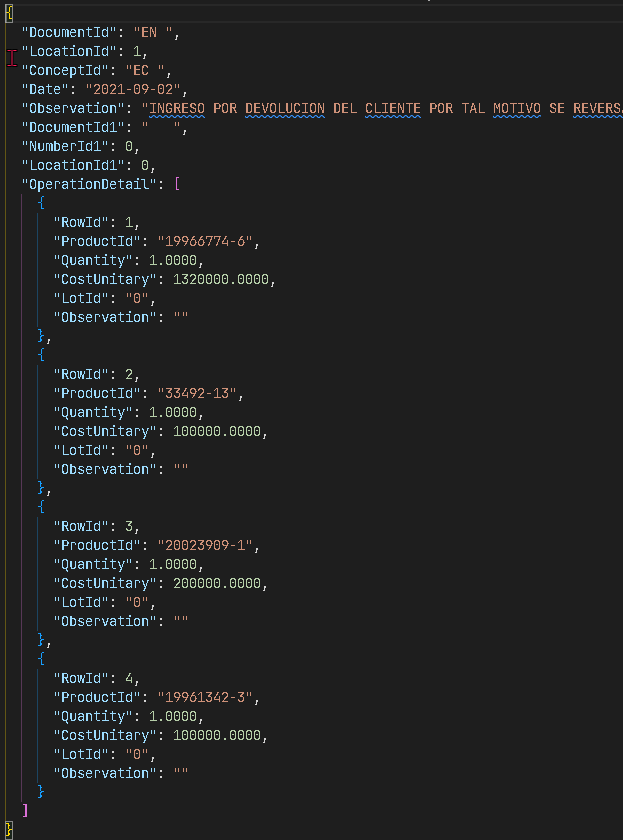

## EndPoint CARGA DE PRODUCTOS

Para realizar la carga de nuestros productos , debemos ingresar al ENDPOINT 40000 en la aplicacion BINT

* BINT  - 40000
  

En este BINT se deben cargar los productos en un archivo JSON con la siguiente estructura.

* FORMATO CARGA DE PRODUCTOS (Archivo JSON)
  
| | | | | | | | | | | | |
|-|-|-|-|-|-|-|-|-|-|-|-|
|ProductId|Ean|ProductName|Inventory|MeasureUnitId|ClassificationId|BrandId|TaxPercentage|Ingress|State|DatePrice|Price|
|19966774-6|7707210531135|ACIDO ASCORBICO 100MG/ML GTA - FCO X 30 |T|19|601|132|19.00|2020-05-02|A|2021-07-23|10000.00|
|4589PRU|NA80950|ADHESIVO DENTAL FCO - FCO X 6|T|18|801|1|0.00|2020-05-02|A|2021-07-23|10000.00|
|33492-14|7703763996148|AMOXICILINA 250MG/5ML SUSP - FCO X 100 |T|18|601|189|0.00|2020-05-02|A|2021-07-23|10000.00|
|20023909-2|8908001535021|AZATIOPRINA 50MG TAB - CJA X 100  - B10|T|32|601|292|0.00|2020-05-02|A|2021-07-23|10000.00|

#### Productos JSON
###### - [Estructura JSON para productos (descargar)](http://docs.oasiscom.com/Desarrollo/productos.json)

## EndPoint CARGA DE TERCEROS

Para realizar la carga de los clientes , debemos ingresar al ENDPOINT 40001 en la aplicacion BINT

* BINT  - 40001
  

En este BINT se deben cargar los clientes
 en un archivo JSON con la siguiente estructura.

* FORMATO CARGA DE CLIENTES (Archivo JSON)
  

## EndPoint CARGA DE MOVIMIENTOS DE INVENTARIO

Para realizar la carga de nuestros movimientos de inventario , debemos ingresar al ENDPOINT 40002 en la aplicacion BINT

* BINT  - 40002
  

En este BINT se deben cargar los movimientos de inventario

 en un archivo JSON con la siguiente estructura.

* FORMATO CARGA DE MOVIMIENTOS DE INVENTARIO (Archivo JSON)
  

