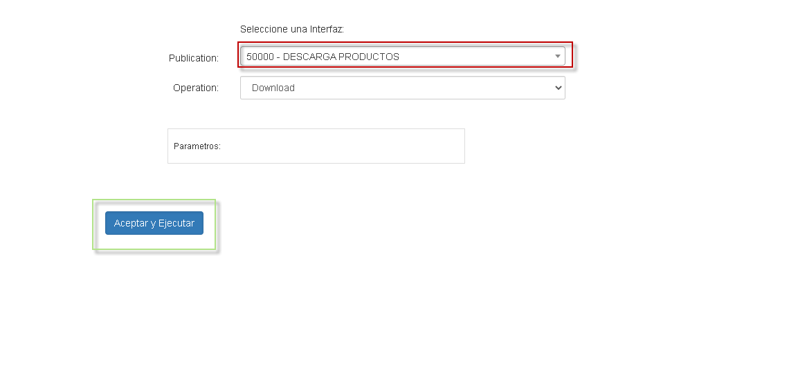
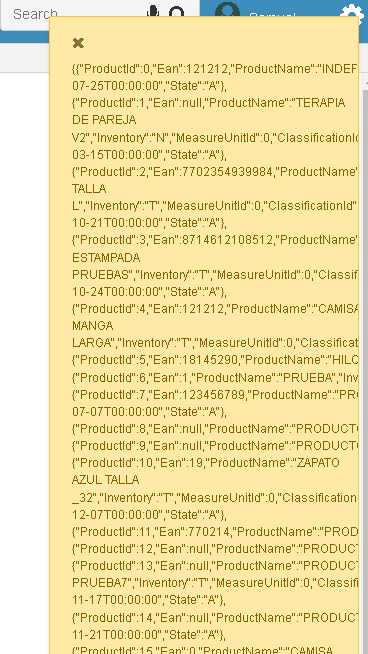
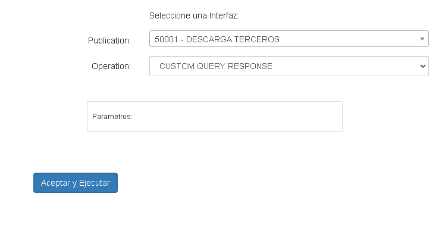
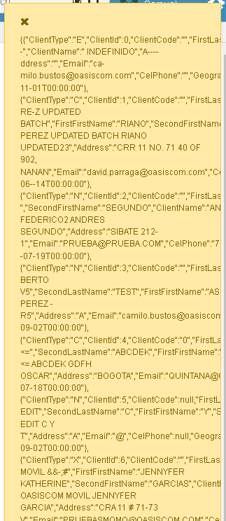

## EndPoint Descarga DE Productos

Para realizar la descarga de nuestros productos , debemos ingresar al ENDPOINT 50000 en la aplicacion BINT

* BINT  - 50000
  

En esta opcion obtendremos todos nuestros productos registrados en el sistema en un formato JSON

## EndPoint Descarga de terceros

Para realizar la descarga de nuestros productos , debemos ingresar al ENDPOINT 50000 en la aplicacion BINT

* BINT  - 50001
  

En esta opcion obtendremos todos nuestros productos registrados en el sistema en un formato JSON

