---

layout: default

title: Creación de reportes con Microsoft SQL Report Builder

permalink: /Desarrollo/reporterdl

editable: si

---

# CREACIÓN DE REPORTES CON MICROSOFT SQL REPORT BUILDER

_Microsoft SQL Server Report Builder_ proporciona un entorno de creación de informes intuitivo para los usuarios empresariales y avanzados. Tiene una interfaz de usuario sencilla que es similar a Microsoft Office, además ofrece la capacidad de diseñar, ejecutar e implementar informes permitiendo que los usuarios empresariales se vuelvan competentes en la creación de reportes con mucha rapidez. A continuación, serán descritos los pasos para el diseño y creación de un reporte:

## 1.	INICIANDO MICROSOFT SQL REPORT BUILDER 

Para iniciar, se debe contar con la versión _**Microsoft SQL Server 2012 Report Builder 3.0**_, para descargarla puede ingresar [aquí](https://www.microsoft.com/en-us/download/details.aspx?id=29072).

Una vez iniciado el programa, se puede visualizar la siguiente pantalla principal. Teniendo en cuenta que se realizará la creación y diseño de un reporte, se debe seleccionar las opciones señaladas:

Hecho esto, se mostrará la siguiente hoja en blanco para iniciar con la creación y diseño del reporte:

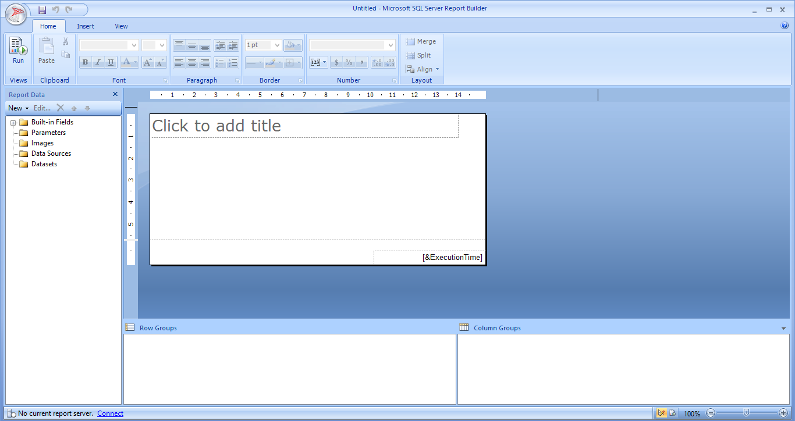

## 2.	DATA SOURCES (Fuentes de Datos)

Continuando con la creación del reporte, como primera instancia se debe tener en cuenta la(s) fuente(s) de datos o conexiones con las cuales se trabajará para la ejecución del reporte y el debido retorno de información. Para esto, se debe realizar lo siguiente:

En la parte izquierda de la pantalla, en el menú Report Data, se encuentra una carpeta llamada _**Data Sources**_, en esta carpeta será creada la fuente de datos de la siguiente manera:

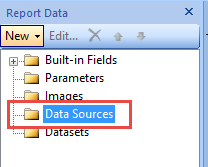

En dicha carpeta se debe hacer ‘clic’ derecho _Add Data Source_:

Se abrirá la siguiente ventana:

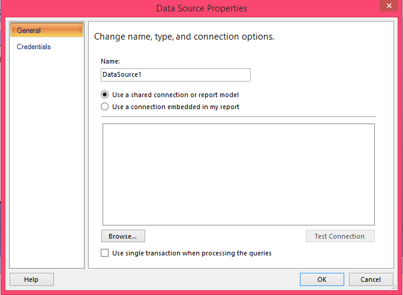

En el campo ‘_Name_’, se debe ingresar el nombre de la fuente de datos.
Luego, existen dos opciones a marcar: ‘_Use a shared connection or report mode_l’ (Usar un modelo de conexión o informe compartido) o ‘_Use a connection embedded in my report_’ (Usar una conexión incrustada en mi informe); en este caso se selecciona la segunda. Al hacer esto se habilita la siguiente lista, en donde se debe seleccionar el tipo de conexión, en este caso será a _Microsoft SQL Server_:

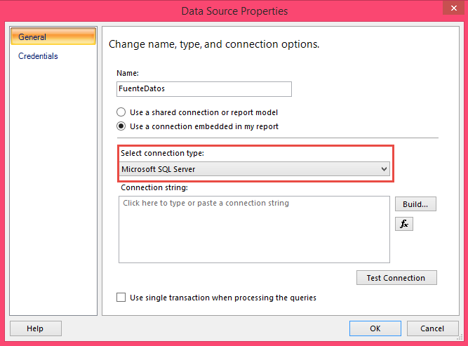

Posterior a esto, se debe ingresar la conexión en el campo _Connection string_, en este caso la conexión se realizará a la base de datos de pruebas, con lo que la conexión debe quedar de la siguiente manera, donde:

Luego, se debe seleccionar el botón ‘_Build_’, esto para ingresar las credenciales de usuario y verificar la conexión:

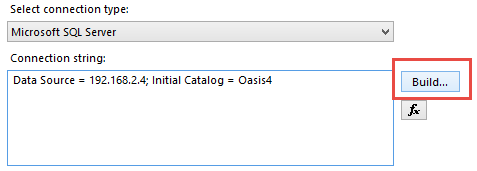

Se abrirá la siguiente ventana en donde se debe ingresar el nombre y usuario contraseña correspondiente a la fuente de datos para realizar la conexión:

Una vez ingresadas las credenciales, se pulsa el botón ‘_Test Connection_’, con la finalidad de comprobar que las credenciales son correctas y que la conexión es exitosa. De ser así, se mostrará el siguiente mensaje:

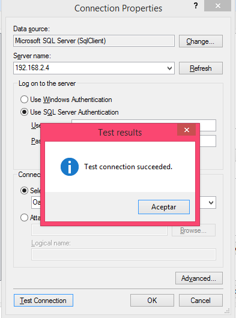

Se da ‘clic’ en Aceptar y _OK_. Volviendo a la pantalla anterior se realiza la misma acción de comprobar la conexión dando ‘clic’ en el botón con el mismo nombre (puede pasarse por alto este paso, pero es recomendable hacerse para confirmar la conexión en su totalidad y que no genere inconvenientes en pasos posteriores). Se abrirá una ventana en donde pedirá el ingreso del nombre de usuario y contraseña, los cuales deben ser los mismos que se ingresaron previamente; si la conexión es correcta, mostrará el mismo mensaje del paso anterior:

Por último, se debe dar ‘clic’ en _OK_ para dar por terminada la configuración de la fuente de datos.

## 3.	DATASETS (Conjunto de Datos)

Una vez creada la fuente de datos, se debe tener en cuenta cual es la información que quiere ser visualizada en el reporte. Para esto, se debe contar con las respectivas consultas en el motor de bases de datos a utilizar, en este caso se trabajará con _SQL Server Management Studio_ (recordando que la fuente de datos fue creada sobre SQL Server) para realizar la ejecución de la consulta por base de datos.

En _Report Builder_, existe una carpeta llama _**Datasets**_, ubicada en la parte izquierda de la pantalla en el menú _Report Data_, cuyo objetivo es ejecutar la(s) consulta(s) de la base de datos para que la información sea visualizada debidamente en el reporte:

Para crear un nuevo dataset, se debe seleccionar ‘clic’ derecho y _Add Dataset_:

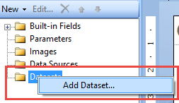

Se abrirá la siguiente ventana:

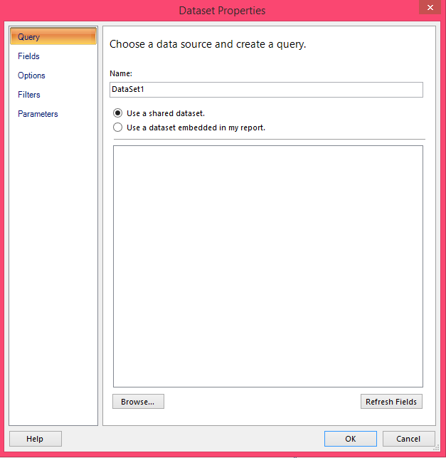

En el campo ‘_Name_’ se debe ingresar el nombre del conjunto de datos.

Al igual que en la fuente de datos existen dos opciones posibles a seleccionar, la primera ‘_Use a shared Dataset_’ (usar un conjunto de datos compartido) y ‘_Use a dataset embedded in my report_’ (usar un dataset incrustado en mi reporte). En este caso, se debe seleccionar la segunda. Hecho esto, se habilitarán las siguientes opciones:

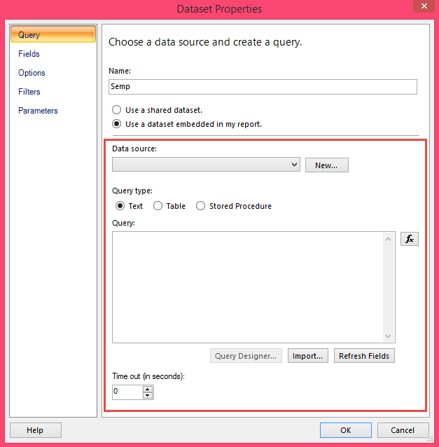

En el campo _Data Source_, debemos seleccionar la fuente de datos que se configuró previamente, esto con el fin de realizar la debida conexión para que la consulta por base de datos sea efectiva.
Luego, seleccionamos de que tipo será la consulta, si texto, tabla, o un procedimiento almacenado. En este caso como corresponde a un query, se debe dejar en _Text_:

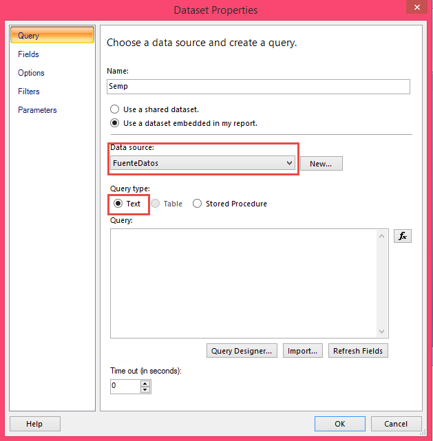

En el campo Query, se debe ingresar la consulta realizada por base de datos (en este caso SQL Server). _**Nota**_: Por lo general, los reportes creados en OasisCom cuentan con dos Datasets, uno que corresponde al encabezado que siempre los caracteriza, donde se encuentra la imagen y nombre de la compañía el modulo y nombre del reporte y la fecha y número de página del mismo y el otro Dataset, que corresponde a la consulta de la información que quiere verse en el reporte como tal. Esta primera consulta corresponde al Dataset del encabezado:

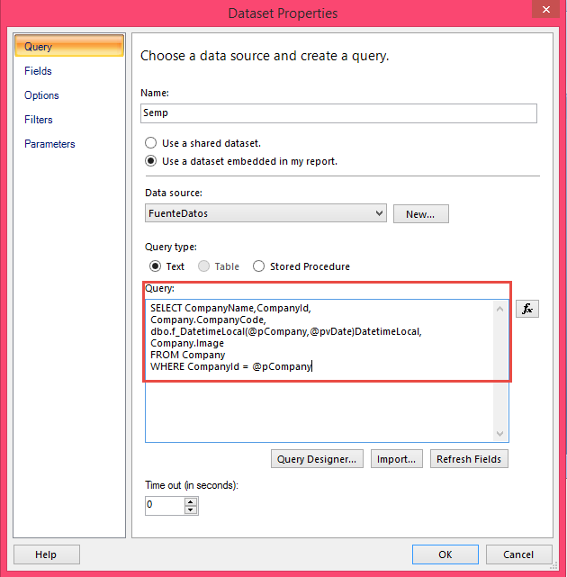

Realizada la consulta, se debe dar clic en el botón _Refresh Fields_ para verificar que la consulta no presenta ningún error de sintaxis. De ser así, pide ingresar nuevamente las credenciales de usuario y posteriormente confirmar la conexión.

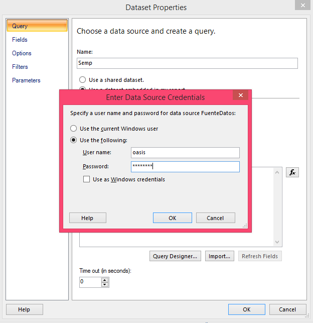

Hecho esto, se da ‘clic’ en _OK_ para dar por terminada la configuración del primer Dataset y en el menú Report Data se enseña el Dataset creado con los campos que se usarán:

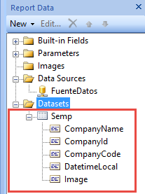

El segundo Dataset, hace referencia a la información del reporte como tal. En este caso, como ejemplo se realizará un reporte que muestre mes a mes el número total de oportunidades, por consiguiente, se crea otro dataset con las mismas características, pero con la siguiente consulta:

Se realizan los mismos pasos de verificación de la consulta y se guarda el Dataset.
Igualmente, en el menú _Report Data_ se enseñan los campos del nuevo Dataset, los cuales serán utilizados para el diseño del reporte:

## 4.	DISEÑO DEL REPORTE

Una vez configurada la Fuente de Datos y los Dataset, se procede con el diseño y/o construcción del reporte, en lo que refiere a la visualización:

Primero, se debe adaptar la hoja del reporte, de manera que conformen un encabezado y un cuerpo, de la siguiente manera:

Se debe eliminar el pie de página (en este caso porque no se requiere) dando ‘clic’ derecho sobre el mismo y _Remove Page Footer_:

Eliminado el pie de página nótese que únicamente queda el cuerpo del reporte, por ende, se debe agregar el encabezado, dando ‘clic’ derecho en el mismo, _Insert_ y _Page Header_.

La hoja, quedará de la siguiente manera:

Hecho esto, se iniciará con la construcción del encabezado, teniendo en cuenta que este debe hacerse encima de la línea que la separa del cuerpo:
Para adicionar una imagen (en este caso el logo de la compañía), se debe hacer ‘clic’ derecho _Insert / Image_:

Se abrirá la siguiente ventana:

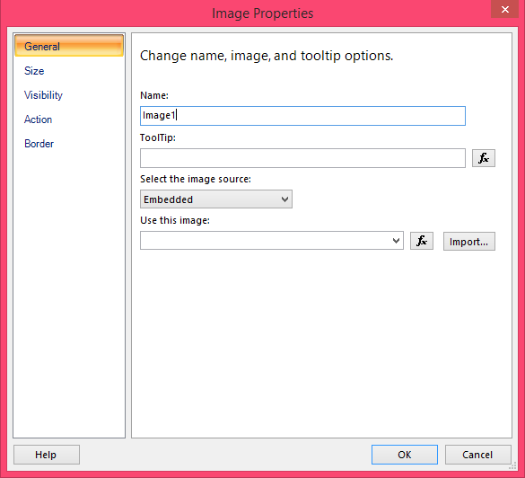

En la lista ‘_Select the image source:_’, se debe seleccionar la fuente de la imagen, en este caso se escoger la opción _Database_. Hecho esto, se actualizará la ventana de la siguiente manera:

En donde se deberá dar ‘clic’ en el botón   de la opción ‘_Use this field_’. Se abrirá una nueva ventana, en donde se deberá seleccionar la expresión de la imagen, la cual se encuentra en el Dataset _Semp_, que fue creado previamente, como se muestra en la imagen:

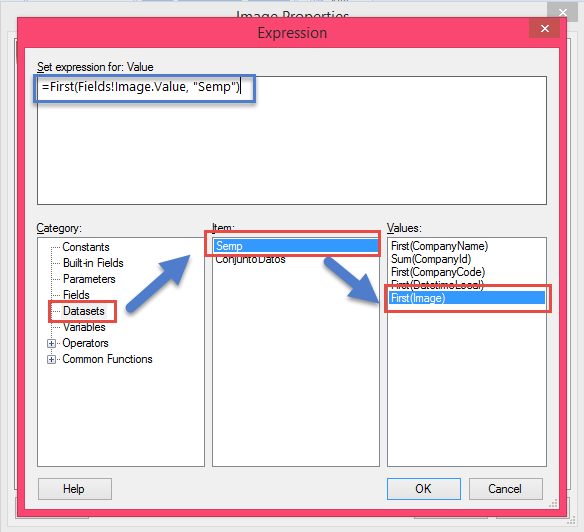

Hecho esto, se debe seleccionar el botón ‘_OK_’ para guardar los cambios:

Posteriormente en la ventana anterior, la siguiente opción ‘_Use this MIME type_’, se debe seleccionar el tipo de la imagen, en este caso será _image/png_.

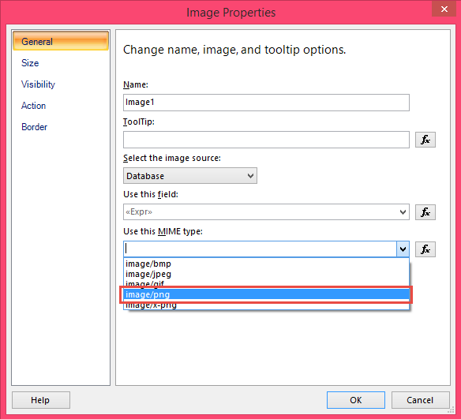

Hecho esto, se da ‘clic’ en el botón ‘_OK_’ para guardar cambios.
Nótese que en la hoja del reporte aparecerá un recuadro, el cual hace referencia a la imagen insertada, la cual puede expandirse o contraerse y ser desplazada a cualquier sitio de la hoja, en este caso será ubicada en la esquina de encabezado:

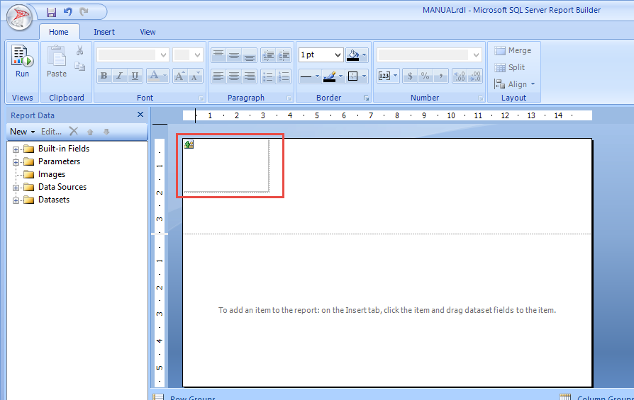

Para insertar los títulos del encabezado, algo referente a la imagen de un encabezado de un reporte de OasisCom, por ejemplo:

Se realiza insertando _Text Box_ o cajas de texto de la siguiente manera:

Haciendo ‘clic’ derecho sobre la hoja del reporte, _Insert / Text Box_, se insertará una caja de texto, la cual se verá así:

Hecho esto, se deberá ingresar el campo del Dataset que se quiere visualizar en el text box (_cabe recordar que todos los campos que se inserten son campos cuya fuente es la base de datos_) haciendo ‘clic’ derecho sobre el text box y seleccionando la opción _Expression_:

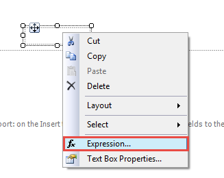

Se abrirá la siguiente ventana, similar a la adición de la imagen, en donde del Dataset requerido se selecciona el campo que se quiere visualizar, en este caso será el _nombre de la compañía_:

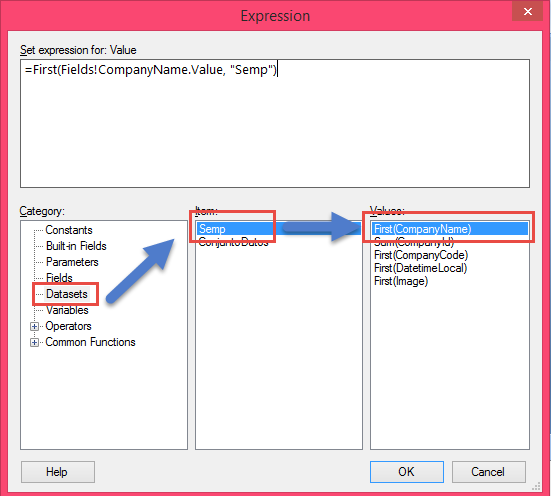

Hecho esto, el text box será visualizado como un campo que contiene una expresión, la cual será visualizada más adelante. Igualmente, que el campo de la imagen estos textbox pueden ser ubicados en cualquier parte de la hoja.

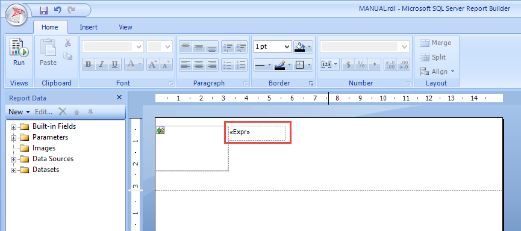

De la misma manera se adicionan los demás campos que se quieren ver en el encabezado del reporte, tales como título del reporte, paginación, etc. Así pues, el encabezado se verá de la siguiente forma:

_**Importante:**_ _Tenga en cuenta que los Text Box que no son vistos como expresiones (_**Expr**_) sino como títulos común y corrientes fueron adicionados manualmente sin ningún tipo de característica, esto con la finalidad de brindar forma al encabezado del reporte._

Diseñado el encabezado, se procederá a construir el cuerpo del reporte, el cual debe hacerse debajo de la línea que separa las dos partes de la hoja:
En este caso, este reporte enseñará información en un formato plano (una tabla), con lo que la característica a utilizar será la siguiente:

Una vez ingresada la tabla, se verá de la siguiente forma, donde está conformada por un encabezado y una parte en donde estará ubicada la información:

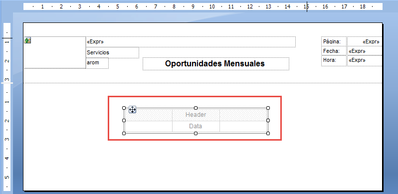

En esta tabla ser ingresarán los campos que se querrán mostrar en el cuerpo del reporte, de la siguiente manera:

En la parte llamada _Header_, se deberán ingresar los títulos de los campos:

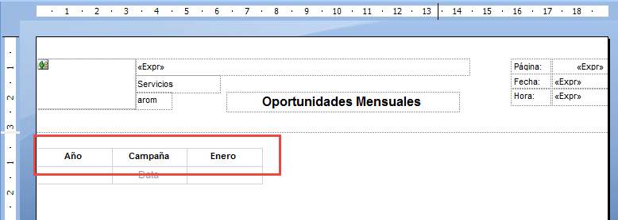

Si desea añadir otra columna a la tabla, se deberá hacer ‘clic’ derecho sobre la última columna _Insert Column – Right_. De esta manera se ingresarán más columnas. En caso de las filas _Insert Row -Above_ (Encima) o _Below_ (Debajo):

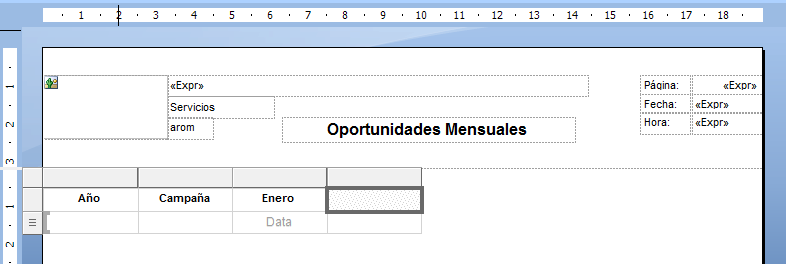

Así pues, se ingresan las columnas faltantes y se adecuan los títulos del reporte:

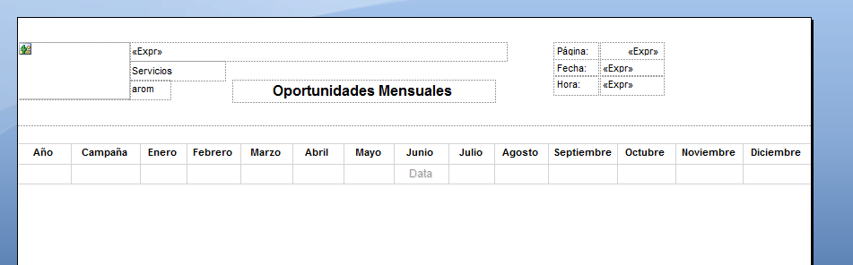

Hecho esto, se procederá a ingresar los campos del Dataset, seleccionado la celda correspondiente, y dando ‘clic’ en el icono . Se mostrarán los Datasets creados, en donde se deberá seleccionar _ConjuntoDatos_ y posteriormente el campo a mostrar:

Se realiza con cada uno de los campos, con lo que al final, se verá de la siguiente forma:

Como lo que se desea es mostrar el número total de oportunidades se agregará otra propiedad al reporte, el cual corresponde a la suma total de cada uno de los campos. Para esto, se agrega una nueva fila a la tabla. Para realizar la suma de cada uno de los campos, se debe hacer ‘clic’ derecho en la celda correspondiente y seleccionar la opción _Expression_:

 

En donde se abrirá la siguiente ventana:

 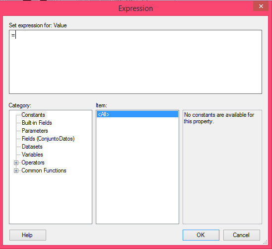

Aquí, se debe seleccionar la opción _Datasets_, el Dataset correspondiente que es _ConjuntoDatos_ y posteriormente el campo a sumar el cual se caracteriza por tener el parámetro de suma y entre paréntesis la expresión, _**Sum(Expresión)**_:

 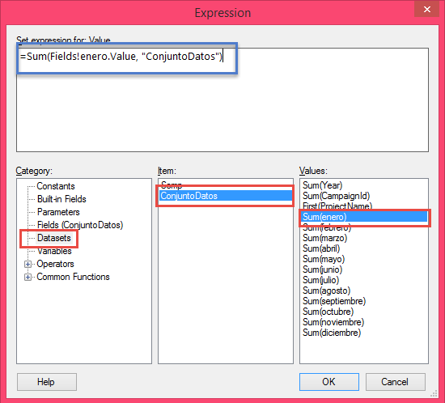

Hecho esto, se da ‘clic’ en el botón ‘_OK_’ para guardar cambios. Nótese que esta propiedad será añadida debajo del campo que se quiere sumar:

 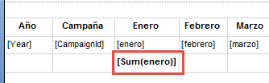

Se realizan los mismos pasos con el resto de campos (_El campo total fue añadido manualmente_):

 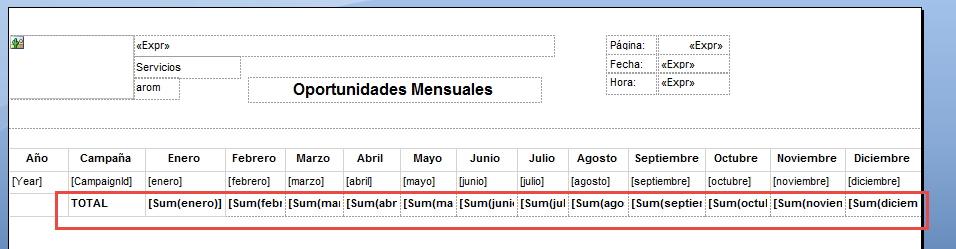

Hecho esto, se quiere realizar una agrupación por año, de tal manera que el reporte se vea más organizado al momento de visualizar la información. Para esto, en el menú Row Groups se debe seleccionar la opción _Add Group_ y _Parent Group_:

 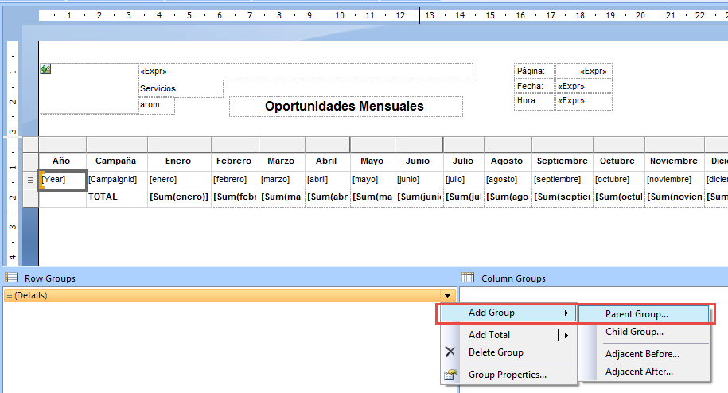

Se abrirá la siguiente ventana, donde se debe seleccionar el campo a agrupar, en este caso ‘_Year_’ y se deben activar los dos flags ‘_Add group header_’ y ‘_Add group footer_’:

 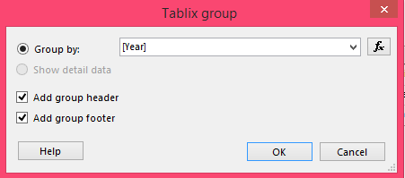

Posteriormente se deben guardar los cambios haciendo ‘clic’ en ‘_OK_’.

Se añadirán nuevas filas y columnas las cuales es necesario adecuar para acomodar la vista:

 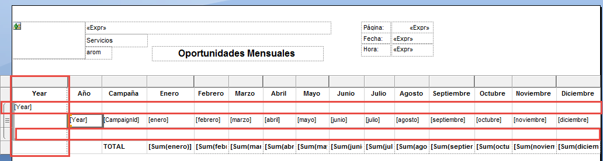

_Los campos resaltados en rojo deben ser eliminados y seleccionar la opción ‘Delete rows only’ cuando se muestre la siguiente ventana para conservar el agrupamiento_:

 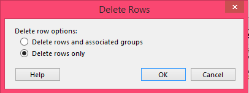

Así pues, quedará de la siguiente forma:

 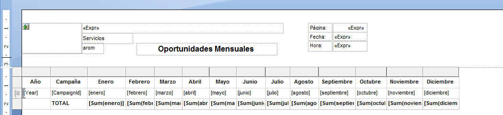

Para terminar con el diseño, se procede a insertar márgenes y a eliminar espacios en blanco para que la visualización del reporte sea más optima:

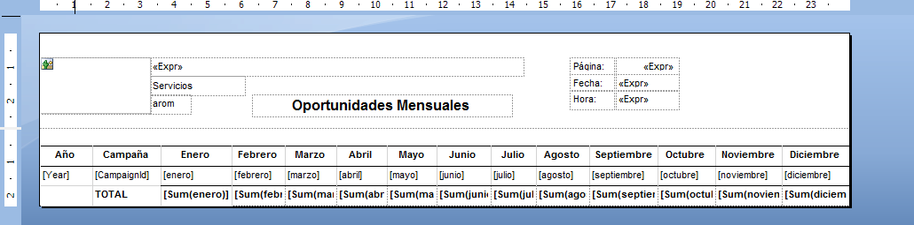

## 5.	PARÁMETROS 

Al haber terminado con el diseño del reporte, el último paso antes de realizar su ejecución, es configurar los parámetros que recibirá como entrada el reporte.

En el menú _Report Data_, existe una carpeta llamada _**Parameters**_, la cual, contiene los datos con los cuales se podrá consultar el reporte:

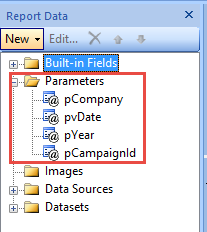

Los campos aquí mostrados son reconocidos, dado que en la consulta de la base de datos estos parámetros ya son ingresados y la aplicación los reconoce.

Para configurar un parámetro, se debe realizar ‘clic’ derecho sobre el mismo y seleccionar la opción _Parameter properties_:

Se abrirá la siguiente ventana, en donde se debe configurar el tipo de dato, si estará visible el parámetro y si contendrá algún valor por defecto. _Se debe tener en cuenta que la configuración de los parámetros no siempre es la misma, dado que el tipo de dato, su visibilidad y sus valores por defecto pueden variar_:

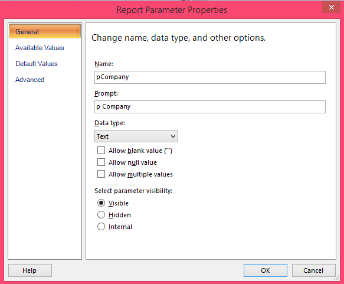

El Id de la compañía al ser un parámetro entero, se debe seleccionar en el campo _Data Type_, la opción _Integer_.

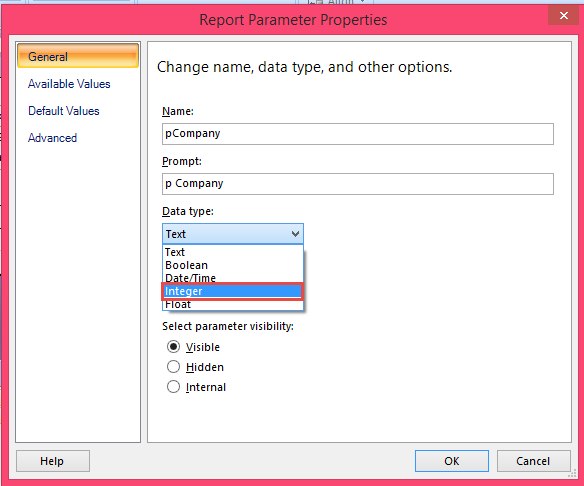

Y en la pestaña _Default Values_, se debe agregar un valor por defecto, el cual será ‘0’.

Se dará ‘clic’ en ‘_OK_’ para guardar cambios.

## 6.	EJECUCIÓN

Hecho esto con todos los parámetros, se procederá con la ejecución del reporte para verificar consistencia de datos y que visualmente sea correcto. Para esto, se deberá seleccionar la opción ‘_Run_’ ubicada en la parte superior izquierda de la aplicación:

Hecho esto, la aplicación pedirá las credenciales de usuario (previamente configuradas en la fuente de datos):

Al realizar la debida autenticación, se mostrará la vista de ejecución del reporte con los parámetros:

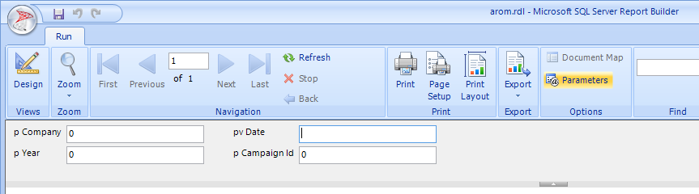

Al ingresar los debidos datos para que el reporte muestre datos, se dará ‘_Enter_’.

Así pues, se mostrará el reporte como se diseñó con sus respectivos campos e información.

_Para volver a la vista de diseño se deberá seleccionar la opción ‘Design’ ubicada en la parte superior izquierda de la aplicación_:

De esta manera culmina este manual de crear un reporte con la aplicación _**Microsoft SQL Server Report Builder**_.
