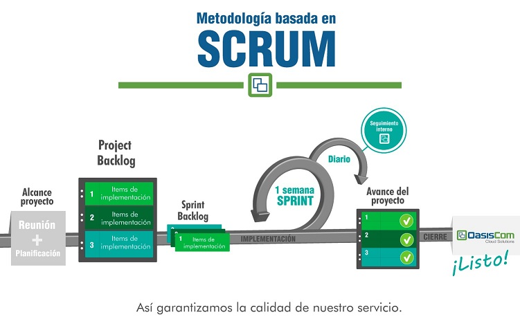

# METODOLOGÍA

La implementación se realiza con base a los principios básicos de la metodología SCRUM, en la cual se definen prioridades de los ítems que abarcan el alcance del proyecto establecido inicialmente y se realizan entregas tempranas y continuas de los diferentes ítems. De igual manera nos permite tener un seguimiento semanal con el cliente del cronograma y un seguimiento diario al interior de nuestra organización de cada una de las actividades planeadas por cada recurso. Es por esto, que con dicha metodología logramos el éxito del proyecto, enfocándonos en la prioridad de los procesos que beneficie al cliente.  

Esta metodología nos permite capacitar rápida y fácilmente a los usuarios que harán uso del sistema, dado que con las entregas tempranas de cada proceso se familiarizan poco a poco con nuestra herramienta, en donde a la entrega final se obtiene un conocimiento consolidado y profundo sobre los diferentes módulos a operar.  

OasisCom define esta metodología dado que está establecida para proyectos complejos, en donde se exigen resultados pronto y un control de cambios flexible de las solicitudes realizadas.  

Dentro de las etapas de implementación se tienen contempladas:  

* **Alcance:** Se realiza la reunión de inicio del proyecto para delimitar el alcance del mismo junto con el cliente, realizar la presentación inicial en donde se explica la metodología a utilizar, los riesgos comunes en los proyectos y un cronograma base. De igual manera se definen las variables relevantes que pueden afectar el proyecto, cómo lo son: disponibilidad de los recursos, comunicación entre el cliente y Oasis, definición de frecuencia de reuniones de seguimiento, entre otros.  

	En esta etapa se realiza la planeación del proyecto, establecer equipos de trabajo,  definición de riesgos y cronograma con fechas establecidas por ambas partes.  

* **Project Backlog:** El alcance definido anteriormente se desglosará en productos, módulos o procesos del sistema OasisCom, los cuales nos definirán los entregables para el cliente.  

* **Sprint Backlog:** Posteriormente a la definición de las actividades a entregar, se realiza la priorización de los mismos generando varios sprint de entrega. En dicho sprint se realizan actividades de conocimiento del negocio, parametrización, migración de la información, pruebas de aceptación, capacitación y puesta en marcha. Según lo acordado con el cliente se realizarán sprint semanales, es decir entregas semanales de cada proceso o módulo definido en el Project backlog.  

* **Seguimiento diario:** Se realiza un seguimiento diario interno en la compañía al sprint semanal del proyecto, con el fin de revisar las tareas programadas y detectar previamente inconvenientes que impacten dichas tareas, solucionándolas rápidamente y no afectar la entrega del sprint y por ende aplazar o postergar las fechas del cronograma del proyecto.  

* **Avance del proyecto:** Se puede evidenciar el avance del proyecto de acuerdo a las entregas realizadas por medio de los diferentes sprint lo cual nos determinaría el final de la implementación del proyecto.  

* **Cierre:** Se debe realizar un cierre o entrega formal de cada sprint, y al cumplir con todas las entregas finaliza la implementación del proyecto. Se realiza una reunión para validar el proceso de implementación realizado, los pendientes en caso que se tengan identificados, registrar lecciones aprendidas tanto del equipo interno como con el equipo del cliente y realizar la respectiva entrega al área de servicio Pos venta.  

