---

layout: default

title: Integracion con NetPay

permalink: /Implantacion/NetPay

editable: si

---

# INTEGRACION CON NETPAY 

para realizar el  proceso de integración con pagos a travez de la plataforma netpay 
Es necesario realzar los suguientes pasos. 

## Configuracion BARC (ARCHIVOS)

En este ejemplo, la integracion se realiza sobre el BARC 2000, en donde en este se configura la estructura del pago que se realizara.

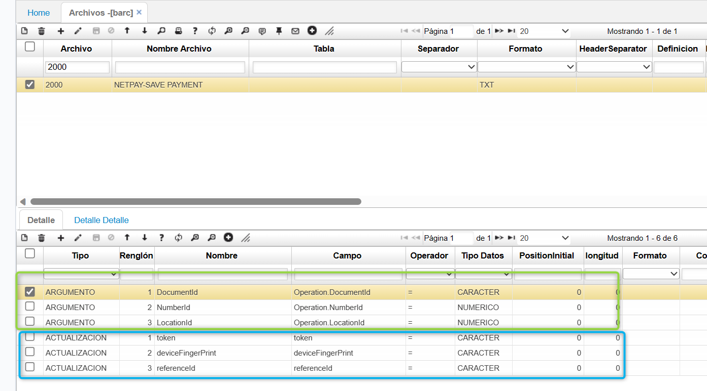

a nivel del detalle del barc se configura tanto los argumentos para consultar una factura en específico,
y adicionalmente los campos a reemplazar (ACTUALIZACION) con lo que se genere previamente desde el formulario.

## Configuracion BPUB(PUBLICACIONES)

**Operación**: CustomQuery Response

**Programa**: Tipo de conexión al api  (HEADER).

**SourceDomainId**: Dominio de donde se generará el origen de datos para el envio al API NetPay.

**TargetDomainId**: Dominio destino a donde se realizará conexión para generar el pago.

**TargetService**: Metodo a conectar para generar el pago.

A NIVEL DEL DETALLE SE REFERENCIA EL BARC PREVIAMENTE CONFIGURADO.

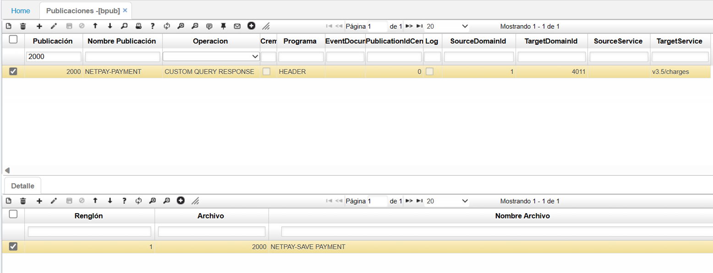

## Configuracion SROl (Roles)

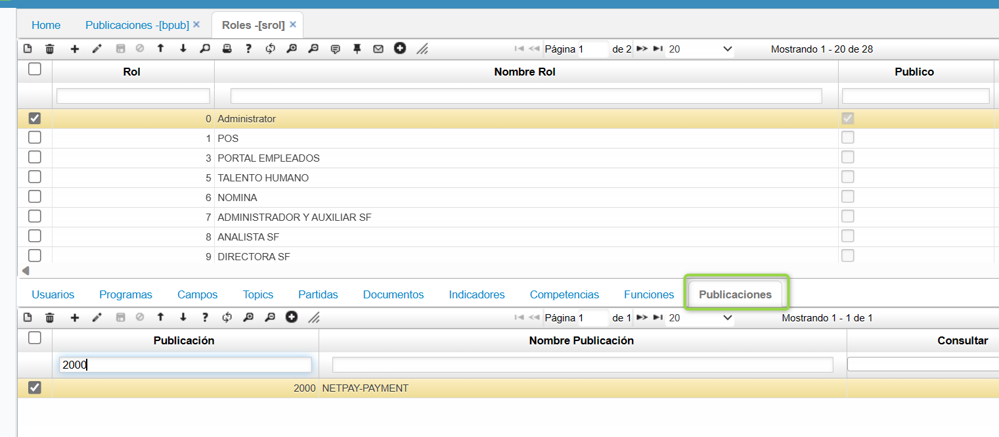

## Configuracion SDOM 

SE CONFIGURA LA SIGUIENTE CONFIGURACION DE DOMINIOS PARA LA EJECUCION DE ESTE PROCESO.

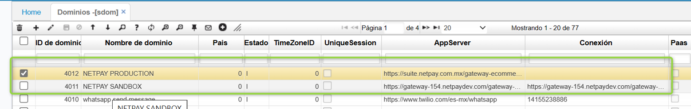

## CONFIGURACION SDOMC

Lo resaltado en Azul, se utiliza para el uso del consumo de api PAGO NETPAY

Lo resaltado en Verde se utiliza para el proceso de authenticación sobre el metodo tokenizacion de tarjeta.

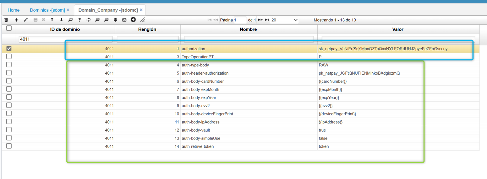

## Configuracion SCAM 

SE CONFIGURA EL BOTON PARA VISUALIZARLO EN LA PESTAÑA PAGO DEL JFAC

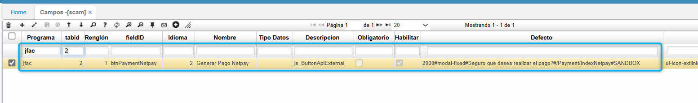

## Ingreso a  la aplicacion donde se parametrizo el boton 

Se consulta una factura o se genera una factura,

donde en el detalle de la factura (PAGO) sobre el boton se activa un ventana emergente que mostrará el ingreso de los datos personales de la tarjeta de credito.

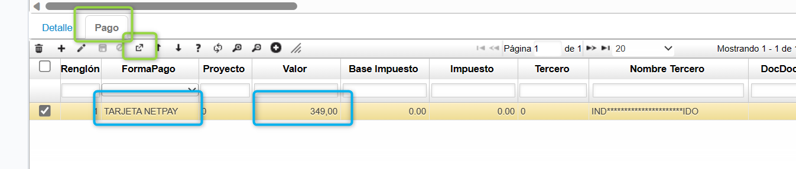

Se ingresan los datos de la tarjeta  y al terminar, se le da click al boton de generar pago 

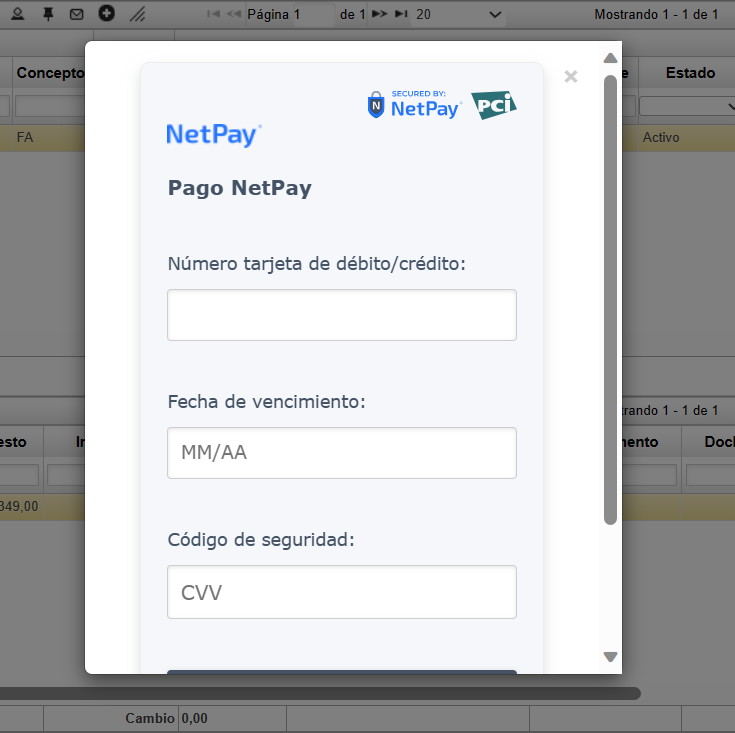

el aplicativo internamente generara los siguientes procesos

- VALIDACION PREVIA- VALIDA DATOS BASICOS PARA GENERAR LA TRANSACCIÓN.* - GENERACION DE TOKEN DE TARJETA - SOBRE EL SERVICIO NETPAY
- GENERACION DE PAGO-SOBRE EL SERVICIO NETPAY.
- CAPTURA DE DATOS DE LA TRANSACCION EN OASISCOM.
- SI ES 3DS, SE EXTIENDE A VALIDAR LA TARJETA.
-  SE ACTUALIZA LA TRANSACCION SEGÚN LA RESPUESTA DEL SERVICIO.

luego de completar el pago exitosamente 

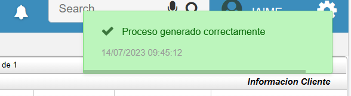

## SE VALIDA EL PAGO REALIZADO POR EL PROGRAMA EPAY

se puede visualizar la información de la transaccion

fecha, hora, valor, información del tercero, estado de la transacción, referencia del documento. 

Franchise Nombre = token de transacción emitida => sirve para realizar la consulta de la transacción emitida sobre netpay.

Respuesta: Se captura la respuesta obtenida por el servicio de parte de NETPAY.

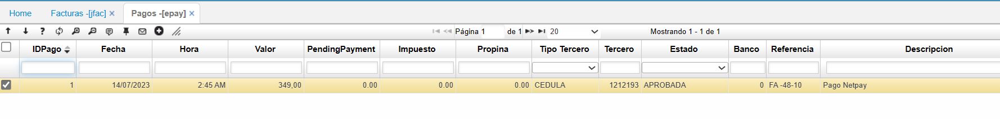

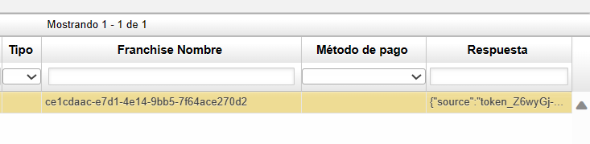