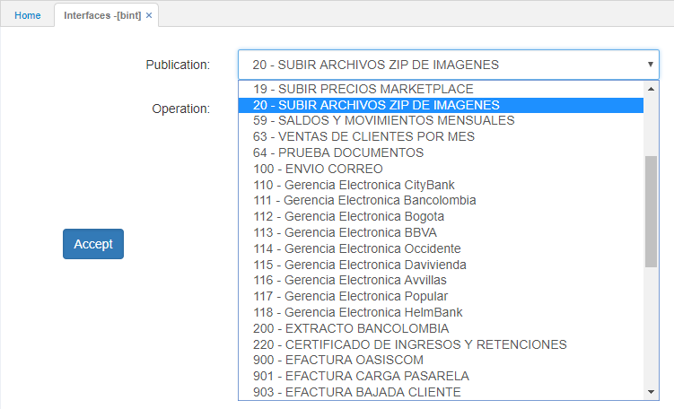
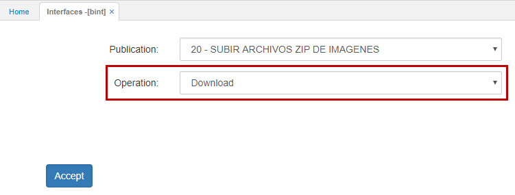
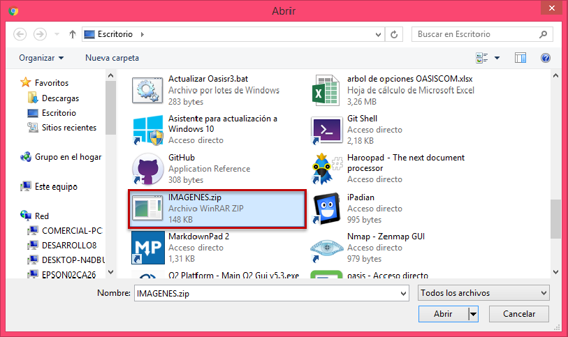
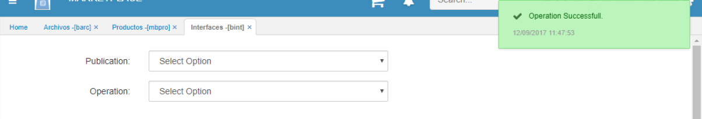
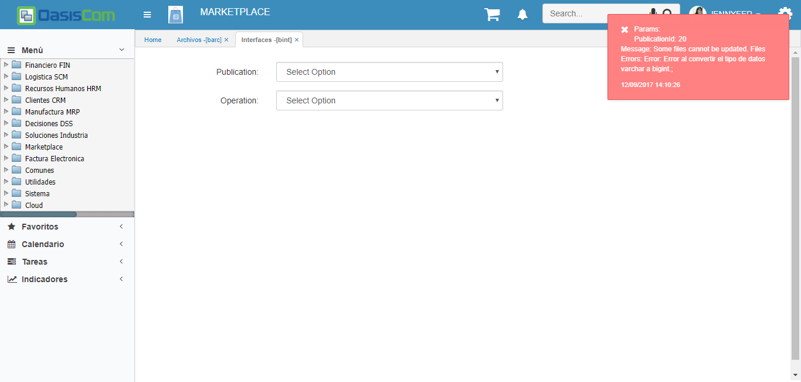

---
layout: default
title: Carga de imágenes al Marketplace
permalink: /Implantacion/cargaimagenes
editable: si
---

# [Carga de imágenes al MarketPlace](http://docs.oasiscom.com/Operacion/utility/barchi/bint#carga-de-imágenes-al-marketplace)

En la aplicación BINT se verificará la parametrización realizada previamente en [**BARC - Archivos**](http://docs.oasiscom.com/Operacion/utility/barchi/barc) y se cargará el archivo con las imágenes.  

Para ello, el usuario deberá ingresar a la opción BINT y elegir la _publicación_ correspondiente a SUBIDA DE IMÁGENES DE PRODUCTOS:  



Posteriormente, la opción cargará el campo _Operación_ correspondiente a Subida (Upload):  



Como siguiente paso debe seleccionar el archivo a cargar:  



Por último damos click en _Aceptar_ y el sistema mostrará un mensaje de operación exitosa:  



Una vez ejecutada la interfaz, las imágenes de los productos podrán ser visualizadas desde la opción [**MBPRO - Productos**](http://docs.oasiscom.com/Operacion/mpportal/mpproveedor/mbpro#verificar-cargue-de-imágenes-al-marketplace). _(Ver aplicaición)_  

## Verificaciones  

En el caso de que no exista fórmula en la parametrización de la aplicación [**BARC - Archivos**](http://docs.oasiscom.com/Operacion/utility/barchi/barc#carga-de-imágenes-al-marketplace), si el usuario ingresa el Id de producto cuyos caracteres correspondan a un String, este arrojará el siguiente mensaje de control:  



Si existe un producto con una imagen previamente cargada y se carga otra imagen asociada a este mismo producto, la imagen se sobrescribirá dado que la lógica  utilizada maneja un _update_.  
