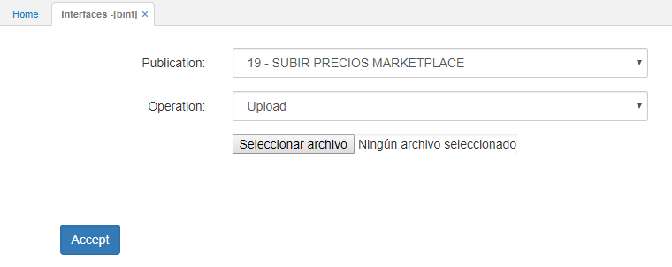
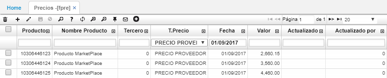
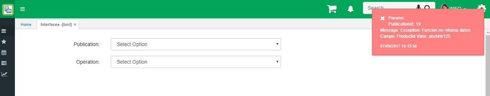

---
layout: default
title: Subir precios al Marketplace
permalink: /Implantacion/subirprecios
editable: si
---

# Subir precios al Marketplace

El propósito de esta funcionalidad es permitir que un cliente pueda subir de forma masiva, a través de la opción **BINT** y un archivo plano, la información de los precios de los productos que desea ofertar en el MarketPlace de OASISCOM. El archivo deberá contener la información del código de producto (del cliente), Tipo de Precio que debe corresponder al maestro de [**FBTP - Tipos de Precio**](http://docs.oasiscom.com/Operacion/scm/facturacion/fbasica/fbtp) que OASISCOM proporcionará, la fecha de entrada en vigencia de dicho precio y el valor.  

### Consideraciones

El sistema al cargar el archivo, tomará el código de producto que viene en el archivo e identificará cual es el código OASIS que le corresponde a dicho producto en el maestro de productos [**BPRO - Productos**](http://docs.oasiscom.com/Operacion/common/bprodu/bpro), para hacer la correcta inserción de los datos en la lista de precios del MarketPlace.  

### Estructura del archivo

El archivo que el sistema aceptará para la carga masiva de los productos, deberá ser un archivo con extensión TXT y los datos deberán estar separados por coma (,), cumpliendo con la siguiente estructura:  

_Ejemplo:_ abc123,0,0,01/09/2017,2660

**Dato 1:** Código del producto (Proveedor). Valor alfanumérico. Longitud máxima de 30 caracteres.  
**Dato 2:** Valor fijo en 0.  
**Dato 3:** Codigo del tipo de precio. Correspondiente con el maestro de tipos de precios definidos por OASISCOM. Valor numérico. Valor por defecto 1.  
**Dato 4:** Fecha desde la cual entra en vigencia el precio. Dato tipo Fecha. Formato dd/mm/yyyy.  
**Dato 5:** Precio del producto. Valor numérico. Acepta decimales.  

### Funcionamiento

El usuario deberá ingresar por la aplicación **BINT**, elegir la interfaz correspondiente a la subida de precios para MarketPlace, seleccionar el archivo a subir y ejecutar la interfaz.  



Si el archivo cumple con la estructura y los datos son validos, el sistema mostrará un mensaje de ejecución exitosa.  



Una vez ejecutada la interfaz, los precios cargados desde el archivo se podrán visualizar en el maestro de precios [**FPRE - Precios**](http://docs.oasiscom.com/Operacion/scm/facturacion/fprecio/fpre).  



### Validaciones

Si un código de producto que viene en el archivo, para la organización a la que pertenece el usuario que está haciendo la carga de datos, no se encuentra en el maestro de Productos [**BPRO - Productos**](http://docs.oasiscom.com/Operacion/common/bprodu/bpro), el sistema no cargará la información y mostrará un mensaje de control.  



Si un precio del producto que viene en el archivo, para el tipo de precio y fecha de vigencia ya se encuentra en el maestro de Precios [**FPRE - Precios**](http://docs.oasiscom.com/Operacion/scm/facturacion/fprecio/fpre), el sistema actualizará el valor para dicho producto.  