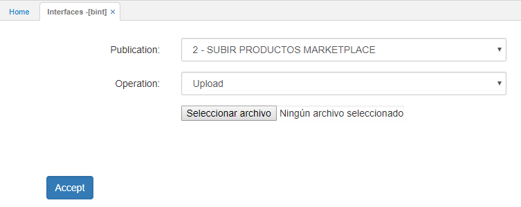
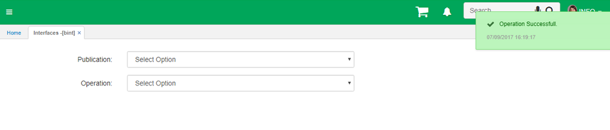
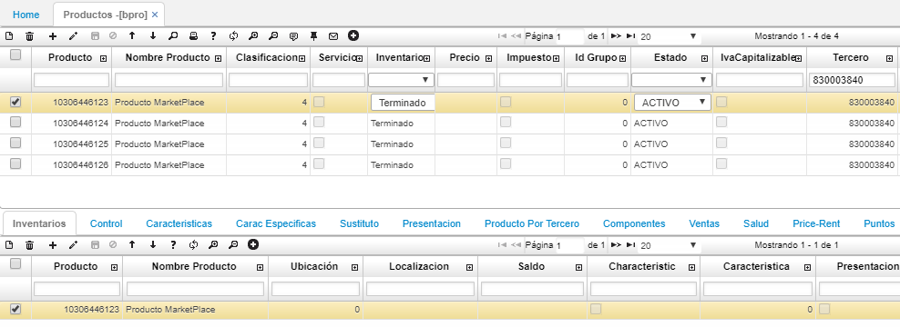
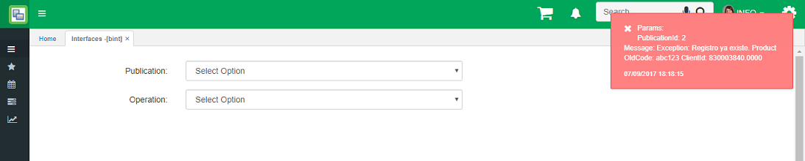

# Subir productos al Marketplace

El propósito de esta funcionalidad es permitir que un cliente pueda subir de forma masiva, a través de la opción **BINT** y un archivo plano, la información básica de los productos que desea ofertar en el MarketPlace de OASISCOM. El archivo deberá contener la información del Código de producto (del cliente), nombre del producto y el código de la clasificación asociada al producto y que debe corresponder al maestro de clasificación que OASISCOM proporcionará.  

### Consideraciones

El sistema, al cargar el archivo, tomará el código de producto que viene en el archivo y lo pondrá como código antiguo del producto definitivo que quedará en el maestro de productos [**BPRO - Productos**](http://docs.oasiscom.com/Operacion/common/bprodu/bpro). OASISCOM asignará de forma automática el código de producto OASIS en el maestro de productos. Los productos cargados al sistema, quedarán asociados con el código de la organización a la cual pertenece el usuario que realiza la carga, y dicho dato estará registrado en el campo _Tercero_ del producto en el maestro de productos.  

### Estructura del archivo

El archivo que el sistema aceptará para la carga masiva de los productos, deberá ser un archivo con extensión TXT y los datos deberán estar separados por coma (,), cumpliendo con la siguiente estructura:  

_Ejemplo:_ 0,Producto MarketPlace,abc123,0,4  

**Dato 1:** Valor fijo en 0.  
**Dato 2:** Nombre del producto. Valor alfanumérico. Longitud máxima de 1000 caracteres.  
**Dato 3:** Código del producto (Proveedor). Valor alfanumérico. Longitud máxima de 30 caracteres.  
**Dato 4:** Valor fijo en 0.  
**Dato 5:** Código de la clasificación asociada al producto. Correspondiente con el maestro de clasificaciones definida por OASISCOM. Valor numérico.  

### Funcionamiento

El usuario deberá ingresar por la aplicación **BINT**, elegir la interfaz correspondiente a la subida de productos para MarketPlace, seleccionar el archivo a subir y ejecutar la interfaz.  

Si el archivo cumple con la estructura y los datos son validos, el sistema mostrará un mensaje de ejecución exitosa.  

Una vez ejecutada la interfaz, los productos cargados desde el archivo se podrán visualizar en el maestro de productos [**BPRO - Productos**](http://docs.oasiscom.com/Operacion/common/bprodu/bpro).

### Validaciones

Si un código de producto que viene en el archivo, para la organización a la que pertenece el usuario que está haciendo la carga de datos, ya se encuentra en el maestro de Productos [**BPRO - Productos**](http://docs.oasiscom.com/Operacion/common/bprodu/bpro), el sistema no cargará la información y mostrará un mensaje de control.  

