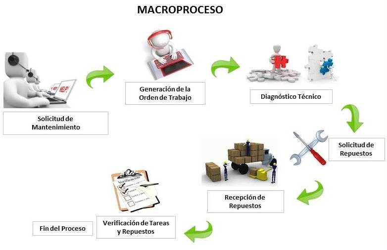

# Servicio

Su objetivo principal es atender las inquietudes y reclamos que hacen los clientes, obteniendo estadísticas de sus causas para tomar los correctivos necesarios.  

Permite el registro de los reclamos que efectúan los clientes, pudiendo generar las devoluciones de productos si es el caso.  

Permite el registro de las llamadas hechas a la línea de Atención al Cliente, incluyendo los motivos, sugerencias e inquietudes, que permitirán identificar el grado de satisfacción de los clientes.  

### Datos básicos

Este módulo está orientado a definir una serie de datos básicos o parámetros necesarios antes de iniciar la operación de atención al cliente. Tales datos se relacionan con los diferentes tipos de reclamos, las causas de garantías, etc.  

### Contac Center

La aplicación de contactos registra las visitas y llamadas que hacen los representantes de venta o vendedor posterior a las ventas para mediar el nivel de satisfacción del cliente. Así mismo permite programar las visitas que deben efectuar los vendedores a sus clientes para la toma de pedidos.  

Además, registra las llamadas que hacen los clientes a una línea de atención al cliente (generalmente gratuita). Estas llamadas se hacen para reclamos, sugerencias, inquietudes, etc. Permite tener estadísticas del comportamiento de los clientes.  

### Ordenes de servicio

La aplicación de llamadas tiene por objeto registrar las solicitudes de servicio realizadas por los clientes, con su respectiva asignación, seguimiento y control de ejecución.  

### Servicio preventivo

La aplicación de preventivo permite la parametrización de las rutinas de mantenimiento preventivo que se deben hacer sobre los equipos, estableciendo las frecuencias y trabajos que deben ser realizados.  

### Help Desk

**Escritorio de Ayuda Interno:** Soporta a los usuarios internos a través de aplicaciones que cubren el manejo y soporte de red, registro y resolución de llamadas, y soporte de clientes internos.  

### Procesos especiales

Tiene como objeto ejecutar una serie de procesos que sirven para mantener el funcionamiento del sistema en cuanto a acumulados, estadísticas, etc.  

### Reportes

La aplicación de reportes tiene como función principal generar una serie de reportes con respecto a la operación del módulo de atención al cliente. Los reportes son del tipo básico y generan información básica y general de acuerdo a las  necesidades de la mayoría de las empresas. Algunos son el resumen de órdenes de servicio, ordenes pendientes, actividades realizadas, tiempos de servicio, evaluación del servicio, etc.  

