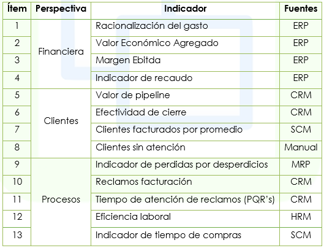

# BSC CUADRO DE MANDO INTEGRAL

Tablero de mando integrado a la solución integral OASIS que incluye el grupo de indicadores definidos por los usuarios tomando los datos directamente desde los procesos de la empresa, de datos externos o alimentados manualmente.  

* Permite la definición de los indicadores, con las metas por periodo, las tendencias, y la fórmula del cálculo.  

* Calcula los valores de los indicadores de acuerdo a la formulación y a la frecuencia del cálculo indicada.  

* Muestra gráficas de los valores históricos de los indicadores, su crecimiento o disminución y el valor en el que se encuentra contra las metas mediante un semáforo.  

La solución tiene las siguientes características generales:

* Indicadores agrupados por temas (cliente, financiero, procesos, producto) Definición de relaciones jerárquicas entre indicadores, y pesos relativos.  

* Definición de metas y márgenes por indicador.  

* Presentación de banderas o alertas comparando el desempeño del indicador vs meta.  
* Valor acumulado (o corrido) del indicador en un periodo de tiempo (trimestral, semestral, anual).  

* Informes estándar para presentar el indicador de acuerdo a los diseños especificados por el sistema de gestión de calidad en CENS.  

* Descripciones, observaciones, y responsables asociados al indicador.  
* Programa de captura para alimentación manual del valor del indicador, cuando aplique.  

* Administración de roles de usuario para acceder a los indicadores (planeador, administrador, consulta).  

* La alimentación manual de indicadores se refiere a aquellos indicadores que no pueden obtenerse del sistema OASIS, y por lo tanto, el sistema permitiría el registro del indicador con opción de digitar manualmente la cifra para cada periodo.  

#### Ejemplo de indicadores

Corresponde a los indicadores del plan estratégico de la compañía. Son los siguientes:

