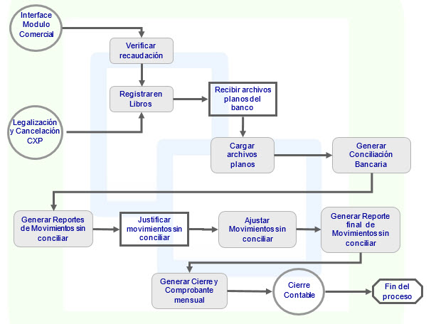
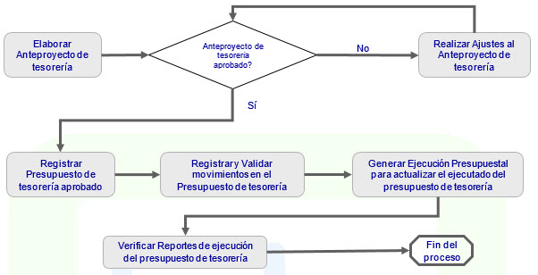

# TESORERÍA

El módulo de tesorería permite las operaciones de flujo de efectivo y optimizar el manejo financiero del efectivo integrados a la operación y objetivos normales de la empresa.  

La integración de los extractos y la conciliación automática posibilitan el control de las operaciones, cálculo y seguimiento del negocio bancario.  

La comunicación con cuentas por pagar y cartera evita la repetición de tareas automatizando la mayoría de los procesos de seguimiento de la tesorería.  

El módulo también agiliza muchas funciones que de otra manera presentarían demoras en todo el proceso. Entre ellas se pueden destacar:  

* Mantiene los saldos de efectivo actualizados con cada uno de los movimientos.  

* Mantiene saldos periódicos para facilitar la labor de la conciliación bancaria.  

* Permite los movimientos principales: recibos de caja y comprobantes de egreso, afectando los correspondientes saldos y módulos (cartera, cuentas por pagar).  

* Permite la inclusión de notas contables de tesorería por los diferentes conceptos que se definan.  

* Facilita el mantenimiento de los cheques recibidos de los clientes, para el control de posfechados y de cheques devueltos.  

* Permite analizar las posibilidades de inversión de los excedentes de efectivo y su ejecución.  

* Mantiene el control de las obligaciones bancarias adquiridas para solucionar los problemas de liquidez y su seguimiento.  

* Permite la ejecución de los cierres periódicos y diarios. Estos permiten la creación de los saldos mensuales y diarios.  

* Realiza el cargue automático de los diferentes movimientos provenientes de otros módulos (ingresos principalmente).  

#### Tesorería en detalle

* Integración con todos los módulos de OASIS ERP  
* Manejo de consecutivo general o por oficina  
* Filtros personalizables para consultar solo la información de interés  
* El usuario final no necesita memorizar el Plan de Cuentas Contables  
* Control de cuentas y movimientos  
* Control de centros de costos  
* Manejo de múltiples monedas  
* Conciliación Bancaria  
* Flujo de efectivo  
* Impresión de Cheques  
* Saldos  
* Movimientos  
* Contabilización automáticamente todos los movimientos bancarios  
* Exportación de datos a Excel  

### Parametrización del módulo

* Permite la parametrización de conceptos personalizables, asignándole a cada concepto la naturaleza, cuenta contable que se afecta, el modulo con el cual interactúa y el valor de la retención.  

* Define los bancos y el formato de archivo con el cual se intercambia información con el banco.  

* Define las cajas y cuentas bancarias que mantiene la empresa, con sus principales atributos.  

### Saldos

* Permite la consulta de los saldos en línea de las cajas y de las cuentas bancarias. Para el control de cajas permite registrar las formas de pago (efectivo, cheque, tarjetas) para el cuadre de estas.  

* Permite consultar los saldos mensuales para el cuadre con contabilidad. Así mismo tiene el registro de saldos diarios.  

* Todos los saldos presentan los movimientos que los afectaron.  

### Movimientos

* Permite el registro de los movimientos (ingresos, egresos y notas contables) que afectan los saldos de tesorería.  

* El sistema registra la contabilización y la forma de pago del movimiento para el control de los cheques.  

* Permite la impresión de los cheques en el formato que la empresa tenga establecido.  

* Permite el pago a proveedores, girando el cheque a un tercero.  

* Permite la anulación o reversión de los movimientos.  

* Ejecuta el cruce con cartera o con cuentas por pagar de las cuentas que se están cancelando con el movimiento.  

### Conciliación

* Facilita la elaboración de la conciliación bancaria (cruce de bancos contra libros).  

* Permite el cargue automático de los estados de cuenta en medio magnético y realiza la conciliación automática de los movimientos que cruzan completamente.  

* Permite la conciliación manual de los documentos con diferencias de números o de fechas.  

* Elabora el reporte de conciliación con todos los movimientos pendientes por conciliar.  

### Inversiones

* Permite el registro de las inversiones que tiene la empresa en certificados y otros títulos.  

* Registra la adquisición o compra de la inversión. Controla la causación de los intereses ganados y cruza contra los cobrados.  

* Permite la consulta de los saldos periódicos y en línea de las inversiones.  

### Obligaciones

* Registra las diferentes obligaciones o préstamos que tiene la empresa en los diferentes intermediarios financieros.  

* Ejecuta la acusación de los intereses por pagar y realiza el cruce contra los pagados.  

* Permite la consulta de los saldos periódicos y en línea de las inversiones.  

### Consultas

Ágil consulta de:  

* Consulta de Movimientos  
* Saldos  
* Saldos por Empresa  
* Saldos por Forma Pago  
* Saldos por Periodo  

Es posible personalizar el contenido de las consultas del sistema para visualizar la información que sea de mayor interés a la empresa.  

### Reportes

Cuenta con gran variedad de reportes para que usted emita. Estos cuentan con filtros y ordenamiento dinámico.  

* Auxiliar de Tesorería  
* Conciliación Bancaria  
* Cheques Girados  
* Conciliación Bancaria  
* Conciliación Bancaria– Extracto Libros No Conciliado  
* Flujo de Fondos  
* Liquidación de Pago  
* Movimientos  
* Movimiento Contable  
* Movimientos Detallados  
* Movimientos por forma de Pago  
* Pagos Detallados  
* Resumen de Movimientos  
* Saldos y Movimientos Diario  
* Saldos y Movimientos  
* Saldos Periódicos  
* Auxiliar por Cuenta  

Tesorería está completamente integrada con OASIS ERP. Esta integración significa que los datos de diversas áreas como contabilidad, cartera y cuentas por pagar entre otras, quedan completamente integrados al sistema, sin tener que duplicar la información o realizar entradas duplicadas de la misma.  Esto permite el control de todas las áreas del proceso contable.  

# Presupuesto de Tesorería - Flujo de Caja

El presupuesto de tesorería es una herramienta flexible mediante la cual podremos ejercer control presupuestario sobre la tesorería real.  

También nos servirá de soporte provisional para mantener actualizada la tesorería a medio plazo.  

El módulo también agiliza muchas funciones que de otra manera presentarían demoras en todo el proceso.  Entre ellas se pueden destacar:  

* Facilita la elaboración, ejecución y control del cumplimiento del presupuesto de tesorería más conocido como el flujo de fondos (cash flow).

* De acuerdo a los estimativos de ventas al contado, más los estimativos de recaudo de cartera se tienen el flujo de ingresos esperado. 

* De la misma forma de acuerdo a las compras y consumos se tienen parte de los egresos, los cuales son complementados con los estimativos de nómina, impuestos, administración, datos que son conocidos históricamente por el flujo de egresos de la empresa.

#### Presupuesto de Tesorería en detalle

* Integración con todos los módulos de OASIS ERP
* Manejo de consecutivo general o por oficina.
* Filtros personalizables para consultar solo la información de interés.
* El usuario final no necesita memorizar el Plan de Cuentas Contables.
* Control de cuentas y movimientos
* Control de centros de costos
* Manejo de múltiples monedas
* Movimientos
* Exportación de datos a Excel

### Parametrización del módulo

* Permite la parametrización de los conceptos que afectan el presupuesto de tesorería, definiendo para cada uno la operación que se ejecutara en el presupuesto y en el ejecutado (sumo o resta).  

* Parametrización de cada cuenta contable y el porcentaje que se le atribuye a la cuenta en el presupuesto.  

### Movimientos

* Permite la elaboración, ejecución y control de los movimientos que afectan el presupuesto contable.  

* Está integrado con el módulo de Tesorería en el cual reportan los movimientos de tesorería, base del presupuesto de tesorería.  
  
  
  

### Consultas

Ágil consulta de:

* Flujo de Fondos
* Detalle de flujo

Es posible personalizar el contenido de las consultas del sistema para visualizar la información que sea de mayor interés a la empresa.  

Presupuesto de Tesorería esta completamente integrada con OASIS ERP. Esta integración significa que los datos de diversas áreas como tesorería entre otras, quedan completamente integrados al sistema, sin tener que duplicar la información o realizar entradas duplicadas de la misma.  Esto permite el control de todas las áreas del proceso contable.  

