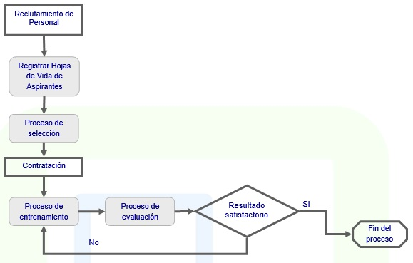

# RECURSOS HUMANOS

La gestión del recurso humano de una compañía, debe ser la oportunidad para la empresa de aprovechar el talento humano con el que cuenta y no convertirse en una carga operativa adicional.  

Recursos Humanos es una solución diseñada para facilitar y controlar la gestión del recurso humano de la compañía, así como la estructura organizacional de la misma.  

El módulo de Recursos Humanos ofrece soluciones a las problemáticas más habituales que se presentan en un departamento de Recursos Humanos entre las que encontramos:  

* Permite el almacenamiento de las hojas de vida de empleados y candidatos, con una información completa de cada persona.

* Permite realizar procesos de selección para ocupar una vacante con las hojas de vida tanto de candidatos como de empleados que se postulen en la búsqueda de una mejor posición. 

* Permite el análisis de cargos definiendo la estructura organizacional de la compañía y los perfiles de cargos con sus respectivas responsabilidades y asignaciones salariales.

* Permite llevar a cabo el proceso de evaluación de cada empleado de acuerdo a su puesto de trabajo y validar el porcentaje de cumplimiento con base en lo definido en el perfil del cargo.

* Permite llevar a cabo procesos de capacitación al interior de la compañía para los empleados.

* Mantiene la información de salud ocupacional y bienestar laboral, complementando así el módulo de recursos humanos con la parte mas sensible de cada uno de los empleados.

#### Recursos humanos en detalle

* Integración con todos los módulos de OASIS ERP.  
* Manejo de consecutivo general o por oficina.  
* Filtros personalizables para consultar solo la información de interés.  
* Gestión optimizada del proceso de contratación, traslado y cese de una persona o un grupo de personas.  
* Seguimiento de información referida a: Información de contacto, formación académica, información médica, nacionalidad, estado civil, empleos anteriores, idiomas entre otras.  
* Gestión de discapacidades y necesidades especiales de cada empleado.  
* Quejas y medidas disciplinares así como felicitaciones o congratulaciones.  
* Gestión de la información contractual.  
* Gestión de la información del puesto.  
* Objetivos, competencias, valoraciones, formación, planes de carrera.  
* Exportación de datos a Excel.  

### Parametrización del módulo

Permite la parametrización de:  

* Tipo de cargo.  
* Tipo de dotación.  
* Tipo de parentesco familiar.  
* Tipo de prueba.  
* Tipo de riesgo laboral.  
* Tipo de eventualidad por salud.  
* Tipo de evento.  
* Tipo de educación.  
* Tipo de evaluación.  
* Tipo de perfiles.  
* Tipo de anotaciones.  
* Tipo de experiencia.  
* Cursos.  
* Competencias.  
* Conceptos.  
* Roles.  

### Expediente

* En este módulo se almacena la información de las diferentes personas que poseen de alguna manera un vínculo con la empresa (aspirantes, temporales, contratistas, empleados, candidatos).  

* Se almacena la información básica de la persona referente a identificación, nombre, estado civil, edad, sexo, fecha de nacimiento y edad, dirección y teléfono entre otros.  

* Se registra la información de la educación de la persona señalando institución donde se educó, fecha de inicio y termino del curso, título obtenido, tipo de educación (Formal / No formal) y créditos obtenidos.  

* Se registra la información de la experiencia laboral de la persona señalando nombre de la empresa, teléfono, tipo de experiencia obtenida, cargo desempeñado, motivo de retiro, fecha de ingreso y de retiro, salario devengado, nombre y cargo del superior y observaciones.  

* Registra la información de las referencias que la persona presenta, nombre, relación, tipo de referencia (personal, familiar, comercial/bancaria), teléfono y observaciones.  

* Almacena la información de la composición familiar de cada empleado especificando nombre, tipo de relación familiar, fecha de nacimiento e identificación.  

* Detalla la dotación que se le ha entregado a cada empleado especificando el tipo de dotación, talla, estado (Entregado, Pendiente, Solicitado), color, cantidad y fecha de entrega.  

* Lleva un registro de amonestaciones y/o congratulaciones para cada empleado.  

* Permite destacar características especiales de la persona definiendo para cada una breve definición o propiedad.  

* Registra las competencias de la persona.  

### Estructura Organizacional

* Registra la definición de cargos estableciendo un orden jerárquico entre los mismos y estableciendo el tipo de cargo, tipo de perfil al que pertenecen y sueldo.  

* Para cada cargo se puede definir el nivel de escolaridad, experiencia laboral, evaluaciones a aplicar, roles que puede desempeñar, pruebas que se aplicaran en el proceso de selección, competencias requeridas y dotación asignada.  

* Registra la definición de posiciones en la compañía por año, estableciendo el cargo, salario presupuestado, salario vigente, tipo de ocupación (Eventual o Permanente), estado de la posición (Ocupada, Vacante o Inactiva), puntaje mínimo en el proceso de selección, y calificación mínima en el proceso de evaluación, partida presupuestal para el caso de entidades oficiales, centro de costo, responsabilidades y funciones inherentes a la posición.  

* Para cada posición también se puede definir competencias adicionales, complementarias a las del cargo.  

### Selección

* Este módulo controla todo lo referente a las necesidades de recurso humano que las diferentes áreas de la empresa requiere.  

* Permite realizar la solicitud de personal para cualquier área de la empresa desde cualquier ubicación.  

* Permite el cargue simultaneo de candidatos y empleados que se postulen al cargo que se oferta en el proceso de selección.  

* Para cada candidato/empleado permite cargar las pruebas que serán incluidas en el proceso de selección, el ente o la persona que realiza la evaluación y el puntaje obtenido en el proceso.  

### Capacitación

* El recurso humano de la compañía debe conocerla a través de programas de inducción, entrenamiento operativo y conceptual a niveles de especializaciones, seminarios internos o externos.  

* Da la facilidad de registrar los diferentes cursos que cada empleado ha tomado en entidades externas o internas de la empresa, fuente básica para la proyección de nuevos cursos, permitiendo el mejoramiento en la labor de cada empleado.  

* Permite realizar la programación de cursos a lo largo del año, estableciendo proveedores, costos, nivel de audiencia y materiales necesarios.  

* Actualiza automáticamente el expediente de cada persona con los cursos que ha tomado en la compañía.  

### Evaluación

* Permite el registro de las evaluaciones de desempeño, evaluaciones por promoción, evaluaciones por periodo de prueba y todas aquellas que las políticas de la empresa solicite.  

* La inclusión de una evaluación dentro del sistema se inicia a partir de una información básica como es la identificación de la persona que sé está evaluando, el periodo de evaluación y el evaluador.   

* Dentro de la evaluación se discrimina una serie de grupos y factores con un determinado peso dentro de la evaluación, además permitirá describir factores cualitativos.  

* Al grupo de factores de evaluación de desempeño se le asocian factores como: presentación personal, conocimientos, calidad del trabajo, puntualidad y todas aquellas que quiera definir la organización.  

### Bienestar Social

* Permite el registro de todos aquellos eventos que la empresa programe pensando en el bienestar de sus empleados como campañas de vacunación, jornadas de donación de sangre, actividades de integración y todas aquellas reuniones que se programen pensados en el beneficio de sus empleados.  

* Permite para cada uno de los eventos establecer un proveedor, costo del evento y listado de asistentes.  

### Salud Ocupacional

* Permite el registro de la historia clínica del empleado como las diferentes visitas del tipo médico, el procedimiento medico aplicado al paciente, su diagnóstico, incapacidades y vinculaciones que de pronto tenga con riesgos profesionales.  

* A partir de estos datos el sistema permitirá la realización de estadísticas de accidentalidad de la empresa.  

### Reportes

Cuenta con gran variedad de reportes para que usted emita. Estos cuentan con filtros y ordenamiento dinámico.  

* Perfiles
* Capacitación de Empleados
* Certificado de Capacitación
* Certificado de Trabajo
* Listado de Uniformes - Cargo
* Dotación de Empleados
* Evaluaciones Detalladas
* Listado de Empleados
* Evaluaciones
* Listado de Dependientes
* Empleados por Ubicación

Recursos Humanos está completamente integrada con OASIS ERP. Esta integración significa que los datos de diversas áreas como nómina, presupuestos, entre otras, quedan completamente integrados al sistema, sin tener que duplicar la información o realizar entradas duplicadas de la misma.  

