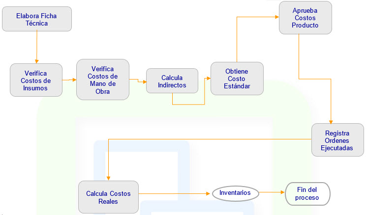

# Costos

Su objetivo general es determinar los costos globales o unitarios de los productos, para ser usados por ejemplo en la fijación de precios.  

* Permite la definición de los elementos del costo, tales como la materia prima, la mano de obra directa y los gastos de fabricación.

* Permite la definición de los costos estándar para su posterior comparación con los costos reales. 

* Permite controlar la variación del costo real con respecto al costo estándar definido.

* Permite discriminar el costo de un producto clasificado por tipo de recurso (mano de obra directa y maquinaría y materias primas).

En general el módulo de costos es el eje de la planeación y control empresarial como apoyo general para cuantificar cifras y datos de producción, así como sirve de soporte para el análisis de rentabilidad del producto.  
  

  
  
### Datos básicos

Este módulo está orientado a definir una serie de datos básicos o parámetros necesarios antes de iniciar la operación de costos. Estos están relacionados con la definición de los diferentes conceptos de costos con la asociación de las cuentas contables, los niveles de distribución de costos indirectos, etc.  

### Costos reales

* Permite el cálculo de los costos reales para cada proceso de producción. Ejecuta el costeo de los productos en proceso, de acuerdo a los parámetros establecidos para este fin (método y sistema). Lleva el auxiliar de producto en proceso registrando las entradas y salidas de productos de la planta y los consumos en la producción.  

* Calcula los costos de la materia prima involucrada en cada uno de los productos, partiendo de los componentes por producto y de la materia prima usada.  

* Distribuye los costos indirectos de fabricación de acuerdo a los parámetros establecidos (prorrateo por participación en el total de la producción, unidades producidas, etc).  

* Calcula los costos finales de cada artículo, con el cual se actualizan las entradas de producción en el sistema de inventarios para el cálculo del costo de ventas y los demás gastos por consumo.  

### Costos estandar

* Permite la definición de los costos estándar para los productos. Estos incluyen la definición de los estándares de materiales requeridos, bajo los criterios de precio y eficiencia.  

* Además incluye la definición de la mano de obra directa requerida con sus costos involucrados.  

* Adicionalmente se definen los estándares de Costos indirectos de fabricación y su distribución para cada producto.  

* Permite realizar los análisis de variaciones (estándar - real) para la investigaciones de las diferencias favorables o desfavorables para la empresa.  

* Para los asientos contables permite la generación de los correspondientes a las variaciones.  

### Procesos especiales

La aplicación de procesos especiales tiene como función realizar una serie de procedimientos que se realizan periódicamente. Estos están relacionados principalmente con los cierres de periodo y la generación de los comprobantes contables.  

### Reportes

La aplicación de reportes tiene como función principal generar una serie de reportes con respecto a la operación del módulo de costos. Los reportes son del tipo básico y generan información general de acuerdo a las  necesidades de la mayoría de las empresas. Algunos son inventario de productos en proceso, costos de materia prima, materia prima usada, costos de producción, gastos indirectos, etc.  

