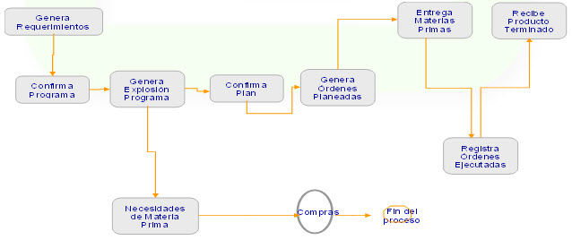

# Producción

Su objetivo es el control de los procesos y recursos de las empresas dedicadas a la manufactura de productos, originados de la transformación de materias primas. Permite la definición de las actividades necesarias para la producción de cada uno de los elementos, así como las materias primas.  

* Permite el registro de las órdenes de producción, ejecuta su seguimiento hasta su finalización.  

* Produce los requerimientos de compra de materias primas al módulo de inventarios.  

* Produce las entregas de producto terminado hacia el módulo de inventarios, llevando un control de los productos entregados y los faltantes por orden de producción.  

* El módulo ha sido desarrollado siguiendo la filosofía MRP II, con algunos conceptos de Justo a Tiempo (JIT).  

**Macroproceso**

### Datos Básicos

Este módulo está orientado a definir una serie de datos básicos o parámetros necesarios antes de iniciar la operación del módulo de producción. Tales datos se relacionan con la definición de Rutas, Estaciones, Líneas de Producción, Actividades, Tipos de Pruebas, etc.  

### Estructura de producto

Su función es la definición de los datos relacionados con la lista de materiales (BOM) de cada uno de los productos que elabora la empresa. Permite la definición a multinivel para la elaboración de los semielaborados.  

Permite la definición de las diferentes actividades involucradas en la producción de cada artículo, con las rutas a seguir y la operación que se debe desarrollar.  

### Plan de producción

Permite el registro del plan maestro de producción (MPS), tomando como punto de partida los requerimientos de producción generados en el sistema de inventarios y en el sistema de ventas con respectos a los presupuestos de facturación.  

Permite la verificación de los requerimientos de capacidad total para estudiar la viabilidad o no del plan, para su modificación y posterior aprobación.  

### Requerimiento de materiales

Tiene como objetivo establecer los requerimientos de materiales (MRP) para la ejecución del plan maestro de producción. Tiene integración directa con los módulos de inventarios y compras para su eficaz planeación.  

Esta planeación se hace partiendo de la explosión de materiales de acuerdo a la estructura establecida para cada producto.  

### Control de Producción

Permite el registro y mantenimientos de las órdenes de producción emitidas en firme, con la validación de los materiales y operaciones involucradas en cada una de ellas.  

Mantiene los diferentes estados en que puede estar cada orden y el plan de producción al cual pertenece. Registra los datos necesarios para establecer una serie de controles de eficiencia como tiempos de arranque, tiempos de parada, operaciones, operarios, etc.  

### Control de calidad

Realiza las operaciones tendientes a alcanzar el grado de calidad exigido por la empresa. Este se desarrolla desde la planeación de las actividades de producción, la ejecución en cada una de las líneas por parte de los operarios de cada estación.  

Permite el registro de las pruebas realizadas a cada una de las muestras escogidas para realizar el control. Mantiene las estadísticas con los resultados de los controles efectuados históricamente.  

### Procesos especiales

La aplicación de procesos especiales tiene como función realizar una serie de procedimientos que se realizan periódicamente  y los cuales deben ser ejecutados con suma atención para evitar daños en los datos. Estos se relacionan con los cierres para la acumulación de estadísticas y control de órdenes de producción y cumplimientos de metas.  

### Reportes

La aplicación de reportes tiene como función principal generar una serie de reportes con respecto a la operación del modulo de producción. Los reportes son del tipo básico y generan información general de acuerdo a las  necesidades de la mayoría de las empresas. Algunos son ejecución de planes de producción, órdenes emitidas, informe de excepciones, desperdicios, órdenes tardías, desempeño de cada estación, etc.  

