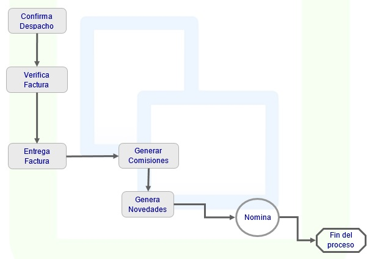

# FACTURACIÓN

Su objetivo es el control de la facturación efectuada por la empresa, y determina las ventas reales, corazón de la empresa, puesto que representa el ingreso proveniente de la ejecución del objetivo social y comercial necesario para la generación de utilidades.  

Las principales características de este módulo corresponden a:

* Permite enfocar los esfuerzos de mercadeo y ventas a sectores específicos con el registro de los clientes y sus características como: segmento comercial, zona, condición de pago, descuentos, entre otras.  

* Permite el control de la facturación por producto, tanto en cantidades como en valores, tanto por periodos (meses) como diarios.  

* Elabora las facturas automáticamente al confirmar las remisiones hechas en el módulo de inventarios o de forma manual en los puntos de venta o centros de facturación.  

* Permite su impresión en diferentes formatos (Pre-impresos, POS y computador).  

* Si se tiene el módulo de cartera genera las correspondientes cuentas por cobrar y actualiza el estado de cuenta del cliente.  

* Controla el cálculo de las comisiones, desde su definición por vendedor, la liquidación y el comportamiento histórico de estas comisiones.  

* Con procedimientos periódicos y anuales el modulo de facturación genera el consolidado de la labor de facturación y la resume en los respectivos comprobantes contables, gracias a que cada uno de los productos tiene definido su régimen tributario (Impuesto a las Ventas), su clasificación de Industria y Comercio, y las cuentas contables del ingreso y del inventario correspondientes, lo que simplifica enormemente la generación de la contabilidad y consolidación de los aspectos contables del estado de resultados como la concerniente a la tributación.  

#### Facturación en detalle

* Integración con todos los módulos de OASIS ERP.
* Manejo de consecutivo general o por oficina.
* Filtros personalizables para consultar solo la información de interés.
* El usuario final no necesita memorizar el Plan de Cuentas Contables.
* Facturación directa (facturas a clientes mostrador o servicios).
* Capacidad de vender y facturar en unidades diferentes a las unidades de compra.
* Control de las unidades vendidas y conversión a la unidad de compra del artículo.
* Gestión de anticipos. Asignación automática o manual de los anticipos.
* Gestión de abonos sobre facturas o sobre devoluciones.
* Facturas directas tanto de artículos de stock como de servicios sin necesidad de un pedido previo.
* Facturas al contado con cobro directo en efectivo.
* Asignación de las fechas de vencimiento y condiciones de pago a documentos en función de la forma de pago con posibilidad de ser modificados.
* Exportación de datos a Excel.

### Parametrización del módulo

* Permite la parametrización de conceptos personalizables, asignándole a cada concepto la naturaleza y cuenta contable que se afecta.  

* Define los tipos de precios, definiendo los tipos de moneda, porcentaje de variación, mínimos y máximos y si debe calcularse IVA para este tipo de precio.  

* Define los motivos para cada concepto y el porcentaje de comisión que a  cada motivo se le puede asignar.  

* Define los planes de comisión y para cada uno de ellos la clase, clasificación, mínimos y máximos de facturación y el porcentaje de comisión.  

### Precios

* Define el listado de precios para cada producto por tipo de precio, parametrizando para cada uno la fecha de vigencia del precio y el valor.

* Permite realizar una parametrización de precios por cliente, para cada producto, definiendo para cada uno porcentaje de descuento, precio, días de entrega, porcentaje de destrozo, calidad, entre otras.

* Parametriza las promociones, definiendo para ellas fechas de inicio y finalización, tipo de precio de la promoción y precio para cada producto.

* Parametriza los descuentos por volumen, definiendo el tipo de precio, producto, cantidad inicial y final y el porcentaje de descuento.

* Parametriza los precios por volumen, definiendo el tipo de precio, producto, fecha de vigencia, cantidad inicial y final y el precio.

### Facturas

* Registro de todos los documentos comerciales que consolidan las ventas de la empresa.

* La facturación se realiza de forma casi automática, si la parametrización del sistema es la adecuada y genera la información concerniente a los demás módulos:

	* Si se tiene el módulo de inventarios activado, descarga automáticamente el inventario.
	* Si se tiene el módulo de cartera, actualiza las cuentas por cobrar en el caso de ventas a crédito.
	* Si las ventas son al contado genera automáticamente el ingreso a la tesorería. 

* La contabilización de las ventas se hace automáticamente y su consolidación depende de las necesidades de la empresa. Puede ser diaria, semanal, mensual o como lo defina el usuario.

* El sistema permite ejecutar consultas interactivas por cualquier parámetro de búsqueda que desee el usuario (Ejemplo: Ventas del Producto X en un rango de fechas, con un descuento superior a 5%).

* Generación de bonificaciones sobre cada factura.

### Comisiones

* Genera la liquidación de comisiones en un rango de fechas, para un plan y/o vendedor.

* Genera la liquidación de bonificaciones para un periodo y un año determinado.

* Consolidación de comisiones y bonificaciones, generando las novedades en nomina para cada vendedor o la cuenta por pagar dependiendo de los procesos internos de la empresa.

### Consultas

Ágil consulta de:

* Consulta de Facturas
* Consulta de Ventas
* Movimiento Contable
* Archivo de Regalías

Es posible personalizar el contenido de las consultas del sistema para visualizar la información que sea de mayor interés a la empresa.  

### Reportes

Cuenta con gran variedad de reportes para que usted emita. Estos cuentan con filtros y ordenamiento dinámico.  

* Listado de Bonificaciones
* Listado de Comisiones
* Listado de Precios
* Facturación Resumida
* Autoretenciones
* Autoretenciones - Producto
* Bonificaciones
* Facturación por Canal
* Costo de Ventas Estándar
* Facturación por Ciudad
* Regalías por Cliente
* Facturación de Contado
* Cubrimiento
* Costo de Ventas
* Facturación Detallada
* Facturación por DIA
* Diario de Ventas
* Facturación Anual
* Facturación por Cliente
* Facturación Detallada
* Facturación por Genérico
* Facturación por Producto
* Facturación Resumida
* Facturación por Ubicación Geográfica, Canal y Genérico
* Facturación por Vendedor
* Facturación por Zona Detallado
* Numeración autorizada
* Facturación por forma de pago
* Precios - Costos
* Facturación Pendiente
* Ranking de Clientes
* Relación de Descuentos
* Regalías
* Resumen de Facturación
* Ranking de Productos
* Resumen por Regional
* Regalías por Ubicación
* Rentabilidad por Cliente
* Rentabilidad por Producto
* Ventas por Clasificación
* Facturación por Vendedor - Detallada
* Cuota Moderadora
* Facturación consolidada por Programa
* Facturación por Programa

Facturación esta completamente integrada con OASIS ERP. Esta integración significa que los datos de diversas áreas como contabilidad, nomina, inventarios, entre otras, quedan completamente integrados al sistema, sin tener que duplicar la información o realizar entradas duplicadas de la misma.  Esto permite el control de todas las áreas del proceso contable.  

