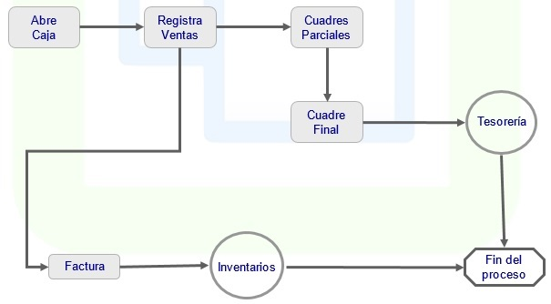

# Punto de Venta - POS

Punto de Venta le permitirá llevar la planeación, ejecución y control  de las operaciones de los puntos de venta, tiendas o almacenes que tiene la empresa para la venta al detalle de productos y servicios a los clientes en general.  

En cada punto de venta el sistema:  

* Permite la definición de la estructura de puntos de venta, su ubicación geográfica, las cajas dentro de cada punto de venta, los supervisores, cajeros y vendedores, así como los productos y servicios que ofrece.  

* El supervisor realiza la apertura de caja al inicio de cada turno, generalmente al iniciar el día, para permitir las operaciones del punto de venta.  

* Permite al cajero el registro de las ventas efectuadas de una forma ágil y segura.  

* Permite dejar las ventas congeladas para la atención de varios clientes al tiempo.  

* Imprime los tiquetes o facturas de venta con el formato definido por la empresa.  

* Mantiene el control de los inventarios de cada punto de venta, con sus correspondientes movimientos (entradas, salidas, traslados).  

* Sugiere las cantidades óptimas de stock de acuerdo a los movimientos históricos.  

* Permite la ejecución de cierres parciales y finales, generando las correspondientes diferencias y ajustes.  

* Permite el arqueo de caja para el cierre de operaciones diarias, registrando los ingresos, consignaciones y egresos elaborados.  

* Facilita las operaciones necesarias para la consolidación con el sistema central, de acuerdo a la plataforma de comunicaciones que se tenga instalada.  

#### Punto de venta en detalle

* Integración con todos los módulos de OASIS ERP.  
* Manejo de consecutivo por punto de venta o por caja.  
* Filtros personalizables para consultar solo la información de interés.  
* Cuadres parciales y cuadres finales.  
* Resumen por forma de pago.  
* Elaboración de cotizaciones en cualquier punto de pago.  
* Manejo de varios turnos al día y de varias cajas por turno.  
* Exportación de datos a Excel.  

### Parametrización del módulo

* Registra los datos de ubicaciones, clientes y productos con una descripción completa de cada uno de ellos.  

* Define el listado de precios para cada producto por tipo de precio, parametrizando para cada uno la fecha de vigencia del precio y el valor.  

* Parametriza las promociones, definiendo para ellas fechas de inicio y finalización, tipo de precio de la promoción y precio para cada producto.  

### Supervisor

* Reúne todas las operaciones que son ejecutadas por el administrador del punto de venta. Estas operaciones son la apertura de las cajas con su respectiva base, la hora de apertura, la hora de cierre, las recogidas de dinero, los cuadres totales y parciales, el control sobre el estado de todas las cajas y las consignaciones o transferencias de dinero entre las cajas.

* Permite manejar los inventarios por punto de venta bajo el concepto de bodega utilizando la tecnología de código de barras.  

* El sistema incluye la funcionalidad de toma de inventarios físicos con la periodicidad que la empresa determine.  

* Así mismo permite llevar el control de las ventas a crédito hechas en los almacenes detallando en todo momento los estados de cuenta por cada cliente.  

* El supervisor puede consultar en cualquier momento el estado de las cajas, sus movimientos y demás información.  

### Cajero

* La función  de esta aplicación es registrar las operaciones efectuadas en la caja.  

* La principal operación son las facturas de venta, en la cual se incluyen los productos y servicios vendidos, los precios, los impuestos, la forma de pago, entre otras.  

* Si la empresa tiene un programa de fidelización o cliente frecuente, se registran los datos del cliente para la acumulación de puntos y su posterior redención.  

* Se registra también el vendedor que efectúa la venta para la liquidación posterior de comisiones y bonificaciones.  

* Permite el registro de los ingresos por cartera o abonos a las ventas a crédito, ya sea por anticipos o por abono a ventas anteriores.  

* El sistema dentro de su esquema de seguridad, valida la caja asignada por medio de una palabra clave y el nombre del usuario, para establecer los datos referentes al punto de venta, caja, fecha y hora de operación.  

### Consultas

Ágil consulta de:  

* Saldos y precios por Ubicación  
* Presupuesto de ventas por Punto de Venta  
* Presupuesto de ventas por Punto de Venta - Producto  
* Presupuesto de ventas Diarias por Punto de Venta  
* Presupuesto de ventas Diarias por Punto de Venta - Producto  
* Créditos  
* Créditos por Periodo  
* Cuadre Parcial  
* Consulta de Movimientos  
* Movimiento Contable  

Es posible personalizar el contenido de las consultas del sistema para visualizar la información que sea de mayor interés a la empresa.  

### Reportes

Cuenta con gran variedad de reportes para que usted emita. Estos cuentan con filtros y ordenamiento dinámico.  

* Resumen de Ventas  
* Ventas por Forma de Pago  
* Resumen de Movimientos  
* Movimientos Detallados  
* Diferencias en Cuadres  
* Resumen Estado de Caja y Movimientos  
* Resumen de Ventas por Tiquete (Factura)  
* Facturación por Canal  
* Listado de Pendientes  
* Cierre diario  
* Facturación Diariaji  
* Facturación detallada  
* Cierre diario por Origen  
* Resumen de Ventas por Vendedor  
* Resumen de Turnos  
* Resumen Facturación por Empresas  

Punto de Venta está completamente integrada con OASIS ERP. Esta integración significa que los datos de diversas áreas como inventarios, cartera, entre otras, quedan completamente integrados al sistema, sin tener que duplicar la información o realizar entradas duplicadas de la misma.  Esto permite el control de todas las áreas del proceso contable.  
