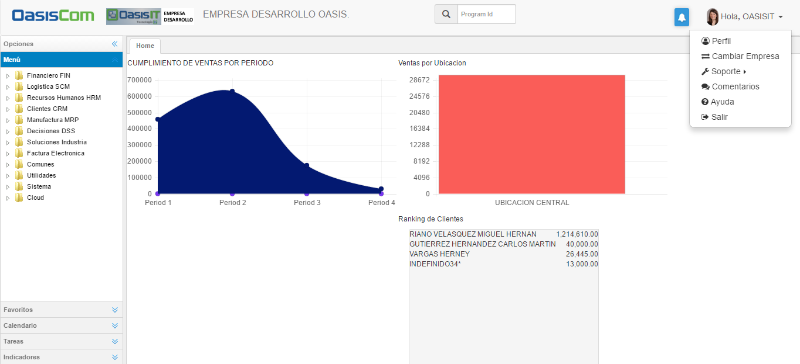
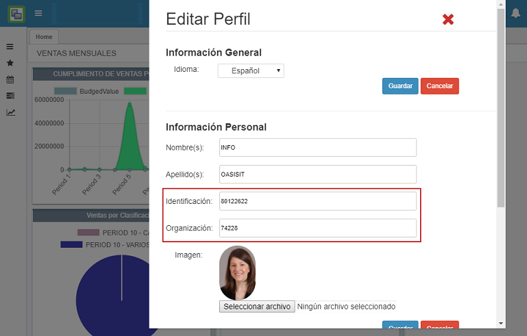
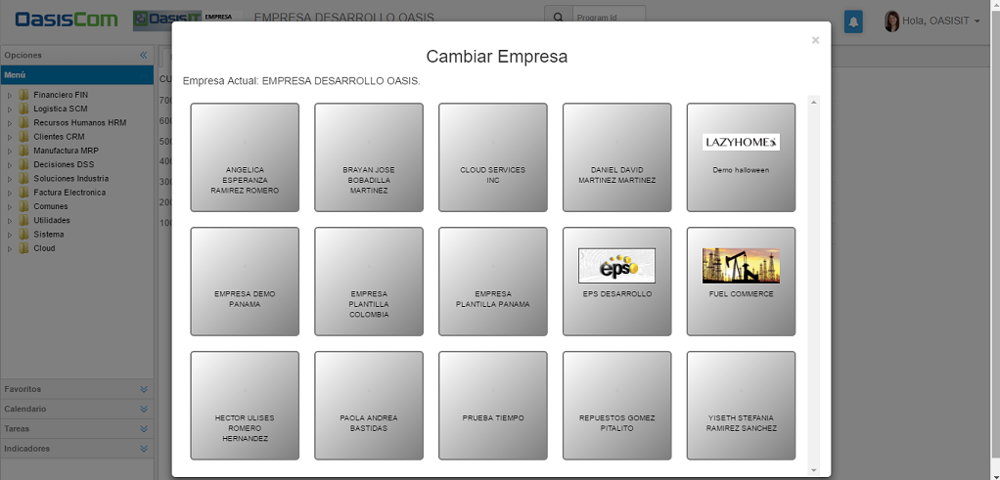
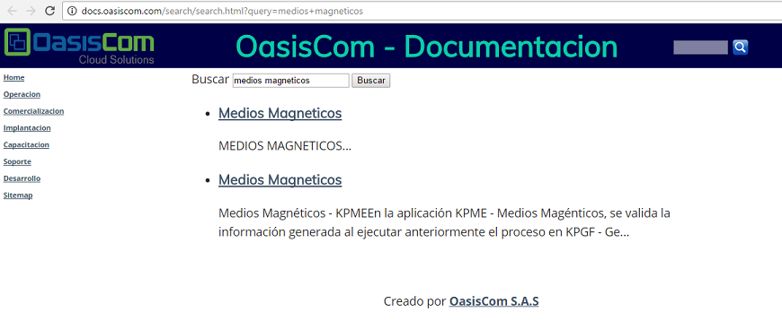

---
layout: default
title: Operacion
permalink: /Operacion/
editable: si
---

# OPERACION

###Menú

OasisCom cuenta con un menú que permite configurar el perfil, cambiar de empresa, solicitar soporte técnico, enviar comentarios, buscar ayuda documental y audiovisual o salir del sistema. Dicho menú se puede ver al dar click en el nombre del usuario.  





#### **Configuración del perfil**  

Al dar click en la opción _Perfil_, el sistema arrojará una ventana en donde se podrá cambiar de idioma, agregar información personal, adjuntar una imagen de perfil y cambiar de contraseña. Por cada cambio realizado se debe dar click en _Guardar_, puesto que, no se permite guardar cambios de manera masiva.  





#### **Cambiar empresa**  

Al dar click en la opción _Cambiar Empresa_, el sistema arrojará una ventana en donde se podrá seleccionar la empresa en la cual se requiere consultar. Bastará con dar click sobre la empresa correspondiente y el sistema se trasladará a ella.  





#### **Soporte**  

Al dar click en la opción _Soporte_, se desplegará una pestaña con dos opciones, _Soporte_ y _Seguimiento_, en la opción _Soporte_ se podrán cargar los casos de fallas que presente el sistema, para entender su funcionamiento ingresar a [**ASOP - Soporte**](https://github.com/OasisCom/Docs/blob/master/Operacion/System/sacceso/asop.md). En la opción _Seguimiento_, se podrá consultar la etapa en la que se encuentra el caso cargado anteriormente en ASOP, para consultar su funcionamiento, ingresar a [**ASEG - Monitoring Cases**](https://github.com/OasisCom/Docs/blob/master/Operacion/System/sacceso/asop.md).  





#### **Comentarios**  

Al dar click en la opción _Comentarios_ se abrirá la aplicación [**APQR - Comentarios**](https://github.com/OasisCom/Docs/blob/master/Operacion/System/sacceso/apqr.md), la cual permite enviar comentarios relacionados al sistema, ya sean, peticiones, quejas, reclamos o felicitaciones.  





#### **Ayuda**  

Al dar click en la opción _Ayuda_, el sistema arrojará un buscador en el cual se puede consultar el tema de inquitud o una aplicación en específico.  





Al consultar, se abrirá una nueva ventana en el navegador con los links que se relacionan a la busqueda.  




