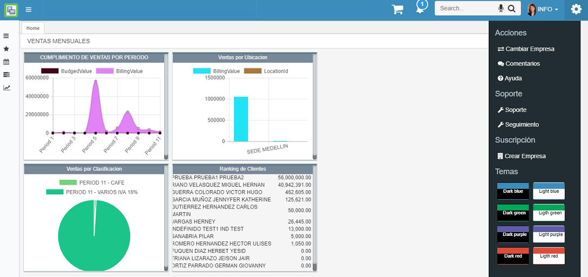
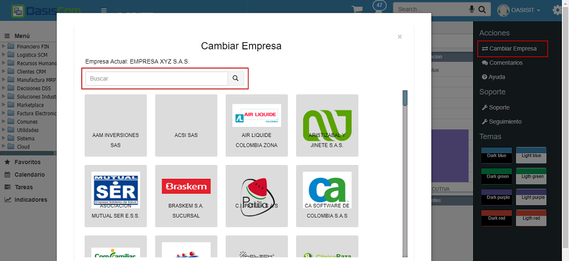
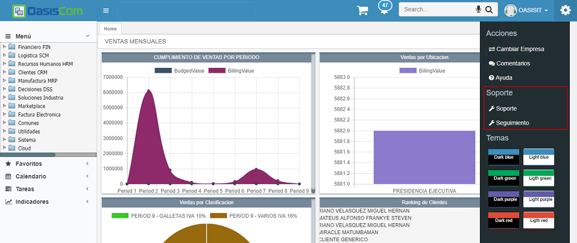
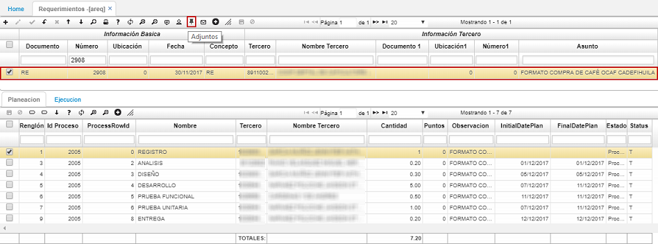
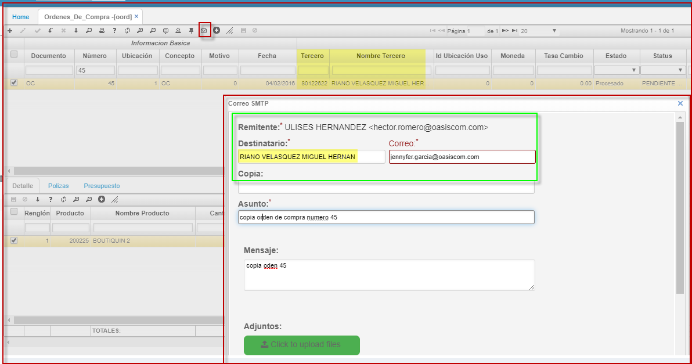
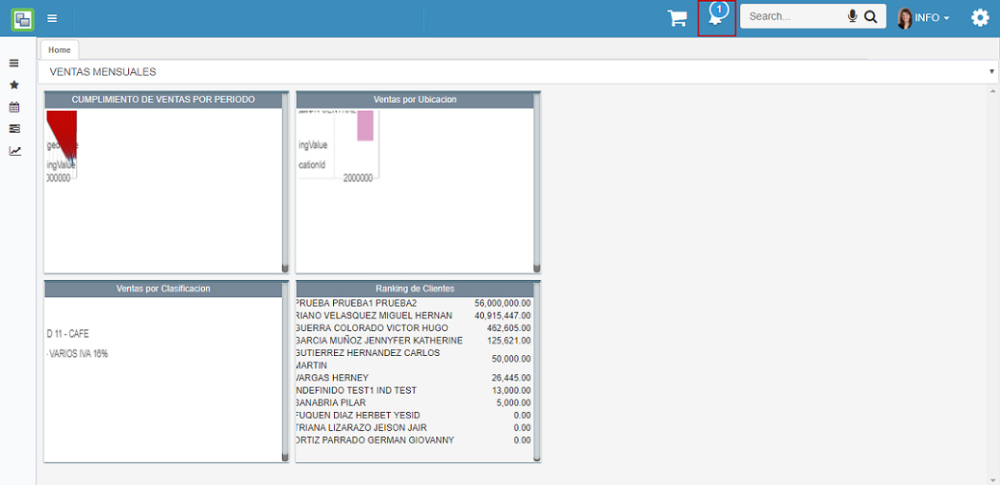
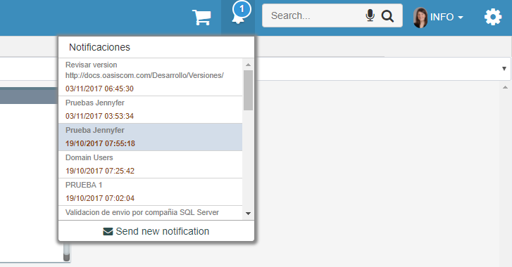

# OPERACIÓN

En esta sección encontrarán los manuales de usuario para cada una de las aplicaciones que tiene el sistema OasisCom.

A continuación se realizará la explicación de la operatividad básica del sistema y las funcionalidades que optimizan la operación sobre el mismo:

## [Registro OasisCom](http://docs.oasiscom.com/Operacion/#registro-oasiscom)

En el explorador de internet se debe ingresar al siguiente link http://app.oasiscom.com/ para acceder a OasisCom

Para ingresar a OasisCom primero debe crear una cuenta como se muestra a continuación:  

**Nombre Usuario:** Correo electrónico.  
**Nombres y Apellidos:** Nombre completo de la persona que se registrará.  
**Contraseña:** Contraseña de su elección.  

Dar clic en registro  

Al dar clic en registro, se abre la siguiente ventana

Se revisa en la Bandeja de Entrada o Spam, el ingreso del correo de verificación enviado desde info_oasis.com.co

Se abre el correo y se da clic al link enviado

Al dar clic en el link, se abre la siguiente pantalla que informa que el registro se ha completado

En la parte superior derecha encontrarás los datos de inicio de sesión a la aplicación “Usuario y contraseña”

Al ingresar tu usuario y contraseña el sistema te enviará al menú principal del sistema de información.

## [Menú](http://docs.oasiscom.com/Operacion/#menú)

OasisCom cuenta con un menú que permite configurar el perfil, crear empresa, cambiar de empresa, solicitar soporte técnico, enviar comentarios, buscar ayuda documental y audiovisual o salir del sistema. Dicho menú se puede ver al dar click en el botón  que seencuentra junto al nombre del usuario.  

La opción _Perfil_ y _Cerrar Sesión_ se podrán ver al dar click en el nombre de usuario.  

#### [**Configuración del perfil**](http://docs.oasiscom.com/Operacion/#configuración-del-perfil)  

Al dar click en la opción _Perfil_, el sistema arrojará una ventana en donde se podrá cambiar de idioma, agregar información personal, adjuntar una imagen de perfil y cambiar de contraseña. Por cada cambio realizado se debe dar click en _Guardar_, puesto que, no se permite guardar cambios de manera masiva.  

Al ingresar la información personal del usuario en sesión, el sistema tomará automáticamente los datos de los campos _Identificación_ y _Organización_ de la aplicación [**SUSU - Usuarios**](http://docs.oasiscom.com/Operacion/system/sacceso/susu) de los campos _Tercero_ y _Organización_.  

En la aplicación [**SUSU - Usuarios**](http://docs.oasiscom.com/Operacion/system/sacceso/susu)  

Al modificar desde el menú de perfil la identificación y la organización, en la opción [**SUSU - Usuarios**](http://docs.oasiscom.com/Operacion/system/sacceso/susu) se actualizarán automáticamente los campos mencionados:  

En la aplicación [**SUSU - Usuarios**](http://docs.oasiscom.com/Operacion/system/sacceso/susu)  

Si se realiza la modificación de estos campos desde la opción [**SUSU - Usuarios**](http://docs.oasiscom.com/Operacion/system/sacceso/susu), el menú de perfil también actualizará automáticamente dichos campos:  

En la aplicación [**SUSU - Usuarios**](http://docs.oasiscom.com/Operacion/system/sacceso/susu)  

En editar perfil.  

#### [**Crear empresa - Suscripción**](http://docs.oasiscom.com/Operacion/#crear-empresa---suscripción)

Al dar click en la opción _Crear empresa_, se desplegará un formulario que se deberá diligenciar para crear una nueva empresa.  

Al diligenciar la información correspondiente y dar click en el botón _Crear_, la aplicación se cargará de nuevo e iniciará sesión automáticamente en la empresa creada.  

Además de realizar la creación de la empresa, el sistema también creará la suscripción de la misma, la cual puede ser validada en la aplicación **SSUS - Suscripciones**. Esta se crea con cantidad de usuarios 1, lo cual lo podemos ver en el campo _Cantidad_.  

Desde la empresa creada, al seleccionar nuevamente el botón  se habilitará la opción de _Suscripción_, la cual se muestra únicamente en la empresa creada y por ende al usuario que la crea, allí el usuario podrá actualizar la suscripción de la empresa creada diligenciando los campos del formulario.  

La suscripción será creada con el **Plan OASISCOM E0** asignado en el campo _Suscripción Actual_ por defecto y con cantidad de usuarios 1.  

Desde esta misma ventana se puede visualizar la pestaña de _Historial de Facturas_, la cual muestra las facturas realizadas por el usuario en esa empresa.  

Si se genera un error, esta pestaña mostrará una alerta como se ve a continuación:  

Cuando el servidor no encuentre datos mostrará el siguiente mensaje:  

Cuando el servidor retorne datos, estos se mostrarán en una tabla como la siguiente:  

#### [**Cambiar empresa**](http://docs.oasiscom.com/Operacion/#cambiar-empresa) 

Al dar click en la opción _Cambiar Empresa_, el sistema arrojará una ventana con todas las empresas que tiene asignadas a su usuario, en dicha ventana se podrá seleccionar la empresa que requiere consultar y el sistema lo trasladará a la misma. En caso de conocer el nombre de la empresa existe un filtro avanzado en la parte superior el cual facilita al usuario la consulta de la empresa, esto se puede realizar por una palabra clave o por el nombre completo de la empresa:

- Filtro con palabra clave:

- Filtro con el nombre completo de la empresa

#### [**Soporte**](http://docs.oasiscom.com/Operacion/#soporte)  

Al dar click en el botón  se podrán ver las opciones _Soporte_ y _Seguimiento_, en la opción _Soporte_ se podrán cargar los casos de las incidencias o consultas presentadas en el sistema, para entender su funcionamiento ingresar a [**ASOP - Soporte**](https://github.com/OasisCom/Docs/blob/master/Operacion/System/sacceso/asop.md). En la opción _Seguimiento_, se podrá consultar la etapa en la que se encuentra el caso cargado anteriormente en ASOP, para consultar su funcionamiento, ingresar a [**ASEG - Monitoring Cases**](https://github.com/OasisCom/Docs/blob/master/Operacion/System/sacceso/asop.md).  

#### [**Comentarios**](http://docs.oasiscom.com/Operacion/#comentarios)  

Al dar click en la opción _Comentarios_ se abrirá la aplicación [**APQR - Comentarios**](https://github.com/OasisCom/Docs/blob/master/Operacion/System/sacceso/apqr.md), la cual permite enviar comentarios relacionados al sistema o a los servicios prestados por Oasis.  

#### [**Ayuda**](http://docs.oasiscom.com/Operacion/#ayuda)  

Al dar click en la opción _Ayuda_, el sistema arrojará un buscador en el cual se puede consultar el tema de inquitud o una aplicación en específico. 

Al consultar, se abrirá una nueva ventana en el navegador con el enlace [http://docs.oasiscom.com](http://docs.oasiscom.com) con los links que se relacionan a la búsqueda realizada, posteriormente, se debe seleccionar el link que requieran consultar, en caso de querer validar más información del sistema o referente a la empresa pueden navegar en el menú de este enlace, allí encontrarán lo siguiente:  

* **Operación:** Manuales de las funcionalidades del sistema.  

* **Comercialización:** Descriptivos de los diferentes módulos del sistema, infografías, listas de precios.  

* **Implantación:** Metodología a utilizar, cómo iniciar una empresa en OasisCom.  

* **Capacitación:** Videos relacionados a las funcionalidades del sistema, talleres o evaluaciones para aumentar la practicidad en el sistema.  

* **Soporte:** Casos frecuentes.  

* **Desarrollo:** Características técnicas, metodología a utilizar, creación de reportes.  

## [Consultas dinámicas](http://docs.oasiscom.com/Operacion/#consultas-din%C3%A1micas)

El botón de _Consultas Dinámicas_ se puede observar en diferentes aplicaciones, este se encuentra en la parte superior o maestro, la apariencia del botón puede variar de acuerdo a las aplicaciones, se puede visualizar así  o .  

Este botón nos permite realizar consultas detalladas sobre el registro seleccionado, se debe seleccionar el registro y dar click en el botón de _consulta dinámica_ y el sistema arrojará un recuadro con la consulta de algunos campos. Para validar algunos ejemplos remitirse a las siguientes aplicaciones [**COPR - Pedidos Retenidos**](http://docs.oasiscom.com/Operacion/erp/cartera/coperacion/copr#consultas-dinámicas), [**VPED - Pedidos**](http://docs.oasiscom.com/Operacion/scm/ventas/vpedido/vped#consultas-dinámicas) y [**GFAC - Facturas**](http://docs.oasiscom.com/Operacion/is/hospital/gfacturacion/gfac#consultas-dinámicas).

## [Traducción de Login de acuerdo al navegador](http://docs.oasiscom.com/Operacion/#traducción-de-login-de-acuerdo-al-navegador)

De acuerdo al idioma que se tenga definido en el navegador de preferencia, al ingresar a OasisCom se mostrará la página de inicio con el idioma correspondiente.  

Se debe tener en cuenta que si el navegador tiene un lenguaje diferente a _Español_, _Inglés_ o _Portugués_, el sistema tomará por defecto el idioma _Inglés_.  

## [Caducidad de Contraseñas](http://docs.oasiscom.com/Operacion/#caducidad-de-contraseñas)

El sistema OASISCOM, solicitará a los usuarios realizar el cambio de sus contraseñas cada cierto tiempo de acuerdo a como se haya definido en las aplicaciones [**SDOM - Dominios**](http://docs.oasiscom.com/Operacion/cloud/sbasica/sdom) y [**SUSU - Usuarios**](http://docs.oasiscom.com/Operacion/system/sacceso/susu).

## [Reconocimiento de Voz](http://docs.oasiscom.com/Operacion/#reconocimiento-de-voz)

En el filtro de búsqueda de aplicaciones se encuentra el icono , el cual permite realizar la búsqueda de diferentes aplicaciones por reconocimiento de voz.  

En algunos navegadores se debe habilitar el micrófono del computador, dado que es un compenente ajeno a la aplicación. Por ejemplo, en Google Chrome.

Una vez habilitado, el micrófono se tornará rojo indicando que está activado para realizar la búsqueda.  

##  [Acceso a programas de Navegación](http://docs.oasiscom.com/Operacion/#acceso-a-programas-de-navegación)

En la parte superior de la aplicación se encuentra el cuadro de texto para ingresar o escribir el nemotécnico del programa al que se desea acceder.  

Los módulos tienen una letra que los identifica, la cual compone el nemotécnico del nombre de la aplicación.  

Contabilidad		-	K  
Distribución		-	D  
Tesorería			-	T  
Nómina				-	N  
Cartera				-	C  
Recursos Humanos	-	R  
Cuentas por pagar 	-	P  
Ventas Cliente		-	A  
Activos fijos		-	H  
Mercadeo			-	A  
Presupuesto 		-	Q  
Producción			-	L  
Asociados 			-	Z  
Costos				-	U  
Ventas Logística	-	V  
Mantenimiento		-	M  
Facturación			-	F  
Básicos				-	B  
Punto de venta		-	J  
Inventarios			-	I  
Compras				-	O  
Salud				-	E  
Importaciones 		-	Y  
Seguridad			-	S

Existen cuatro tipos de ventana, movimientos, básicos, reporte y procesos especiales.  

-	Movimiento: para un nemotécnico de una ventana tipo movimiento, inicia con la letra representativa del módulo seguido de la letra M. Ejemplo: KMOV.  

-	Básicos: para un nemotécnico de una ventana de básicos, inicia con la letra (B) de básicos, seguida del nombre de la aplicación. Ejemplo: BTER Básicos de tercero.  

-	Reporte: para un nemotécnico de una ventana tipo reporte, inicia con la letra representativa del módulo seguida de la letra (R) y por último el nombre de la aplicación. Ejemplo: KRBG Balance General.  

-	Procesos Especiales: para un nemotécnico de una ventana de un proceso especial, inicia con la letra representativa del módulo seguida de la letra (P) y por último el nombre de la aplicación. Ejemplo: KPCR Cierre de resultados.  

## [Filtro de búsqueda](http://docs.oasiscom.com/Operacion/#filtro-de-b%C3%BAsqueda)

El _Filtro de búsqueda_ permite al usuario consultar la aplicación deseada mediante el nemotécnico, el nombre de la aplicación o alguna palabra clave.  

#### **Nemotécnico**

#### **Nombre de la aplicación**

#### **Palabra clave**

Como sea que haya consultado el usuario de acuerdo a las opciones explicadas anteriormente, se ingresará a la opción normalmente, conservando la misma funcionalidad del filtro anterior.  

##  [Maestro - Detalle de los programas](http://docs.oasiscom.com/Operacion/#maestro---detalle-de-los-programas)

Al ingresar a un programa se verán en la parte superior e inferior el maestro y detalle del mismo.  

## [Filtros](http://docs.oasiscom.com/Operacion/#filtros)

Para poder realizar filtros en la aplicación solo debes ubicarte en una de las casillas del maestro y filtras por el campo que necesites.  

En el detalle de las aplicaciones, es posible filtrar la información contenida allí por fecha.  

## [Filtros Avanzados](http://docs.oasiscom.com/Operacion/#filtros-avanzados)

La función de Filtros Avanzados, permite acceder a la información de manera más específica de acuerdo a la necesidad. Esta opción está representada por el botón   

De acuerdo en la aplicación a la cual se ingrese, la función Filtros Avanzados traerá una lista con las opciones de búsqueda, seguidamente, permitirá digitar el dato por el cual se desee filtrar la información. 

En el siguiente ejemplo, ingresaremos a la aplicación BCUE – Cuentas y filtraremos las cuentas contables que inicien por el número 8, esto se realiza agregando el símbolo % (porcentaje) a la derecha del número.  

La función también permite filtrar por fechas, por ejemplo, de una fecha mayor a una fecha menor.  

Si adicional a la fecha, deseamos también filtrar por ubicación, agregamos un nuevo renglón de filtro dando click en el botón 

## [Ordenamiento](http://docs.oasiscom.com/Operacion/#ordenamiento)

En el sistema se puede realizar el ordenamiento en diferentes campos de forma ascendente o descendente, para esto se requiere seleccionar el nombre del campo, cabe resaltar que los campos que son calculados no se pueden ordenar:

- Ascendente (menor a mayor)

- Descendente (mayor a menor)

## [Opciones de Documentos](http://docs.oasiscom.com/Operacion/#opciones-de-documentos)

En las ventanas de los programas hay varias opciones para los documentos como son (crear, consultar, editar, eliminar, refrescar, guardar, etc…).  

El funcionamiento de cada botón es:  

### [Eliminar](http://docs.oasiscom.com/Operacion/#eliminar)

Cuando la ventana es tipo movimiento, el sistema solo permite eliminar el detalle en la aplicación, el registro en el maestro no podrá ser eliminado, puesto que, ya generó un consecutivo según la aplicación. Pero en aplicaciones de tipo de ventana de básicos si permite eliminar el maestro.  

## [Agregar](http://docs.oasiscom.com/Operacion/#agregar)

La funcionalidad permite agregar un nuevo registro en la aplicación.  

Luego de hacer clic en la opción agregar, el sistema nos solicitará toda la información relacionada con el documento.  

### [Guardar](http://docs.oasiscom.com/Operacion/#guardar)

Cuando realicemos una creación o edición de documentos, con éste botón salvamos todos los cambios realizados.  

Al guardar, los documentos quedarán en estado _Activo_ sin ningún color en específico.  

### [Cancelar](http://docs.oasiscom.com/Operacion/#cancelar)

Esta opción la utilizamos cuando por algún motivo NO deseamos guardar un documento o registro en el sistema.  

### [Confirmar o Procesar](http://docs.oasiscom.com/Operacion/#confirmar-o-procesar)

La confirmación de movimientos implica el cambio en el estado del movimiento o comprobante de activo, ha procesado, este cambio de estado realizará las operaciones que dicho movimiento implica, afectación de saldos en: Inventarios, Cuentas por pagar, cartera, entre otras.  

Cuando un documento se encuentre en estado _Procesado_, este se verá de color **verde**.  

### [Reversar](http://docs.oasiscom.com/Operacion/#reversar)

Esta opción permite la corrección de errores en la inclusión de datos, su ejecución vuelve al comprobante o movimiento a estado ACTIVO en el cual se corrigen los errores cometidos para después volver a confirmar dicho comprobante o movimiento.  

### [Anular](http://docs.oasiscom.com/Operacion/#anular)

La opción de anulación permite la cesación de vigencia de un comprobante o movimiento. Un comprobante o movimiento anulado no permite su activación nuevamente, de ser necesario este debe ser elaborado nuevamente a lo cual el sistema le asignará un nuevo consecutivo o número.  

Cada vez que se vaya ejecutar la acción de anulación de un documento, el sistema mostrará un mensaje de confirmación para realizar dicha acción.  

Este proceso también se puede ejecutar en lote, es decir, con más de un registro al tiempo.  

Cuando un documento esté en estado _Anulado_, este se verá de color **rojo**.  

### [Imprimir](http://docs.oasiscom.com/Operacion/#imprimir)

Esta opción permite imprimir la información que se está consultando en el momento.  

### [Imprimir en lote](http://docs.oasiscom.com/Operacion/#imprimir-en-lote)

Es permitido en unas aplicaciones imprimir la información de varios registros desde el maestro de la aplicación con el fin de que se mejorar el proceso y optimizar el tiempo.  

En la siguiente imagen seleccionamos 3 registros para imprimir.  

A continuacion se desplegará una ventana donde confirmará si desea realizar la impresión, en esta ventana le indicará el numero de registros que se van a imprimir.  

Después de dar clic en el botón aceptar, el sistema generará la impresión ya sea en un PDF o directamente seleccionando la impresora para tenerlos de forma física.  

### [Vista Preliminar](http://docs.oasiscom.com/Operacion/#vista-preliminar)

Esta opción permite observar el informe de forma preliminar.  

### [Importar](http://docs.oasiscom.com/Operacion/#importar)

Esta opción permite importar datos generados.  

### [Exportar](http://docs.oasiscom.com/Operacion/#exportar)

Esta opción permite exportar datos a diferentes tipos de archivos.  

### [Refrescar o Actualizar](http://docs.oasiscom.com/Operacion/#refrescar-o-actualizar)

Esta opción permite actualizar la información reflejada en la pantalla con base a lo que esté siendo actualizada y ésta cambia en el momento de la consulta.  

### [Archivo imágenes](http://docs.oasiscom.com/Operacion/#)

OasisCom permite almacenar en algunas aplicaciones imágenes según la naturaleza de la aplicación y la necesidad de los registros, esta opción se encuentra en la columna imagen.  

Al dar clic en “enviar” se abrirá una ventana emergente en la cual se podrá seleccionar el archivo que se desea cargar.  

### [Borrado masivo](http://docs.oasiscom.com/Operacion/#borrado-masivo)

En OasisCom podrá encontrar la opción de realizar un borrado masivo en algunas aplicaciones, esta opción varía dependiendo de la funcionalidad de cada aplicación lo cual permitirá o no realizar el borrado masivo.  

Para realizar el borrado masivo de registros se debe seleccionar dos o más registros.  

Si desea eliminar todos los registros del maestro o del detalle en la parte superior respectivamente, se encuentra un cuadro de Check en el cual al dar clic sobre él seleccionará todos los registros.  

Una vez seleccionados los registros que se desean eliminar, se debe dar clic en el icono de eliminar situado en la barra superior de cada segmento de la aplicación, se recuerda que los iconos de la barra de herramientas del detalle son independientes a los iconos de la barra de los maestros.  

Una vez se da clic en eliminar, aparece una ventana emergente en el cual se confirma la solicitud de eliminar los registros.  

Después de confirmar la acción los registros se eliminaran.  

### [Limpiar consulta](http://docs.oasiscom.com/Operacion/#limpiar-consulta)

Esta función permite limpiar los filtros realizados en las diferentes columnas de la grilla.  

Al  utilizar la  función de limpieza de filtros en el maestro en opciones que contienen Maestro-Detalle, se limpiarán los campos de consulta de este y adicionalmente se limpiaran los registros del detalle. 

### [Adjuntos](http://docs.oasiscom.com/Operacion/#adjuntos)

Esta Función facilita el cargue de archivos para el registro seleccionado.  

Para realizar este proceso:  

1) Se  realiza la selección de un registro y  del botón adjunto.  

2) Luego se visualizará una ventana que permitirá adjuntar documentos.  

3) Se selecciona el botón Elegir archivos y  se escoge el archivo que se desea adjuntar.  

En esta etapa se puede asignar el tipo de adjunto que se desea dar al archivo. 

Los tipos de adjuntos se parametrizan por la aplicación BTAD.  

Y se procede a guardar los cambios, de esta manera el archivo queda adjunto y asociado al renglón seleccionado.  

Nota: El archivo se almacenará con nombre de documento, número de registro y el nombre del archivo.  

### [Visualización de adjuntos](http://docs.oasiscom.com/Operacion/#visualización-de-adjuntos)

Para visualizar un documento adjunto, ingresamos a la aplicación correspondiente y seleccionamos el registro al cual consultaremos los archivos adjuntos, seguidamente, damos click en el botón  (_Adjuntos_).  

Se abrirá una ventana con los documentos adjuntos al registro seleccionado. Para visualizar alguno, damos click sobre el ícono del mismo.  

Finalmente, se abrirá otra página mostrando la información del archivo seleccionado.  

### [Mensajes](http://docs.oasiscom.com/Operacion/#mensajes)

La función Mensajes permite enviar mensajes internos entre usuarios del sistema y visualizar los mensajes no leídos con la aplicación SMEU.  

Para enviar un nuevo mensaje:  

1) Dar clic en Enviar un nuevo mensaje.  

2) El sistema arroja una ventana para escribir el nuevo mensaje, además muestra los campos para diligenciar la información necesaria para su envío. El remitente (From) será el correo electrónico del usuario en sesión, este es tomado por el sistema y no permite ser modificado.  

En el campo destinatario (To) se tienen dos opciones: escribir el correo electrónico al cual se desea enviar el mensaje o dar clic en el botón azul del signo + para seleccionar un contacto del sistema.  

Seguido se encuentra el campo para el Asunto (Subject) y para la descripción del nuevo mensaje. Se finaliza el envío del mensaje dando clic en el botón (Send new message). 

Para visualizar los mensajes no leídos:  

1) Dar clic en mensajes no leídos (Unread messages).  

2) El sistema trae la aplicación SMEU – Mensajes de Usuario en la cual veremos los mensajes no leídos por el usuario en sesión.  

La aplicación nos describe la fecha y hora de llegada del mensaje, el origen, destino, asunto, cuerpo del mensaje y en Read nos indica si el mensaje ya fue leído o no.  

### [Vista Zoom](http://docs.oasiscom.com/Operacion/#vista-zoom)

La función del Zoom muestra una segunda ventana que permite seleccionar un registro de manera más fácil filtrando la búsqueda. Esta función está activa en todas las aplicaciones que contengan campos color azul ya sea en el maestro o en el detalle.  

Para visualizar un Zoom:  

1) Dar doble clic en el campo color azul  

2) Seleccionar registro  

La función permite realizar un filtro para que la búsqueda sea más rápida.  

### [Multiadicionar](http://docs.oasiscom.com/Operacion/#multiadicionar)

La función Multiadicionar muestra una segunda ventana tipo Zoom que permite seleccionar uno o más registros de manera conjunta, también permite filtrar la búsqueda. Esta función está activa en algunas aplicaciones que contengan campos color azul en el detalle.  

Para visualizar la función Multiadicionar:  

1) Dar doble clic en el campo color azul  

2) Seleccionar los registros y dar clic en Accept.  

### [Vista Formulario](http://docs.oasiscom.com/Operacion/#vista-formulario)

La vista Formulario permite agregar un nuevo registro en el maestro de las aplicaciones. Esta función facilita el ingreso de la información, puesto que, se diligencian todos los campos en una sola ventana como un formulario.  

Para agregar un nuevo registro:  

1) Clic en el signo + Agregar nueva fila.  

2) Diligenciar la ventana tipo formulario y dar clic en Guardar.  

3) Registro guardado.  

### [Copy-Paste](http://docs.oasiscom.com/Operacion/#copy-paste)

La función Copy – Paste permite duplicar los renglones seleccionados, asignando el consecutivo correspondiente.  

### [Totales en detalles por consulta general](http://docs.oasiscom.com/Operacion/#totales-en-detalle-por-consulta-general)

La función total en detalles por consulta general permite visualizar la sumatoria de los campos parametrizados para dicha función.  

La función se divide en dos sumatorias. La sumatoria en **Negrita** muestra el valor total por número de cuenta contable y la sumatoria del recuadro, arroja el valor total de todas las cuentas contables anteriormente marcadas con **Negrita**.  

### [Workflow para procesos automáticos](http://docs.oasiscom.com/Operacion/#workflow-para-procesos-automáticos)

La funcionalidad permite realizar workflow en los procesos de forma automática. Un ejemplo es en la aplicación VPED – Pedidos, se define un flujo (por medio de status) por los cuales debe pasar el pedido según el proceso, esto permite no solo controlar los tiempos sobre cada etapa sino informar a los usuarios vía correo electrónico o por medio de tareas pendientes las acciones que requerían de su intervención.  

### [Impresión por lote](http://docs.oasiscom.com/Operacion/#impresión-por-lote)

La función permite seleccionar varios registros e imprimirlos según la parametrización del formato pertinente. Esto también aplica para las opciones que contienen formatos asociados, especialmente para las opciones tipo movimiento (Ventana tipo C).  

1) Ingresar a una aplicación con opciones tipo C (movimientos).  

2) Seleccionar los registros que se desean imprimir y dar clic en el botón Impresión.  

3	Aplicar la configuración deseada para la impresión y dar clic en Imprimir.  

Se puede observar que el sistema adjuntó los registros seleccionados con el detalle correspondiente para realizar la impresión.  

### [Duplicar registro](http://docs.oasiscom.com/Operacion/#duplicar-registro)

La función duplicar registro, permite al seleccionar un registro y dar clic en el botón  , crear otro renglón exactamente igual al seleccionado, evitando volver a digitar toda la información.  

El registro duplicado tendrá un número de consecutivo nuevo, al igual que actualizará la fecha al día en que se realice el duplicado. La información del detalle también será duplicada en el nuevo registro.  

La función Duplicar Registro de igual manera se encuentra disponible en el detalle de las aplicaciones que lo permitan.  

## [Envío de correo electrónico OasisCom](http://docs.oasiscom.com/Operacion/#envío-de-correo-electrónico-oasiscom)

#### **Parametrización**

Para hacer uso del envío de correos electrónicos primero se debe realizar cierta parametrización en las siguientes aplicaciones.  

##### **Empresas (SEMP)**

En la aplicación (SEMP) Empresas, se debe parametrizar el dominio del smtp de servidor de correo que utiliza la compañía y el número de puerto.  

Para realizar dicha parametrización nos dirigimos a los últimos campos de la aplicación (SEMP).  

**Smtp Server**: corresponde al smtp del servidor del correo.  

**Puerto**: número de puerto que utiiza el servidor de correo.  

##### **Perfil (SPER)**

La aplicación (SPER) Perfil, solo arroja la información del usuario con el que se ingresó al sistema OasisCom.  

En el campo _PasswordMail_ se debe diligenciar la contraseña correspondiente al correo electrónico del usuario con el cual se accedió al sistema.  

##### **Envío de correos electrónicos en OasisCom**

OasisCom permite enviar correos electrónicos con los procesos que se estén realizando a diferentes usuarios desde las aplicaciones que tengan habilitado el botón _Send_Email_.  

Como ejemplo, enviaremos una orden de compra mediante un correo electrónico desde la aplicación (OORD) Órdenes de Compra.  

En la aplicación (OORD) seleccionamos el registro que se desea enviar por correo electrónico y damos clic en el botón _Send_Email_ de la barra de herramientas.  

El sistema arrojará una ventana en la cual se deben diligenciar todos los campos necesarios para el envío del correo, el remitente siempre será el usuario con el cual se ingresó al sistema.  

**Destinatario**: Nombre del usuario destinatario, en este caso nombre del tercero al cual se le generó la orden de compra.  

**Correo**: Correo electrónico del usuario destinatario.

**Copia**: si es necesario enviar copia del correo electrónico a varios usuarios, cada correo electrónico debe ser separado por el signo punto y coma (;).  

**Asunto**: Describir el asunto del mensaje que se desea enviar.  

**Mensaje**: Si se requiere se puede escribir un mensaje de acuerdo al proceso que se envía, este campo es opcional.  

**Adjuntos**: si se requiere enviar un documento anexo, damos clic en el botón elegir archivos y seleccionamos el documento que se desea adjuntar.  

El documento seleccionado aparecerá adjunto en la lista Archivos, seguidamente debemos dar clic en el botón Aceptar, confirmando el cargue de los documentos.  

Por último, damos clic en el botón Enviar y el sistema arrojará un mensaje de confirmación.  

Podemos confirmar el envío de la orden de compra y del documento adjunto en el correo destinatario.  

## [Comentarios o notas](http://docs.oasiscom.com/Operacion/#comentarios-o-notas)

En algunas opciones del sistema se podrán ingresar notas o comentarios a los documentos mediante el icono de chat o mensaje que se muestra a continuación, al seleccionar dicho icono se desplegará la siguiente ventana en donde permite ingresar las notas que el usuario desee:

De las misma manera varios usarios podrán realizar diferentes notas sobre el mismo documento y estos se lográn identificar fácilmente dado que en la parte superior de la nota se muestra el usuario.

## [Notificaciones](http://docs.oasiscom.com/Operacion/#notificaciones)

La funcionalidad _Notificaciones_ permite visualizar las notificaciones leídas o no leídas del usuario al igual que en el ícono se verá la cantidad de notificaciones sin leer.  

Al desplegar el listado de notificaciones, se podrán ver todas aquellas que hayan sido recibidas sin importar que estén leídas, estas cargarán en grupos de 10 notificaciones hasta llegar al último mensaje.  

Al hacer click sobre alguna notificación, se desplegará una ventana con la información completa de la notificación. Si el mensaje contiene adjunto un hipervínculo se podrá acceder desde allí mismo.  

Las notificaciones nuevas o no leídas se verán de color azul en el listado y serán desmarcadas luego de hacer click sobre la misma.  

Para enviar un nuevo mensaje, damos click en la opción _Send new nofitication_, allí se desplegará una nueva ventana en donde ingresaremos el correo electrónico del destinatario y el mensaje.  

## [Favoritos](http://docs.oasiscom.com/Operacion/#favoritos)

La funcionalidad _Favoritos_ permite guardar las aplicaciones que el usuario utiliza con mayor frecuencia con le fin de acceder fácilmente.  

Ingresamos a la aplicación que deseamos guardar como favoritos y damos click derecho sobre el nombre.  

Allí nos aparecerán cuatro opciones: Agregar a favoritos, quitar de favoritos, fijar pestaña y quitar pestaña.  

Cuando agregamos una aplicación del sistema a Favoritos, esta se podrá ver en el costado derecho como se muestra en la siguiente imagen.

Para quitar alguna aplicación de la sección de Favoritos, bastará con dar click en la opción _Quitar de Favoritos_.  

## [Fijar Pestañas](http://docs.oasiscom.com/Operacion/#fijar-pestañas)

Esta funcionalidad del sistema permite fijar una pestaña a la ventana de inicio, así cuando el usuario vuelva a iniciar sesión la aplicación se abrirá automáticamente.  

Para quitar alguna aplicación que se haya fijado daremos click en la opción _Quitar pestaña fija_.  

## [Foro](http://docs.oasiscom.com/Operacion/#foro)

En este foro se encuentran diferentes temas de discusión en los cuales se podrán obtener respuesta a varios interrogantes y en caso de dar un aporte al foro también tiene la posibilidad ya sea para plantear una pregunta o dar respuesta de un tema en específico.  

Para ingresar al foro, accedemos al website de OasisCom con la URL [www.oasiscom.com](www.oasiscom.com), nos dirigimos a la pestaña _Soporte_ y seleccionamos la opción **Foro**.  

## [Temas](http://docs.oasiscom.com/Operacion/#temas)

OasisCom cuenta con diferentes temas de personalización de color de la pantalla inicial de la aplicación.  

Algunos ejemplos de los temas son:

## [TaskWorkFlow](http://docs.oasiscom.com/Operacion/#taskworkflow)

La funcionalidad TaskWorkFlow permite ver las actividades pendientes por ejecutar relacionadas a una tarea y las actividades ya ejecutadas de dicha tarea.  

Para acceder a la función TaskWorkflow damos click en el botón  ubicado en la barra de herramientas de la aplicación que la contenga.  

Seguidamente, se mostrará una ventana con dos pestañas, _Pendientes_ y _Ejecutadas_. En la primera pestaña se podrán ver las actividades pendientes por ejecutar de la tarea seleccionada en el maestro de la aplicación, allí se detallará el nombre de la actividad, el usuario asignado a dicha actividad y una pequeña descripción. Igualmente, cuenta con un campo en donde se deberá ingresar el tiempo que se demoró realizando la actividad y otro para detallar lo que se realizó.  

Si la actividad requiere adjuntar algún archivo, se podrá anexar por medio del botón .  

La segunda pestaña permite ver las actividades que ya han sido ejecutadas de la tarea seleccionada.  

## [Acciones sobre columnas](http://docs.oasiscom.com/Operacion/#acciones-sobre-columnas)

Los usuarios pueden realizar las siguientes operaciones sobre los campos que conforman las aplicaciones:

 * Inmovilización de columnas

 * Agrupamiento por campos

 * Ocultar columnas

 * Mover columnas

 * Guardar ajustes de opción

 * Restaurar ajustes de opción

Estas operaciones aplican tanto para encabezados como para el detalle de las aplicaciones.  

#### [Inmovilización de columnas](http://docs.oasiscom.com/Operacion/#inmovilización-de-columnas)

Para inmovilizar una columna, el usuario debe hacer click derecho sobre la etiqueta (nombre) de la misma y seleccionar la opción _Inmovilizar_:  

Al ejecutar esta acción, la columna quedará congelada y al desplazar la barrra hacia la derecha, se moverán los demás campos dejando la seleccionada inmóvil:  

Si se inmoviliza más de una columna, estas se desplazarán al inicio de la tabla como veremos en el siguiente ejemplo con la aplicación **BTER**.  

Se inmoviliza el campo _Tercero_ el cual es el primero de la tabla y posteriormente se inmoviliza el campo _Estado_, situándose este último junto a la columna _Tercero_.  

Se debe tener en cuenta que sobre las columnas inmovilizadas no es posible ejecutar ninguna acción.  

#### [Agrupamiento de columnas](http://docs.oasiscom.com/Operacion/#inmovilización-de-columnas)

Para realizar agrupaciones por columnas se debe dar click derecho sobre la etiqueta (nombre) de la misma y seleccionar la opción _Agrupar Por_:  

En este caso, al agrupar por la columna _Estado_ de la opción **BTER - Terceros**, se visualizará de la siguiente manera:  

Igualmente, será posible agrupar por dos o más campos si así lo requiere el usuario. En este caso se agrupa por las columnas _Estado_, _Tipo Cliente_ y _Tipo de Precio_:  

Tenga en cuenta que las columnas agrupadas no son removidas de la ventana de la aplicación, es decir, la columna agrupada también se mostrará como una columna individual.  

Por ejemplo, al agrupar por la columna _Estado_, este mostrará la agrupación pero el campo seguirá mostrandose:

#### [Ocultar columnas](http://docs.oasiscom.com/Operacion/#inmovilización-de-columnas)

Para ocultar columnas, damos click en el botón _Opciones de columna_ . Este mostrará todos los campos que la componen y las opciones de mover y ocultar los mismos.  

Para ocultar una columna se debe desactivar el flag del campo y este automáticamente desaparecerá de la ventana. El usuario podrá ocultar las columnas que desee.  

**Limitaciones:** No es posible ocultar una columna inmovilizada.  

#### [Mover columnas](http://docs.oasiscom.com/Operacion/#inmovilización-de-columnas)

Para mover columnas, damos click en el botón  y arrastramos el campo hacia arriba o hacia abajo según se desee.  

**¡Importante!:** Al mover una columna que está inmovilizada hacia la derecha, el sistema tomará las columnas a la izquerda de la misma y las inmovilizará de igual manera:  

En el siguiente caso el campo _Tercero_ está inmovilizado y al moverlo hacia la derecha congelará también las columnas que se encuentren a su izquierda:  

Al mover la columna _Tercero_, las demás quedarán inmovilizadas.  

#### [Guardar ajustes de opción](http://docs.oasiscom.com/Operacion/#guardar-ajustes-de-opción)

Para guardar los cambios anteriormente mencionandos, se debe dar click derecho en el nombre de la aplicación y seleccionar del menú la opción _Guardar ajustes de opción_:  

Si se realiza alguna de las opciones anteriormente mencionadas y no se guardan dichos ajustes, al cerrar y abrir la opción o bien, la aplicación OasisCom, estas acciones no serán tenidas en cuenta y no se guardaran los cambios. Adicionalmente, para visualizar los cambios guardados se debe cerrar e ingresar nuevamente a la aplicación.  

#### [Restaurar ajustes de opción](http://docs.oasiscom.com/Operacion/#restaurar-ajustes-de-opción)

Para restaurar los ajustes realizados a una opción, se debe dar click derecho en el nombre de la misma y seleccionar _Restaurar ajustes de opción_:  

Se debe cerrar e ingresar nuevamente a la aplicación OasisCom para evidenciar la restauración de la opción.  

## [Formularios Dinámicos](http://docs.oasiscom.com/Operacion/#formularios-dinámicos)

Los formularios dinámicos se encuentran en el detalle de algunas aplicaciones como por ejemplo, GCON - Consultas o AANA - Análisis de Calidad.  

En la aplicación [**BMOT - Motivos**](http://docs.oasiscom.com/Operacion/common/bsistema/bmot#parametrización-zoom-formularios-dinámicos) podremos ver la parametrización de los zoom.  

En el maestro de la aplicación, se creará un registro del documento a generar y posteriormente, en el detalle, se diligenciará el formulario dinámico.  

Los campos que contiene el formulario son parametrizables, según la necesidad del usuario, en la aplicación [**BMOT - Motivos**](http://docs.oasiscom.com/Operacion/common/bsistema/bmot), así mismo se debe parametrizar el botón _Guardar_.  

Los formularios dinámicos también cuentan con un botón que permite agregar un nuevo bloque al formulario.  

Si se desea eliminar el bloque agregado, damos click en el botón _Borrar_.  

## [Colores en el detalle de acuerdo a la condición](http://docs.oasiscom.com/Operacion/#colores-en-el-detalle-de-acuerdo-a-la-condición)

Esta funcionalidad permite la visualización de los detalles de las opciones con colores de acuerdo a condiciones especiales.  

Ejemplo en la opción **GLAB**:  

En el detalle de esta opción, los registros visualizados en color **Rojo**, indican que el campo _Resultado_ se salen de los rangos establecidos en los campos _Mínimo_ y _Máximo_.  

## [Adjuntos y Comentarios](http://docs.oasiscom.com/Operacion/#adjuntos-y-comentarios)

Se permite la visualización de registros que contienen adjuntos y/o comentarios. En la botonera, cuando un registro tengan alguna de estas dos características (o ambas) los botones se verán resaltados con color azul.  

##### **Comentarios**

##### Adjuntos

