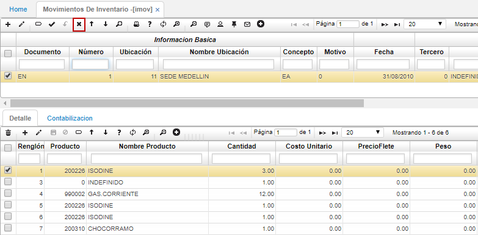

# OPERACION

En esta sección encontrarán los manuales de usuario para cada una de las aplicaciones que tiene el sistema OasisCom.

A continuación se realizará la explicación de la operatividad básica del sistema y las funcionalidades que optimizan la operación sobre el mismo:

## Registro OasisCom

En el explorador de internet se debe ingresar al siguiente link http://app.oasiscom.com/ para acceder a OasisCom

Para ingresar a OasisCom primero debe crear una cuenta como se muestra a continuación:  

**Nombre Usuario:** Correo electrónico  
**Nombres y Apellidos:** Nombre completo de la persona que se registrará  
**Contraseña:** Contraseña de su elección  

Dar clic en registro  

Al dar clic en registro, se abre la siguiente ventana

Se revisa en la Bandeja de Entrada o Spam, el ingreso del correo de verificación enviado desde info_oasis.com.co

Se abre el correo y se da clic al link enviado

Al dar clic en el link, se abre la siguiente pantalla que informa que el registro se ha completado

En la parte superior derecha encontrarás los datos de inicio de sesión a la aplicación “Usuario y contraseña”

Al ingresar tu usuario y contraseña el sistema te enviará al menú principal del sistema de información.

## [Menú](http://docs.oasiscom.com/Operacion/#menú)

OasisCom cuenta con un menú que permite configurar el perfil, cambiar de empresa, solicitar soporte técnico, enviar comentarios, buscar ayuda documental y audiovisual o salir del sistema. Dicho menú se puede ver al dar click en el nombre del usuario.  

#### **Configuración del perfil**  

Al dar click en la opción _Perfil_, el sistema arrojará una ventana en donde se podrá cambiar de idioma, agregar información personal, adjuntar una imagen de perfil y cambiar de contraseña. Por cada cambio realizado se debe dar click en _Guardar_, puesto que, no se permite guardar cambios de manera masiva.  

#### **Cambiar empresa**  

Al dar click en la opción _Cambiar Empresa_, el sistema arrojará una ventana con todas las empresas que tiene asignadas a su usuario, en dicha ventana se podrá seleccionar la empresa que requiere consultar y el sistema lo trasladará a la misma.  

#### **Soporte**  

Al dar click en la opción _Soporte_, se desplegará una pestaña con dos opciones, _Soporte_ y _Seguimiento_, en la opción _Soporte_ se podrán cargar los casos de las incidencias o consultas presentadas en el sistema, para entender su funcionamiento ingresar a [**ASOP - Soporte**](https://github.com/OasisCom/Docs/blob/master/Operacion/System/sacceso/asop.md). En la opción _Seguimiento_, se podrá consultar la etapa en la que se encuentra el caso cargado anteriormente en ASOP, para consultar su funcionamiento, ingresar a [**ASEG - Monitoring Cases**](https://github.com/OasisCom/Docs/blob/master/Operacion/System/sacceso/asop.md).  

#### **Comentarios**  

Al dar click en la opción _Comentarios_ se abrirá la aplicación [**APQR - Comentarios**](https://github.com/OasisCom/Docs/blob/master/Operacion/System/sacceso/apqr.md), la cual permite enviar comentarios relacionados al sistema o a los servicios prestados por Oasis.  

#### **Ayuda**  

Al dar click en la opción _Ayuda_, el sistema arrojará un buscador en el cual se puede consultar el tema de inquitud o una aplicación en específico. 

Al consultar, se abrirá una nueva ventana en el navegador con el enlace [http://docs.oasiscom.com](http://docs.oasiscom.com) con los links que se relacionan a la búsqueda realizada, posteriormente, se debe seleccionar el link que requieran consultar, en caso de querer validar más información del sistema o referente a la empresa pueden navegar en el menú de este enlace, allí encontrarán lo siguiente:  

* **Operación:** Manuales de las funcionalidades del sistema.  

* **Comercialización:** Descriptivos de los diferentes módulos del sistema, infografías, listas de precios.  

* **Implantación:** Metodología a utilizar, cómo iniciar una empresa en OasisCom.  

* **Capacitación:** Videos relacionados a las funcionalidades del sistema, talleres o evaluaciones para aumentar la practicidad en el sistema.  

* **Soporte:** Casos frecuentes.  

* **Desarrollo:** Características técnicas, metodología a utilizar, creación de reportes.  

## [Filtro de búsqueda](http://docs.oasiscom.com/Operacion/#filtro-de-b%C3%BAsqueda)

El _Filtro de búsqueda_ permite al usuario consultar la aplicación deseada mediante el nemotécnico, el nombre de la aplicación o alguna palabra clave.  

#### **Nemotécnico**

#### **Nombre de la aplicación**

#### **Palabra clave**

Como sea que haya consultado el usuario de acuerdo a las opciones explicadas anteriormente, se ingresará a la opción normalmente, conservando la misma funcionalidad del filtro anterior.  

## [Consultas dinámicas](http://docs.oasiscom.com/Operacion/#consultas-din%C3%A1micas)

El botón de _Consultas Dinámicas_ se puede observar en diferentes aplicaciones, este se encuentra en la parte superior o maestro, la apariencia del botón puede variar de acuerdo a las aplicaciones, se puede visualizar así  o .  

Este botón nos permite realizar consultas detalladas sobre el registro seleccionado, se debe seleccionar el registro y dar click en el botón de _consulta dinámica_ y el sistema arrojará un recuadro con la consulta de algunos campos. Para validar algunos ejemplos remitirse a las siguientes aplicaciones [**COPR - Pedidos Retenidos**](http://docs.oasiscom.com/Operacion/erp/cartera/coperacion/copr#consultas-dinámicas), [**VPED - Pedidos**](http://docs.oasiscom.com/Operacion/scm/ventas/vpedido/vped#consultas-dinámicas) y [**GFAC - Facturas**](http://docs.oasiscom.com/Operacion/is/hospital/gfacturacion/gfac#consultas-dinámicas).

## [Traducción de Login de acuerdo al navegador](http://docs.oasiscom.com/Operacion/#traducción-de-login-de-acuerdo-al-navegador)

De acuerdo al idioma que se tenga definido en el navegador de preferencia, al ingresar a OasisCom se mostrará la página de inicio con el idioma correspondiente.  

Se debe tener en cuenta que si el navegador tiene un lenguaje diferente a _Español_, _Inglés_ o _Portugués_, el sistema tomará por defecto el idioma _Inglés_.  

## [Caducidad de Contraseñas](http://docs.oasiscom.com/Operacion/#caducidad-de-contraseñas)

El sistema OASISCOM, solicitará a los usuarios realizar el cambio de sus contraseñas cada cierto tiempo de acuerdo a como se haya definido en la aplicaciones [**SDOM - Dominios**](http://docs.oasiscom.com/Operacion/cloud/sbasica/sdom) y [**SUSU - Usuarios**](http://docs.oasiscom.com/Operacion/system/sacceso/susu).

## [Reconocimiento de Voz](http://docs.oasiscom.com/Operacion/#reconocimiento-de-voz)

En el filtro de búsqueda de aplicaciones se encuentra el icono , el cual permite realizar la búsqueda de diferentes aplicaciones por reconocimiento de voz.  

En algunos navegadores se debe habilitar el micrófono del computador, dado que es un compenente ajeno a la aplicación. Por ejemplo, en Google Chrome.

Una vez habilitado, el micrófono se tornará rojo indicando que está activado para realizar la búsqueda.  

##  Acceso a programas de Navegación

En la parte superior de la aplicación se encuentra el cuadro de texto para ingresar o escribir el nemotécnico del programa al que se desea acceder.

Los módulos tienen una letra que los identifica, la cual compone el nemotécnico del nombre de la aplicación.

Contabilidad		K		Distribución		D
Tesorería			T		Nómina				N
Cartera				C		Recursos Humanos	R
Cuentas por pagar 	P		Ventas Cliente		A
Activos fijos		H		Mercadeo			A
Presupuesto 		Q		Producción			L
Asociados 			Z		Costos				U
Ventas Logística	V		Mantenimiento		M
Facturación			F		Básicos				B
Punto de venta		J		Inventarios			I
Compras				O		Salud				E
Importaciones 		Y		Seguridad			S

Existen cuatro tipos de ventana, movimientos, básicos, reporte y procesos especiales.

-	Movimiento: para un nemotécnico de una ventana tipo movimiento, inicia con la letra representativa del módulo seguido de la letra M. Ejemplo: KMOV.

-	Básicos: para un nemotécnico de una ventana de básicos, inicia con la letra (B) de básicos, seguida del nombre de la aplicación. Ejemplo: BTER Básicos de tercero.

-	Reporte: para un nemotécnico de una ventana tipo reporte, inicia con la letra representativa del módulo seguida de la letra (R) y por último el nombre de la aplicación. Ejemplo: KRBG Balance General.

-	Procesos Especiales: para un nemotécnico de una ventana de un proceso especial, inicia con la letra representativa del módulo seguida de la letra (P) y por último el nombre de la aplicación. Ejemplo: KPCR Cierre de resultados.

## Maestro - Detalle de los programas

Al ingresar a un programa se verán en la parte superior e inferior el maestro y detalle del mismo.

## Filtros

Para poder realizar filtros en la aplicación solo debes ubicarte en una de las casillas del maestro y filtras por el campo que necesites.

## Filtros avanzados

La función de Filtros Avanzados, permite acceder a la información de manera más específica de acuerdo a la necesidad. Esta opción está representada por el botón 

De acuerdo en la aplicación a la cual se ingrese, la función Filtros Avanzados traerá una lista con las opciones de búsqueda, seguidamente, permitirá digitar el dato por el cual se desee filtrar la información. 

En el siguiente ejemplo, ingresaremos a la aplicación BCUE – Cuentas y filtraremos las cuentas contables que inicien por el número 8, esto se realiza agregando el símbolo % (porcentaje) a la derecha del número.

La función también permite filtrar por fechas, por ejemplo, de una fecha mayor a una fecha menor.

Si adicional a la fecha, deseamos también filtrar por ubicación, agregamos un nuevo renglón de filtro dando click en el botón 

## Opciones de documentos

En las ventanas de los programas hay varias opciones para los documentos como son (crear, consultar, editar, eliminar, refrescar, guardar, etc…) estas opciones también están.

El funcionamiento de cada botón es:

**Eliminar**

Cuando la ventana es tipo movimiento, el sistema solo permite eliminar el detalle en la aplicación, el registro en el maestro no podrá ser eliminado, puesto que, ya generó un consecutivo según la aplicación. Pero en aplicaciones de tipo de ventana de básicos si permite eliminar el maestro.

## Agregar

La funcionalidad permite agregar un nuevo registro en la aplicación.

Luego de hacer clic en la opción agregar, el sistema nos solicitará toda la información relacionada con el documento.

**Guardar**

Cuando realicemos una creación o edición de documentos, con éste botón salvamos todos los cambios realizados.

**Cancelar**

Esta opción la utilizamos cuando por algún motivo NO deseamos guardar un documento o registro en el sistema.

**Confirmar o Procesar**

La confirmación de movimientos implica el cambio en el estado del movimiento o comprobante de activo, ha procesado, este cambio de estado realizará las operaciones que dicho movimiento implica, afectación de saldos en: Inventarios, Cuentas por pagar, cartera, entre otras.

**Reversar**

Esta opción permite la corrección de errores en la inclusión de datos, su ejecución vuelve al comprobante o movimiento a estado ACTIVO en el cual se corrigen los errores cometidos para después volver a confirmar dicho comprobante o movimiento.

**Anular**

La opción de anulación permite la cesación de vigencia de un comprobante o movimiento. Un comprobante o movimiento anulado no permite su activación nuevamente, de ser necesario este debe ser elaborado nuevamente a lo cual el sistema le asignará un nuevo consecutivo o número.

