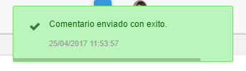

## Comentarios - APQR

OasisCom permite a los clientes enviar comentarios relacionados al sistema o a los servicios prestados por Oasis. Estos comentarios serán leídos por técnicos de OasisCom con el fin de dar una respuesta a la situación que se presente.  

Recuerda que en esta aplicación debes diligenciar comentarios respecto al sistema o servicios ofrecidos por OasisCom, pero no incidencias para reportar, dado que estas se deben registrar desde la aplicación [**ASOP - Soporte**](https://github.com/OasisCom/Docs/blob/master/Operacion/System/sacceso/asop.md) para dar el respectivo tratamiento.  

Para enviar un comentario nos dirigimos al nombre de usuario ubicado en la parte superior derecha de la pantalla y damos click, se desplegará un menú en donde seleccionaremos la opción _Comentarios_.  

Al dar click en la opción _Comentarios_ el sistema abrirá la aplicación **APQR** en donde se deberá indicar un asunto y una descripción del comentario que se desea enviar.  

Diligenciado el asunto y la descripción, enviamos el comentario dando click en el botón . El sistema arrojará un mensaje indicando que el comentario ha sido enviado con éxito.  

