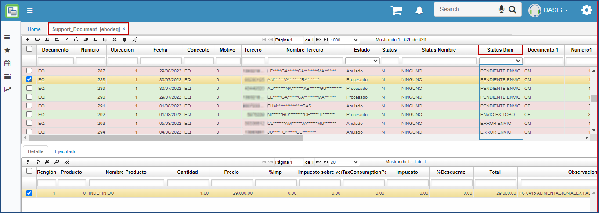
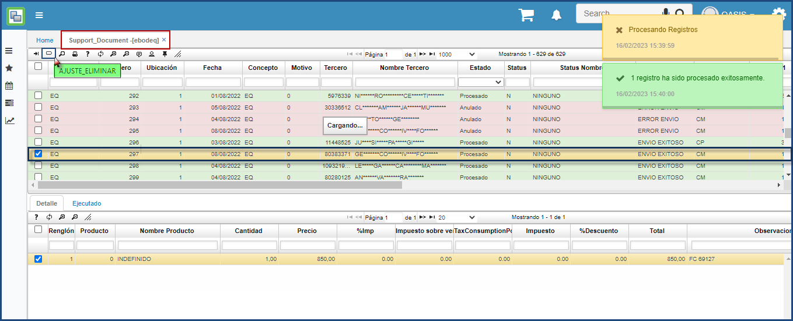

**Contenido Documento Soporte**  

* [EBODEQ - Documento Soporte](http://docs.oasiscom.com/Operacion/cloud/Documento_Soporte/#ebodeq-documento-soporte)  
* [Nota de Ajuste para caja menor](http://docs.oasiscom.com/Operacion/cloud/Documento_Soporte/#nota-de-ajuste-para-caja-menor)  
* [Integración de Documento Soporte con OasisCom](http://docs.oasiscom.com/Operacion/cloud/Documento_Soporte/#integración-de-documento-soporte-con-oasiscom)  
    * [Archivo XML](http://docs.oasiscom.com/Operacion/cloud/Documento_Soporte/archivo-xml) 

* [Manual Documento Soporte (descargar)](http://docs.oasiscom.com/Operacion/cloud/Documento_Soporte/documentos-soportes.pdf)  
* [Diccionario Datos Documento Soporte (descargar)](http://docs.oasiscom.com/Operacion/cloud/Documento_Soporte/DiccionarioDatos_DS.pdf)

---
## [EBODEQ - Documento Soporte](http://docs.oasiscom.com/Operacion/cloud/Documento_Soporte/#ebodeq-documento-soporte) 

Esta aplicación contiene los documentos electronicos emitidos a la DIAN a nivel de documento soporte, permite observar el estado de los documentos a nivel de la DIAN “Envio Exitoso, Pendiente de Envio o Error de envio”

La función del botón Ajuste_Eliminar es generar una nota de ajuste, donde la nota de ajuste tiene como propósito corregir información errónea en un documento soporte con estado envio exitoso a la DIAN. Esta nota de ajuste documento NQ por Concepto NX tendrá efecto en la información reportada en la DIAN mas no en la registrada contablemente en OasisCom.
Ejemplo en la imagen se selecciona el documento Soporte EQ - 297 

La nota de ajuste generada automáticamente se puede consultar por documento NQ – Nota de ajuste por Concepto NX. En la imagen se observa la nota de ajuste NQ – 5 referenciando el documento soporte EQ – 297

## [Nota de Ajuste para caja menor](http://docs.oasiscom.com/http://docs.oasiscom.com/Operacion/cloud/Documento_Soporte/#nota-de-ajuste-para-caja-menor)

Para realizar una nota de ajuste del documento soporte, primero se debe iniciar desde el aplicativo *pmov- Movimientos*, se crea un nuevo registro con documento (NB) *nota debido cuenta por pagar* en el Campo DocDoccumento se diligencia CM – Caja menor y Numero del registro de la Caja Mejor para este caso el (1847) creado desde la aplicación [TMEN – Caja Menor](https://docs.oasiscom.com/Operacion/erp/tesoreria/tmovimient/tmen)

Se debe crear con el documento NB y concepto NB (Nota debito cuenta por pagar), de acuerdo con el tercero al cual se debe realizar la nota de ajuste.

Una vez creado el tercero, se verifica que información se quiere ajustar, se ingresa a la aplicación [TMEN – Caja Menor](https://docs.oasiscom.com/Operacion/erp/tesoreria/tmovimient/tmen) consultando por documento CM, Numero (1847) para este ejemplo. En el detalle se visualiza la información que se quiere ajustar.

Esta información es la que se debe agregar en el aplicativo *pmov – Movimientos* documento (NB) *nota debido cuenta por pagar*, en el detalle se adiciona la información con los tipos de naturaleza, valores, nombre del tercero y centro de cotos, solicitados en la nota de ajuste.

Una vez ingresados los valores requeridos se procesa la nota de ajuste en el aplicativo *pmov – Movimientos* 

Procesada la información en el *pmov – Movimientos*, se valida en el aplicativo *Ebodeq – Documentos Soporte* la creación del documento NQ (nota de ajuste del documento soporte) en estado *procesado*.

## [Integración de Documento Soporte con OasisCom](http://docs.oasiscom.com/http://docs.oasiscom.com/Operacion/cloud/Documento_Soporte/#integración-de-documento-soporte-con-oasiscom)

### [Archivo XML](http://docs.oasiscom.com/http://docs.oasiscom.com/Operacion/cloud/Documento_Soporte/#archivo-xml)
Mediante archivo XML el cliente puede subir documentos soporte a la plataforma de OasisCom. 

**Estructura**

