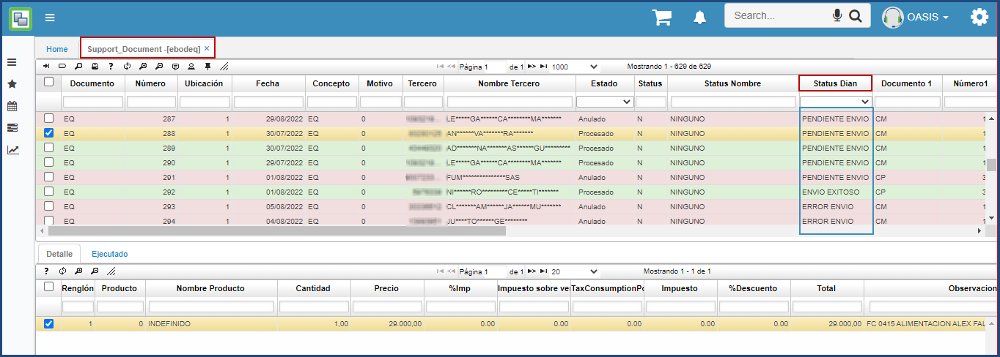
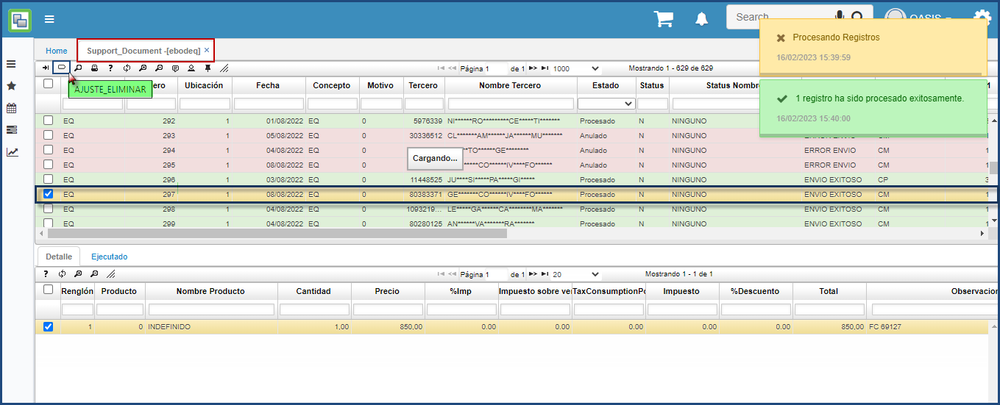
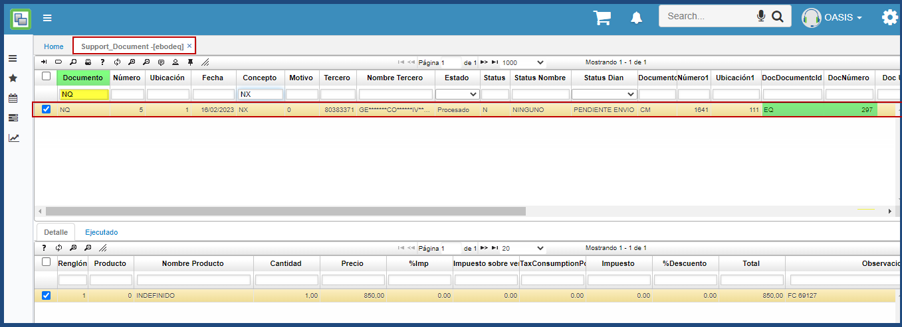

**EBODEQ - DOCUMENTO SOPORTE**

Esta aplicación contiene los documentos electronicos emitidos a la DIAN a nivel de documento soporte, permite observar el estado de los documentos a nivel de la DIAN “Envio Exitoso, Pendiente de Envio o Error de envio”

La función del botón Ajuste_Eliminar es generar una nota de ajuste, donde la nota de ajuste tiene como propósito corregir información errónea en un documento soporte con estado envio exitoso a la DIAN. Esta nota de ajuste documento NQ por Concepto NX tendrá efecto en la información reportada en la DIAN mas no en la registrada contablemente en OasisCom.
Ejemplo en la imagen se selecciona el documento Soporte EQ - 297 

La nota de ajuste generada automáticamente se puede consultar por documento NQ – Nota de ajuste por Concepto NX. En la imagen se observa la nota de ajuste NQ – 5 referenciando el documento soporte EQ – 297

