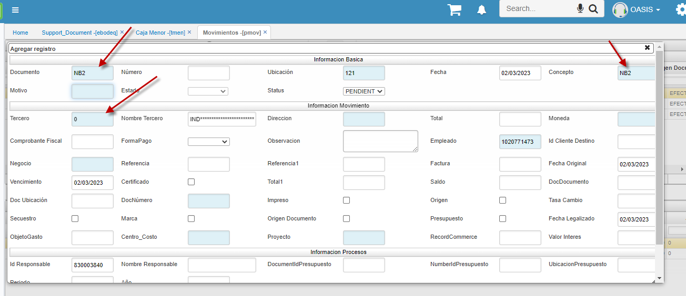
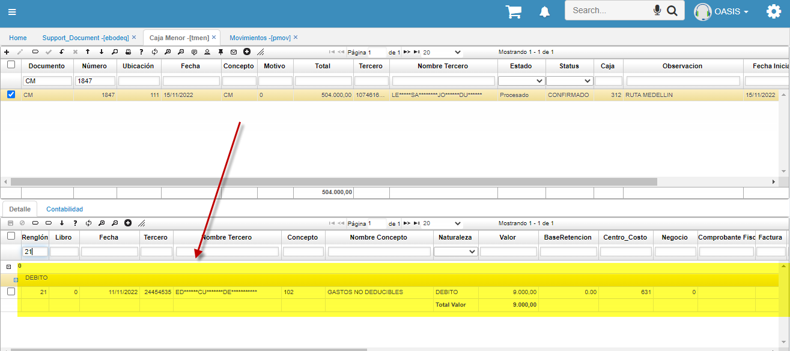
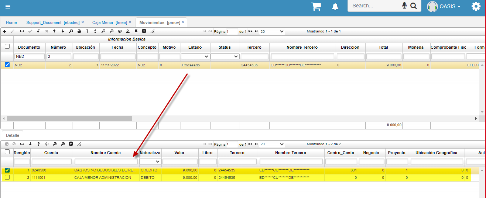
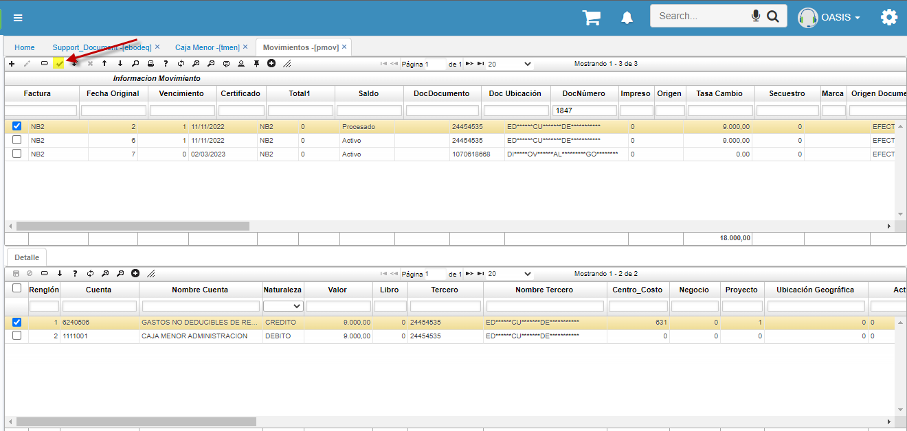
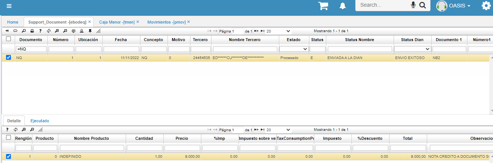
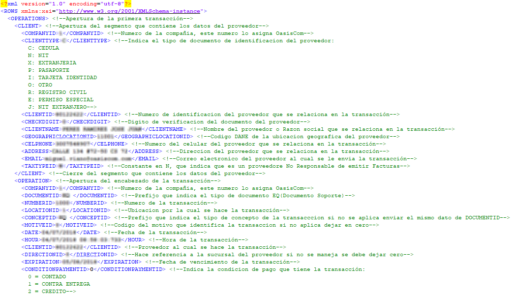

**EBODEQ - DOCUMENTO SOPORTE**

Esta aplicación contiene los documentos electronicos emitidos a la DIAN a nivel de documento soporte, permite observar el estado de los documentos a nivel de la DIAN “Envio Exitoso, Pendiente de Envio o Error de envio”

La función del botón Ajuste_Eliminar es generar una nota de ajuste, donde la nota de ajuste tiene como propósito corregir información errónea en un documento soporte con estado envio exitoso a la DIAN. Esta nota de ajuste documento NQ por Concepto NX tendrá efecto en la información reportada en la DIAN mas no en la registrada contablemente en OasisCom.
Ejemplo en la imagen se selecciona el documento Soporte EQ - 297 

La nota de ajuste generada automáticamente se puede consultar por documento NQ – Nota de ajuste por Concepto NX. En la imagen se observa la nota de ajuste NQ – 5 referenciando el documento soporte EQ – 297

**DEVOLUCION - DOCUMENTO SOPORTE**

Para realizar una devolución del documento soporte, primero se debe iniciar desde el aplicativo *pmov- Movimientos*

Se debe crear con el documento NB2 y concepto NB2, de acuerdo con el tercero que se requiere realizar la devolución.

Una vez creado el tercero, se debe validar que información es la que se quiere devolver, y esta información se ve reflejada en el aplicativo *tmen - Caja Menor* en el apartado del detalle, cómo se puede observar a continuación:

Esta información es la que se debe agregar en la NB2, que se creó en el aplicativo *pmov – Movimientos*, con los tipos de naturaleza, valores, nombre del tercero y centro de cotos, solicitados en su devolución.

Una vez ingresados los valores requeridos se procesa el *pmov – Movimientos* 

Procesada la información en el *pmov – Movimientos*, se valida en el aplicativo *Ebodeq – Documentos Soporte* la creación del documento NQ de la devolución realizada con estado procesado, cómo se evidencia a continuación

La devolución con documento NQ debe estar referenciada con el documento soporte EQ – 499 para este caso

