**Menú**  

[Integración de Nómina Electrónica con OasisCom](http://docs.oasiscom.com/Operacion/cloud/nominaelectronica#integración-de-nómina-electrónica-con-oasiscom)
* [Archivo XML](http://docs.oasiscom.com/Operacion/cloud/nominaelectronica#archivo-xml)   
* [Archivo Plano](http://docs.oasiscom.com/Operacion/cloud/nominaelectronica#archivo-plano)  

[Diccionario Nómina electrónica (descargar)](http://docs.oasiscom.com/Operacion/cloud/nominaelectronicadiccionariodatos-conceptos-XML-v5u.xlsx)  

---

## [Integración de Nómina Electrónica con OasisCom](http://docs.oasiscom.com/Operacion/cloud/nominaelectronica#integración-de-nómina-electrónica-con-oasiscom)
### [Archivo XML](http://docs.oasiscom.com/Operacion/cloud/nominaelectronica#archivo-xml)   

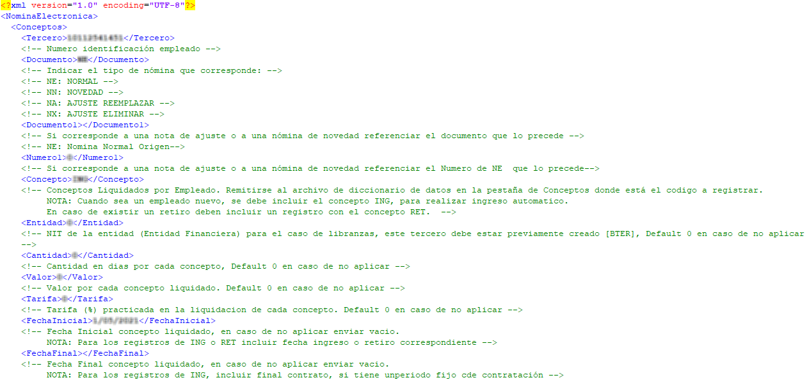
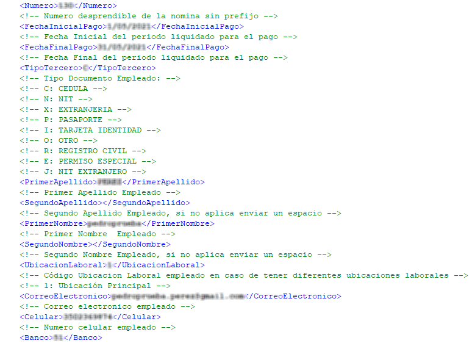
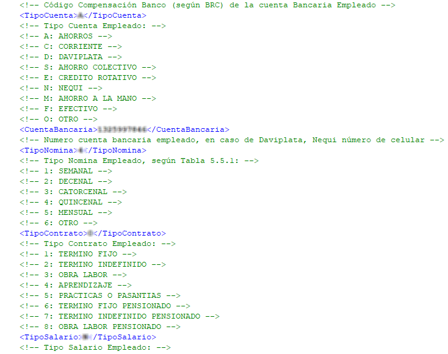
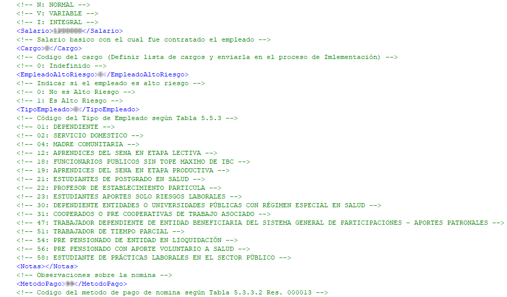
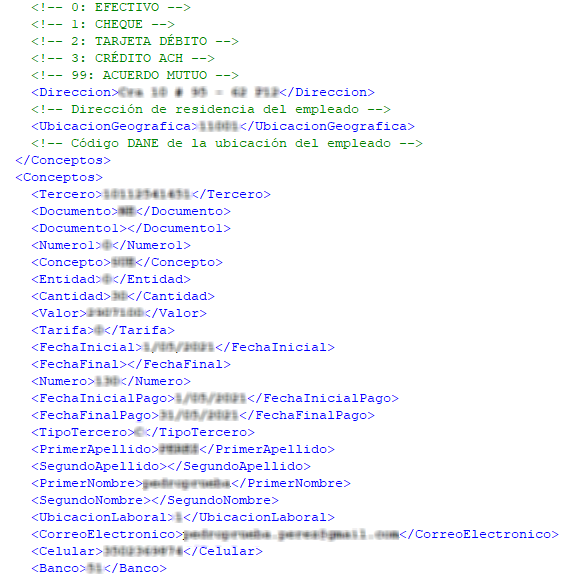
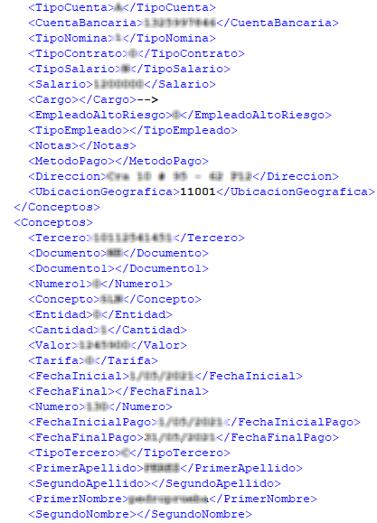
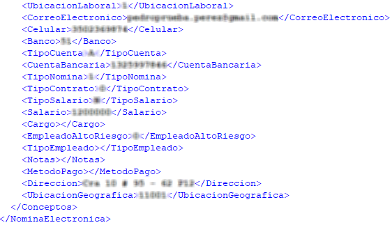

Estructura XML [descargar.](http://docs.oasiscom.com/Operacion/cloud/NominaElectronica/Estructura_XML_v8.xml) 

### [Archivo Plano](http://docs.oasiscom.com/Operacion/cloud/nominaelectronica#archivo-plano) 

Cuando no se cuenta con una estructura en formato XML, OasisCom provee una estructura en formato de archivo plano el cual puede ser cargado de forma manual a la plataforma de OasisCom por medio de la aplicación **BINT - Interfaces o por medio del consumo de servicio web.**

**Nota:** al cargar el archivo plano, el sistema creará los terceros y contratos en caso de que no existan previamente.

La estructura enviada por OasisCom cuenta con comentarios en cada campo para facilitar su diligenciamiento, también puede consultar el diccionario de datos para validar los valores y formatos sobre cada campo.

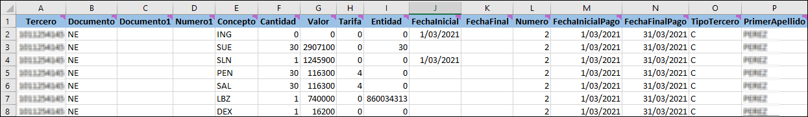
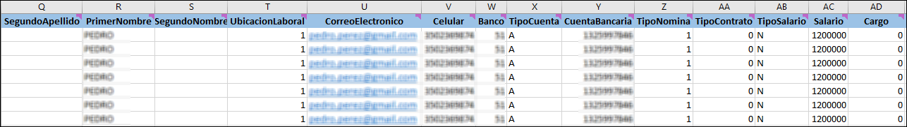
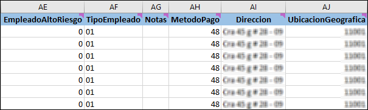

Para convertir el archivo en formato **.CVS** vamos a _Archivo  Guardar como  Elegimos una ubicación  Asignamos un nombre  Tipo: CSV (delimitado por comas)  Guardar_.   

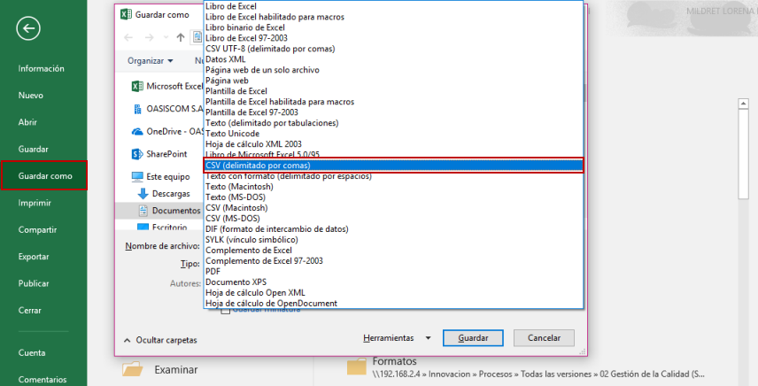

Una vez guardado, se ingresa a la aplicación *Interfaces - BINT,* se selecciona la publicación *995 (CARGA PLANO NE)*, se selecciona el archivo que se guardó en *.CSV* y se da clic en Aceptar y Ejecutar.

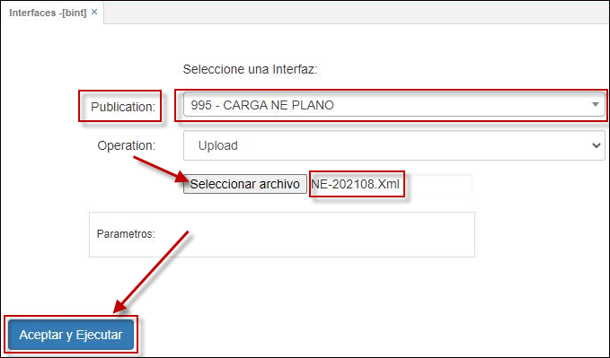

Estructura Archivo Plano [descargar](http://docs.oasiscom.com/Operacion/cloud/NominaElectronica/PlanoNE.xlsx) 