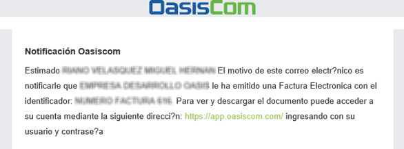
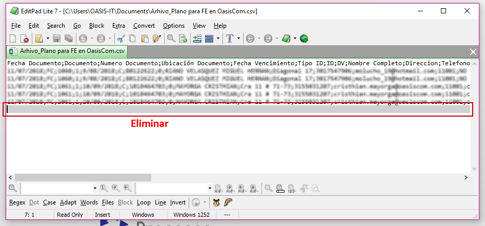
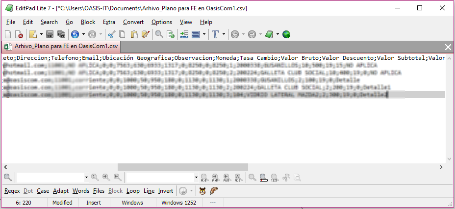
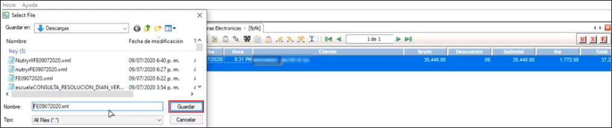
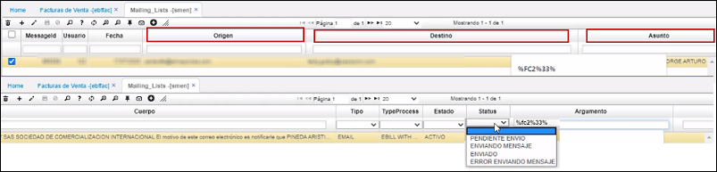
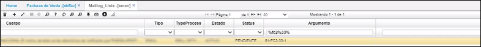
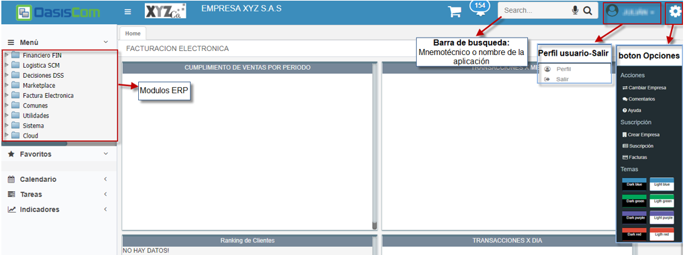
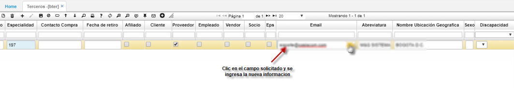

# Factura  Electrónica  

**Menú**  

1. [Correo Factura Electrónica](#correo-factura-electrónica)  
2. [Código QR](#código-qr)  
3. [Adjuntos en la factura electrónica](#adjuntos-en-la-factura-electrónica)  
4. [Integración de factura electronica con OasisCom](#integración-de-factura-electrónica-con-oasiscom)  
4.1 [Archivo XML Factura](#archivo-xml-factura)  
4.2 [Archivo plano Factura](#archivo-plano-factura)  
4.3 [Instructivo Integración OasisCom](#instructivo-integración-oasiscom)    
4.4 [Proceso de Factura Electrónica en Oasiscom R3](#proceso-de-factura-electrónica-en-oasis-r3)   
4.5 [Proceso de Factura Electrónica en la plataforma de Oasiscom](#proceso-de-factura-electrónica-en-la-plataforma-de-oasiscom)  
4.6 [Manual Facturación Electrónica - Archivo XML](#manual-facturación-electrónica---archivo-xml)  
4.7 [Cargue de Factura Electrónica - Archivo XML](#cargue-de-factura-electrónica---archivo-xml)   
4.8 [Verificación de Facturas Electrónicas](#verificación-de-facturas-electrónicas)  
5. [Preguntas Frecuentes de Factura Electrónica](preguntasfe.pdf) 
6. [Revisión de Nodos Anexo 1.9](#revisión-de-nodos-anexo-1.9) 

---
## [Correo Factura Electrónica](#correo-factura-electrónica)

La plantilla de envío de facturas electrónicas contiene el .zip con su respectivo XML y representación gráfica.

## [Código QR](#código-qr)

El formato de factura electrónica que se envía al adquiriente contiene un Código QR, que le permitirá ver desde un dispositivo móvil los datos de la factura.  

## [Adjuntos en la factura electrónica](#adjuntos-en-la-factura-electrónica)

En el envío de la factura electrónica es posible agregar archivos adjuntos, para ello, se debe parametrizar inicialmente los campos _Ebill_ y _EbillAdjunct_ en la aplicación **SEMP - Empresas**, lo cual indicará que la empresa emite facturación electrónica y podrá adjuntar archivos en la misma.  

Los archivos adjuntos que se visualizarán en el correo eletrónico son:  

1. Documento **.pdf** con el formato fisico de la factura.  
2. Archivo **.zip** con la factura electrónica en formato **.xml**.  
3. Los demás archivos adjuntos que hayan sido agregados en la factura electrónica al momento de generarla.  

## [Integración de factura electrónica con OasisCom](#integración-de-factura-electrónica-con-oasiscom)

En el documento se encuentra el proceso de la parametrización factura electrónica en OasisCom [(descargar)](factura-electronica.pdf).  

### [Archivo XML Factura](#archivo-xml-factura)

Mediante archivo XML el cliente puede subir documentos electrónicos a la plataforma de OasisCom o consumiendo un servicio web que provee OasisCom para que este cargue sea de forma automática.  

**Estructura**

### [Archivo plano Factura](#archivo-plano-factura)  

Cuando no se cuenta con una estructura en formato XML, OasisCom provee una estructura en formato de _archivo plano_ el cual debe ser cargado de forma manual a la plataforma de OasisCom por medio de la aplicación BINT - Interfaces.  

#### [Descargue Aquí el Archivo Plano](archivo_plano.xlsx) 

>**Nota:** al cargar el archivo plano, el sistema creará los terceros y productos en caso de que no existan previamente.  

Los datos relacionados al color:  
* **Azul** corresponde al Adquiriente.   
* **Color** gris del vendedor.   
* **Amarillo** son los que irán diligenciados en el maestro de la aplicación FFAC - Facturas.  
* Los asociados al color **verde** en el detalle.    

  

**Datos adquirientes:**  

**Tipo ID:** C - cedula de ciudadanía, N – Nit empresa  
**ID:** Número de cedula o Nit  
**DV:** Dígito de verificación (aplica únicamente para NIT, se coloca 0 cuando es cedula)  
**Nombre Adquiriente:** Nombre del cliente a quien se factura  
**Ubicación geográfica:** Ubicación código DANE.  
**Teléfono:** Número teléfono fijo o celular adquiriente  
**Dirección:** Dirección ubicación adquiriente  
**Email:** Correo electrónico adquiriente (sin espacios).  
**Régimen:** C – Común, S – simple, G – Gran contribuyente  

  

**Datos vendedores:**  

**Tipo ID vendedor:** C – Cedula de ciudadanía, N – Nit empresa  
**ID Vendedor:** Número de cedula o Nit  
**DV:** Dígito de verificación (aplica únicamente para NIT, se coloca 0 cuando es cedula)  
**Nombre Vendedor:** Nombre de vendedor o empresa quien factura  
**Ubicación geográfica:** Ubicación código DANE  
**Dirección Vendedor:** Dirección ubicación vendedor.  

  

**Datos encabezado documento:**  

**Documento:** FC – Factura electrónica, DV – nota crédito, NF – nota débito  
**Número documento:** número consecutivo documento  
**Ubicación documento:** se ingresará numero 1 (excepción para empresa)  
**Concepto:** para facturas se utilizará FC. Para notas crédito se utilizará DV cuando se asocia una factura electrónica, DS cuando no se asocia ninguna factura, D1 cuando se asocian facturas de fase 1.  
**Motivo:** Para facturas se utiliza 0, para notas crédito y débito se utilizará los siguientes motivos dependiendo el proceso.  

  

**Fecha documento:** fecha realización documento   
**Hora documento:** hora de realización documento.   
**Id Adquiriente:** número de cedula o NIT a quien se factura  
**Sucursal:** se colocará el numero 0, en caso de tener varias sucursales se hará la respectiva parametrización con el consultor a cargo.  
**Id Vendedor:** número de cedula o NIT de quien factura.  
**Fechas vencimiento:** Fecha en la que se vence la factura.  
**Condición de pago:** se ingresará 1 para contado y 2 para crédito  

  

**Moneda:** 0 = Pesos Colombianos, 1 = Dólar, 32 = Euro  
**Tasa de cambio:** únicamente aplica cuando es distinto a pesos colombianos, en ese caso se ingresará la TRM que corresponda.  
**Orden de compra:** número de orden de compra, si aplica, en caso contrario quedará en 0.  
**Observación:** Observación general de la factura.  
**Documento1:** Referencia documento de factura (aplica únicamente para notas)  
**Numero1:** número de documento referenciado (aplica únicamente para notas)  
**Ubicacion1:** número de ubicación referenciado factura (aplica únicamente para notas)  
**Referencia:** Este campo se utilizará para ingresar el numero de un documento adicional que maneje la empresa (Remisiones, recibos de caja, etc.)   

  

**Valor bruto:** Valor total bruto de la factura  
**Valor descuento:** Valor total de descuentos de la factura  
**Valor Subtotal:** Valor subtotal de la factura  
**Valor impuesto IVA:** Valor total impuesto IVA de la factura  
**Valor impuesto ICO:** Valor total impuesto al consumo de la factura (si aplica)  
**Valor Total:** Valor total de la factura  
**Valor Retenciones:** Valor total de las retenciones de la factura  
**Valor Neto:** Valor Neto a pagar de la factura  

  

**Datos producto:**  

**Numero Ítem:** consecutivo que se ingresa en orden para cada producto  
**Código de producto:** Código único que se le brinda a cada producto  
**EAN:** código EAN del producto.  
**Descripción:** Nombre del producto.  
**Cantidad:** Cantidad a facturar del producto  
**Precio:** Precio unitario del producto  
**Indica si producto es gravado:** S = si el producto es gravado, N = Exento, X= Excluido  
**% impuesto IVA:** Número del porcentaje IVA  
**% impuesto INC:** Número del porcentaje INC (impuesto al consumo)  
**% Descuento:** Número porcentaje descuento producto.  
**Total Ítem:** total del producto, Precio x Cantidad.  
**Total IVA ítem:** Valor total de IVA por producto.  
**Total INC ítem:** Valor total de INC por producto. (impuesto al consumo)  

  

**Vencimiento:** Fecha vencimiento producto facturado  
**Lote:** Numero lote, si aplica.   
**Observación:** Observación o descripción por producto.  
**Regalo:** se ingresa 1 cuando el producto es regalo, 0 cuando no es regalo.  
**Renglón Pago:** Numero consecutivo en orden de acuerdo al pago de la factura  
**Código forma de pago:** Número de la forma de pago de acuerdo a parametrización en la aplicación BFOR  
**Valor pago:** Valor del pago realizado en factura. 

   

La estructura enviada por OasisCom cuenta con comentarios en cada campo para facilitar su diligenciamiento.  

  

Ingresada toda la información en el archivo de Excel, debemos eliminar los renglónes señalados en la siguiente imagen para así proceder a convertirlo en formato _.CVS_.   

  

Al eliminar los anteriores renglones deberá quedar así:  

 

Para convertir el archivo en formato **.CVS** vamos a _Archivo  Guardar como  Elegimos una ubicación  Asignamos un nombre  Tipo: CSV (delimitado por comas)  Guardar_.   

Una vez guardado, se ingresa a la aplicación **Interfaces - BINT**, se selecciona la publicación 961 (SUBIDA FACTURA ELECTRÓNICA FASE II (PLANO)), se selecciona el archivo que se guardó en .csv y se da clic en *Aceptar y Ejecutar* y el sistema genera un mensaje de control.

  

Posteriormente, se ingresa a la aplicación **Facturas de venta - ebffac.** En esta aplicación se valida que estén todas las facturas de acuerdo al consecutivo, estén en Envío exitoso y estén cargadas en **OASIS.**

En la pestaña *Ejecutado,* se entra a validar si el envío efectivamente se realizó con éxito a la DIAN y la hora en la que se realizó el envío.

**_IMPORTANTE:_** Convertido el archivo en formato _.CVS_, para su correcta verificación, este se debe abrir en el editor de texto y validar que no queden punto y coma (;) debajo de los datos, en este caso se eliminará la ultima fila que no contiene ninguna información.  

Quedando el cursor en el último caracter del último renglón.  

### Instructivo Integración OasisCom

A continuación, se dará a conocer la data requerida para realizar la carga de documentos electrónicos en los formatos XLS o TXT para el proceso de facturación electrónica en OasisCom.  

#### _Definiciones_

Descripción de cada una de las columnas de la malla de validación:  

**Atributo:** Corresponde al nombre del campo a definir.  
**Tipo:** Identifica si los datos del campo son a nivel de maestro **(M)** o del detalle **(D)** de la transacción, factura o nota.  
**Descripción:** Breve explicación de la característica del campo en cuestión.  
**T:** Corresponde al tipo de dato del campo:  

 * **D**: Campo tipo fecha.  
 * **N:** Campo de tipo número (Entero, Decimal).  
 * **C:** Carácter o cadena de caracteres.  

**Longitud máxima:** En esta columna se describe el tamaño máximo requerido para el campo (en números).  
**Req. Valor:** Identifica si el campo es o no es obligatorio. **S** para si, **N** para no.  
**Formato:** Ejemplo de cómo debe ser llenado cada campo.  

#### _Malla de validación_

A continuación, se describe la malla de validación con la información precisa para realizar la carga de documentos electrónicos.  

  

## [Proceso de Factura Electrónica en Oasiscom R3](#proceso-de-factura-electrónica-en-oasiscom-r3)

Para iniciar el proceso de Facturación electrónica en la versión R3 de Oasiscom, se crea una factura normal con el *Documento* correspondiente y el *Número* de documento. Cabe resaltar que la factura debe estar en *Estado Procesado* para poderla transmitir a Oasiscom en Azure.

Cuando la factura ya esté hecha, ingreso a la aplicación **Log-BINT - FPFE.** Una vez en esta aplicación, se filtra por el número de la factura.

Se utiliza el comando **Ctrl F** y aquí se evidencia la factura para poderla transmitir a Oasiscom. Se selecciona y se oprime el primer botón de la derecha: *Marcar todo*

Finalmente, se oprime el botón _**Envía transacciones automáticamente**_ y aparece un aviso de control diciendo que el proceso ha terminado.

Una vez terminado el proceso, nos dirigimos a Oasiscom e ingresamos a la aplicación **Facturas de venta - EBFFAC**

Aquí también se filtra por el número de la factura y se evidencia que la factura se transmitió de manera correcta y se verifica que el campo Status _**DIAN**_ sea _**Envío exitoso**_

Ahora, en esta parte, se valida cómo se pasa una factura de OasisR3 a Oasiscom descargando el archivo XML. Una vez se tiene la factura ya lista y procesada, se pasa de nuevo a la aplicación **Log-BINT - FPFE** y se filtra por el número de factura y se hace aplica el comando **Ctrl F.** Estando en este punto, se selecciona el registro y se da clic en la opción *Marcar todo*. Aparece el aviso de control *Proceso terminado* y se da clic en aceptar.

Luego, se oprime el botón *Generar archivo XML.* El sistema solicita que se guarde el archivo y se puede asignar el nombre que se desee. Aparece el aviso de control *Proceso terminado* y se da clic en aceptar.

Una vez terminado el proceso, se accede a Oasiscom y se ingresa a la aplicación **Interfaces - BINT**. En el campo *Publicación,* se selecciona la opción **951 - Subida factura Oasiscom XML Ver 2 Ebill**, se habilita la opción para buscar el archivo y poderlo cargar. Una vez cargado el archivo, se da clic en *Aceptar y Ejecutar*. Sale un aviso de control informando que la Factura fue enviada correctamente.

Para validar esta factura, se ingresa a la aplicación **Facturas de venta - EBFFAC** y se filtra por el número del documento. Como se puede apreciar en la ilustración, ya está cargada la factura y el campo Status dian aparece como _**Envío Exitoso.**_

## [Proceso de Factura Electrónica en la plataforma de Oasiscom](#proceso-de-factura-electrónica-en-la-plataforma-de-Oasiscom)

Se hace una factura en cualquiera de las aplicaciones **Facturas - JFAC** o **Facturas - FFAC** (+). Para la ilustración, tomamos la factura número 15 que ya está creada y se encuentra en _**Estado Activo**_. Al momento de confirmar o *Procesar* la factura, el documento se emite a la DIAN y posteriormente al adquiriente. Una vez el proceso termina, sale el aviso de *Transacción exitosa.*

Posteriormente, se ingresa a la aplicación **Facturas de venta - EBFFAC** para validar que la factura se haya enviado con éxito a la DIAN. Se filtra por el número del documento y se verifica que el campo *Status Dian* sea _**Envío exitoso.**_

En la aplicación **Mailing-Lists(Listas de Correo) - SMEN**, se puede verificar el envío a los adquirientes, en el campo *Argumento* se puede filtrar la factura.

En la pantalla, me muestra quién envió el correo, el destino al que se envía, asunto, y sus respectivos adjuntos. En el campo *Status*, me muestra el estado de envío.

Si en algún momento se queda en *Enviando mensaje*, lo que se puede hacer si de pronto es porque no hay un e-mail relacionado a ese tercero, se corrige la información en el básico de terceros (**Terceros - BTER**), colocarle el e-mail correspondiente y oprimir el botón *Reenviar* correo en la aplicación **Facturas - EBFFAC.**

El sistema crea otro seguimiento en la aplicación **Mailing-Lists(Listas de Correo) - SMEN** con ese mismo número de factura y con los datos corregidos.

## [Manual Facturación Electrónica - Archivo XML](#manual-facturación-electrónica---archivo-xml)

A continuación, se informará el paso a paso del proceso de cargue, validación y modificación de facturación electrónica en la plataforma OASISCOM. 

Para empezar, se debe realizar el registro del usuario ingresando los datos pertinentes que solicita la plataforma OASISCOM en la página principal [**https://app.oasiscom.com**](https://app.oasiscom.com).  

### [Cargue de Factura Electrónica - Archivo XML](#cargue-de-factura-electrónica-archivo---xml)

Ingresamos con nuestro usuario y contraseña a la plataforma OASISCOM en el siguiente link https://app.oasiscom.com.  

Al momento de ingresar aparecerá una interfaz como la siguiente, donde tendrá varias opciones.  

Nos ubicamos en la barra de búsqueda e ingresamos el nemotécnico **“BINT” – Interfaces**, nos aparecerá una ventana.  

Nos ubicamos en la opción **Publication** y damos click, se despliega una lista y seleccionaremos la opción **906-SUBIDA FACTURA OASISCOM XML**.  

Después de seleccionar la opción, en el campo **Operation** cargará automáticamente la opción Upload (No modificar esta opción). Luego damos click en el botón “seleccionar archivo” y buscamos el archivo XML en nuestros documentos.  

Al momento de cargar el archivo, se verá reflejado el nombre de este. A continuación, damos click en “Accept”.  

Al momento de hacer click en Aceptar, aparecerá un mensaje indicando que la operación fue satisfactoria, así:  

Así sabremos que la factura quedó bien cargada en el sistema.  

### [Verificación de Facturas Electrónicas](#verificación-de-facturas-electrónicas)

Para realizar la verificación de las facturas, ingresaremos al nemotécnico **“EBFFAC – Facturas de Venta**. Ingresaremos esta opción en la barra de búsqueda.  

Y aparecerá la siguiente ventana:  

En la parte superior de la ventana se mostrará el encabezado de la factura con los valores en general y en la parte inferior se verá el detalle de la factura: Productos de la factura.  

Para realizar el filtro de todas las facturas, simplemente nos ubicamos en un campo en blanco y oprimimos la tecla **“Enter”**.  

De igual manera se puede realizar el filtro por cualquiera de los campos.  

Existen los campos de verificación llamados **“status”** de los cuales se desglosan varias opciones.  

#### **Status Name**  

**Ninguno:** no se envió correo.  
**Registrado:** El correo se envió al adquiriente.  
**Apertura de correo:** Adquiriente vio el correo.  
**Acuse de recibo:** El adquiriente oprime la opción acuse de recibo a la factura.  
**Factura aceptada:** El adquiriente acepta la factura.  
**Factura rechazada:** El cliente rechaza la factura.  

#### **Status Dian**  

**Pendiente envío:** Aun no se ha enviado la factura.  
**Envío Exitoso:** La factura llegó correctamente a la Dian.  
**Error de envío:** La factura tuvo errores de envío. (Para este caso OASISCOM se encargará de revisar estas facturas y realizar el reenvío).  

En la parte superior se puede observar el encabezado de la factura y los valores totales que corresponden, y en la parte inferior se observará el detalle de la factura, en este caso los productos que se están facturando.  

Se puede imprimir la factura seleccionada oprimiendo el botón **“vista preliminar”** o directamente desde el botón **"imprimir"**.  

### [Modificación de Datos Adquiriente](#modificación-de-datos-adquiriente)

Al momento de realizar nuestros registros de facturas, la plataforma OASISCOM toma los datos del adquiriente y lo crea en la base de datos solamente, si el adquiriente no está creado o es la primera vez que se le factura por OASISCOM. Esto lo podemos verificar por la aplicación **BTER - Terceros**.  

Se puede filtrar por cualquier campo o si se requiere consultar todos los terceros podemos seleccionar cualquier campo en blanco y oprimir la tecla **“Enter”**.  

Esta base de datos es muy importante, ya que los datos que se encuentren allí son los datos que se imprimirán en la factura.  

**IMPORTANTE:** Al momento de cargar las facturas, la plataforma OASISCOM, tomará los datos que se encuentran en la factura para crear el tercero solo si no está creado en la base. Si el tercero ya se encuentra en la base de datos, la plataforma OASISCOM tomará los datos que estén allí para insertarlos en la factura. La plataforma NO realiza actualización de los datos automáticamente al subir nuevas facturas.  

En el caso de que algún cliente cambie algún dato en específico como: dirección, teléfono, ciudad, o en el caso más importante de correo electrónico, debemos ir a la base de datos de los clientes **BTER - Terceros** y de allí realizar el cambio de los datos que se requieran.  

#### **Cambio de Datos en BTER - Terceros**  

Para realizar el cambio de datos de los clientes, primero debemos ir al aplicativo **BTER**, podemos filtrar específicamente por el usuario que necesitamos o podemos filtrar todos los clientes.  

Hacemos click en el campo que se requiere hacer el cambio y se ingresa el nuevo dato.  

Luego podemos presionar la tecla “Enter” o con el puntero del mouse dar click en el botón **Guardar**.  

Y la información que esté guardada será la que se muestre en la factura.  

>**NOTA:**  Para referirse a los detalles técnicos sobre la generación de los archivos xml requeridos por la Dian, y el proceso de ejecución de los mismos, favor referirse a la documentación expedida por la Dian en la siguiente dirección:  https://factura-electronica.dian.gov.co/documentacion-normatividad-16.html en la caja de herramientas. 

## [Revisión de Nodos Anexo 1.9](#revisión-de-nodos-anexo-1.9)

Según, el Anexo 1.9 (Revisión de Nodos) se configura en las aplicaciones [GFAC - Facturas](https://docs.oasiscom.com/Operacion/is/hospital/gfacturacion/gfac), [FFAC - Facturas](https://docs.oasiscom.com/Operacion/scm/facturacion/ffactura/ffac) Y [JFAC - Facturas](https://docs.oasiscom.com/Operacion/scm/pos/jcajero/jfac#jfac---facturas) a nivel de facturación y se puede visualizar el XML, en la aplicación  [EBFFAC - Facturas](https://docs.oasiscom.com/Operacion/ebportal/ebprestador/ebffac), para verificar y monitorear el status de la DIAN.  Adicional se le agregaron en el tipo grilla los campos Fecha Inicial y Fecha Final. 