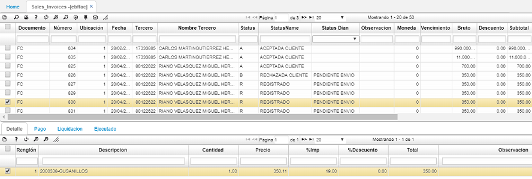
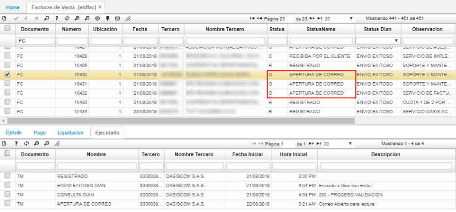
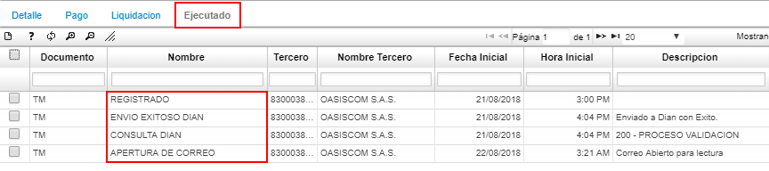

# EBFFAC - Facturas de Ventas

La aplicación EBFFAC permite visualizar los documentos electrónicos concernientes a las facturas electrónicas de venta. La aplicación es de consulta y se puede filtrar de acuerdo a la característica desea.  

## [Apertura de correo](http://docs.oasiscom.com/Operacion/ebportal/ebprestador/ebffac#apertura-de-correo)

EBFFAC permite conocer cuando el destinatario o cliente abre el e-mail que contiene la factura electrónica y a su vez actualiza el status en la aplicación.  

En el detalle, en la pestaña _Ejecución_, se pueden ver las acciones que ha tenido la factura electrónica.  

