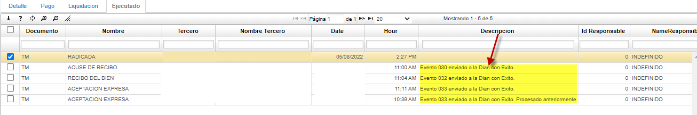

# EBOFAC - Facturas de Compra

La aplicación EBOFAC permite visualizar los documentos electrónicos concernientes a las facturas electrónicas de compras. La aplicación es de consulta y se puede filtrar de acuerdo a la característica desea.  

# EBOFAC - Control de Registro de Status

Desde la aplicación EBOFAC, permite desde el campo Status Nombre, realizar el proceso de actualización de los eventos exigidos por la DIAN,que se generan con los documentos da facturación electronicas de compras.

En el apartado del detalle, en la pestaña ejecutado, se evidenciaran los eventos generados, los cuales exige las DIAN

