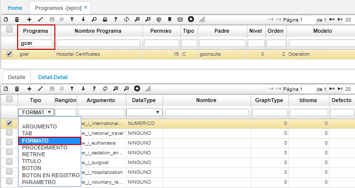
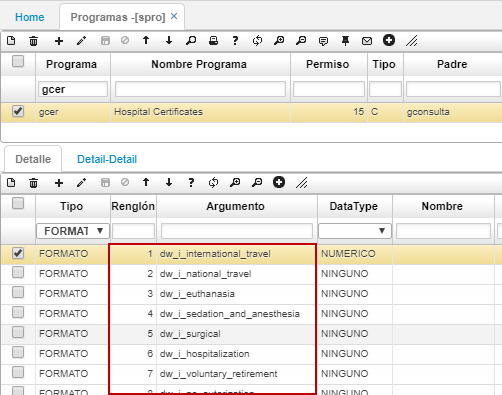
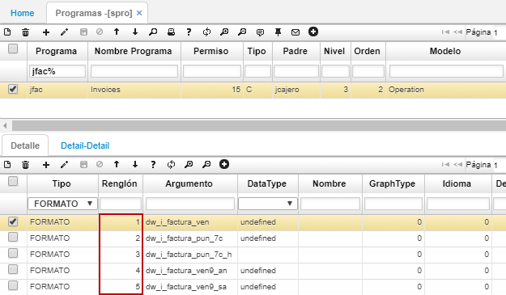
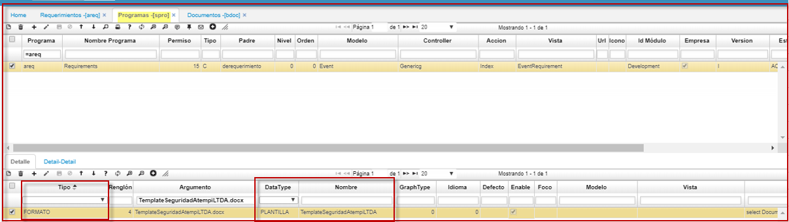
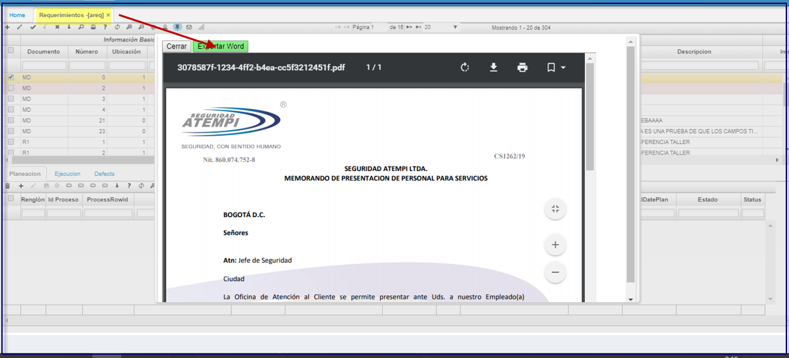

# SPRO - Programas

## [Parametrización de formatos de impresión](http://docs.oasiscom.com/Operacion/cloud/smetadata/spro#parametrización-de-formatos-de-impresión)

Para asignar un tipo de formato de impresión a un documento, primero se deben parametrizar dichos formatos asociandolos a la aplicación que los usará mediante la opción **SPRO**.  

Ingresamos a la aplicación y consultamos por el programa en donde se imprimirá el formato. En el detalle seleccionamos en el campo _Tipo_ la opción _Formato_.  

Al filtrar podemos ver los diferentes tipos de formatos que le han sido parametrizados a la opción relacionada en el maestro, junto con el ID correspondiente indicado en la columna _Renglón_.  

Consultados los formatos existentes para la aplicación ingresada en el maestro,  nos dirigimos a la opción [**BDOC - Documentos**](http://docs.oasiscom.com/Operacion/common/bsistema/bdoc#parametrización-de-formatos-de-impresión) para asignar el formato deseado a el documento correspondiente de la aplicación. _Ver aplicación_  

## [Parametrización de formatos de impresión para facturas](http://docs.oasiscom.com/Operacion/cloud/smetadata/spro#parametrización-de-formatos-de-impresión-para-facturas)

Para poder asignar un tipo de formato de impresión a un documento FA - Facturas, primero se le deben parametrizar dichos formatos a la aplicación que los usará mediante la opción SPRO.  

A continuación asignaremos los diferentes tipos de formatos a la aplicación [**JFAC - Facturas**](http://docs.oasiscom.com/Operacion/movil/jfac#impresión--dinámica-de-facturas).  

Consultamos el programa **JFAC** y filtramos en el detalle por tipo _Formato_. Allí podemos ver los 5 diferentes tipos de formatos que tiene asignada la opción JFAC para imprimir facturas.  

Para asignar un tipo de formato al documento FA - Facturas, ingresaremos a la aplicación [**BDOC - Documentos**](http://docs.oasiscom.com/Operacion/common/bsistema/bdoc#parametrización-de-formatos-de-impresión-para-facturas). (_Ver aplicación_)

## [Parametrización que permitir exportar en Word las vistas previas](http://docs.oasiscom.com/Operacion/cloud/smetadata/spro#parametrización-que-permitir-exportar-en-Word-las-vistas-previas)

Esta funcionalidad permitir exportar en Word, las vistas previas.  Parametrización que se realiza: en el detalle de la opción programas SPRO.  
Para el siguiente escenario tomammos como ejemplo parametrizar el AREQ; para que permita exportar en Word, debe de existir vista preliminar inicialmente en el formato.  
* En el detalle del **SPRO** en la columna **Tipo** debe de llevar FORMATO.  
* Como segunda parametrizacion, en la columan **DataType** debe de llevar **PLANTILLA EXPORT**.  

Posterior se valida la exportacion:  
  

