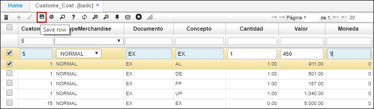

# BADC - Costos de Aduana

La aplicación **BADC** permite la parametrizacion de costos por aduana según documento y concepto definido. Estos costos podrán estar en moneda local o en cualquier otra moneda. Las aduanas que maneja una empresa estarán parametrizadas en la aplicacion [**BADU - Aduanas**](http://docs.oasiscom.com/Operacion/common/bcomer/badu).  

Para parametrizar un costo por aduana, agregamos un nuevo renglón, diligenciamos los campos y damos click en el botón _Guardar_.  

**AduanaId:** seleccionar del zoom la aduana a la cual se le asignará el costo. Las aduanas son parametrizables en la aplicación [**BADU - Aduanas**](http://docs.oasiscom.com/Operacion/common/bcomer/badu).  

**Tipo mercancía:** seleccionar el tipo de mercancía, si es normal o peligrosa.  
**Documento:** indicar el documento al cual se le asocia el costo de aduana.  
**Concepto:** indicar el concepto de acuerdo al documento seleccionado anteriormente, al cual se le asocia el costo de aduana.  
**Valor:** indicar el valor del costo.  
**Moneda:** indicar la moneda en la cual se registra el costo de aduana.  

Para continuar con el proceso de exportaciones, realizaremos la parametrización de fijaciones en la aplicación [**VFIJ - Fijaciones**](). (_Ver aplicación_)  