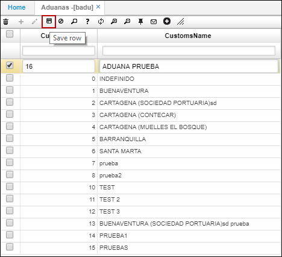

# BADU - Aduanas

En la aplicación **BADU** se registran las diferentes aduanas.  

Para registrar una aduana, ingresamos un nuevo renglón, indicamos el Id de aduana de acuerdo al consecutivo que lleve la aplicación e ingresamos el nombre. Finalmente, damos click en el botón _Guardar_.  

