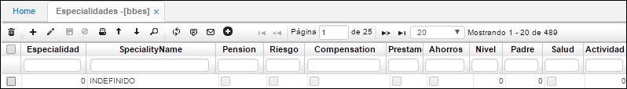

# Especialidades - BBES

En esta aplicación se deben especificar los tipos de especialidades que tenemos en la empresa o las especialidades de nuestro mercado objetivo que nosotros podemos suplir con nuestro producto y/o servicio.  

**Especialidad:** Consecutivo automático que arroja el sistema
**Nombre especialidad:** Se registra el nombre de la especialidad que vamos a parametrizar, por ejemplo, especialidad lácteos, carnes, ganadería, caja de compensación, entidad bancaria, entre otros.  

Los campos de pensión, riesgos, compensación, préstamos, ahorros y salud se deben activar en caso que la especialidad se dedique a las opciones nombradas anteriormente, ejemplo si en nombre especialidad registramos cajas de compensación el campo compensación debe estar activo, o si registramos entidad bancaria los campos de préstamo y ahorros deben estar activos.  

