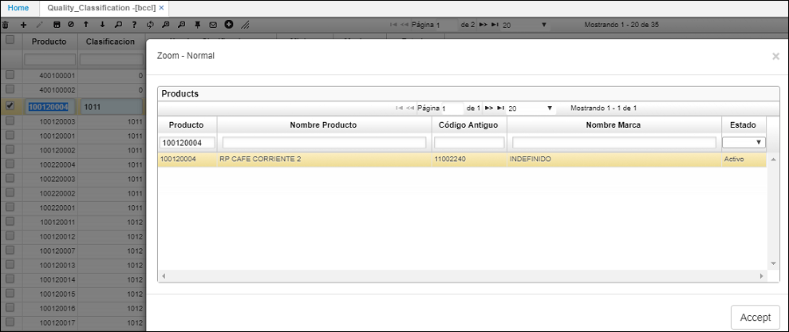
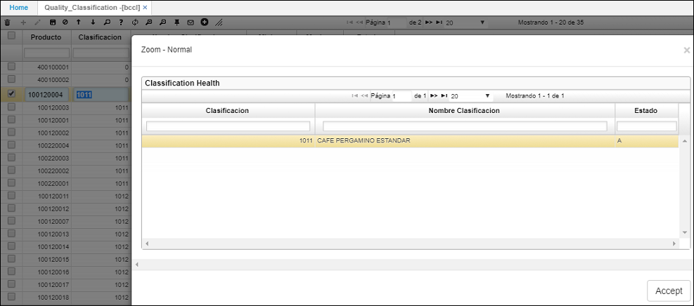

# BCCL - Calidades

Esta aplicación hace parte de la parametrización que se debe realizar para efectuar el proceso de compra de café.  

En la aplicación **BCCL** parametrizamos los rangos de factores en los que se puede clasificar el café. Estos rangos entre máximo y mínimo son definidos por la cooperativa de café.  

Para crear un nuevo rango de factores, agregamos un renglón y diligenciamos los campos.  

**Producto:** ingresamos al zoom dando doble click y seleccionamos el producto al cual le vamos a asignar el rango de factor.  

**Clasificación:** ingresamos al zoom y seleccionamos la clasificación correspondiente al producto.  

**Mínimo y Máximo:** ingresar el rango de factor que aplica al producto seleccionado. Este rango es definido por la cooperativa de café.  

Seleccionamos el estado _Activo_ y damos click en el botón _Guardar_ .  

Para continuar con la parametrización necesaria para realizar el proceso de compra de café, veremos la aplicación [**ODES - Precio de Café**](http://docs.oasiscom.com/Operacion/scm/compras/oprecio/odes).  