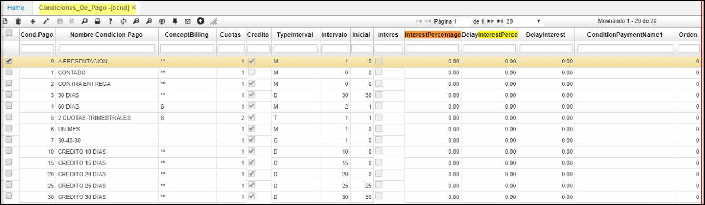
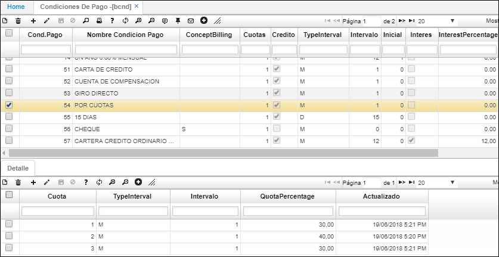

# BCND - Condición de Pago

Esta aplicación permite parametrizar todas las condiciones de pago posibles a la hora de generar un documento, esto permite visualizar la fecha de vencimiento del documento, por ejemplo, permite distinguir las facturas que se encuentran en cartera y están vencidas por su respectiva condición de pago.  

**Condición de pago:** Consecutivo automático que arroja el sistema.  
**Nombre condición de pago:** El nombre de la condición de pago como por ejemplo a 15 días, a 30 días, de contado, a presentación, entre otros.  
**Cuotas:** Se deben registrar la cantidad de cuotas que están relacionadas a la condición de pago, si especifico una condición de pago que diga 50% por adelantado y 50% a entrega, se requiere que en el campo cuotas se diligencie 2.  
**Crédito:** Se debe activar el Check box en todas las condiciones de pago que sean a crédito, si se paga de contado no se debe activar, pero si damos un lapso para pagar de 15 días si lo debemos activar.  
**Tipo intervalo:** Se debe registrar D si es diario, M si es mensual, B si es bimensual, T si es trimestral, S si es semestral, A si es anual.  
**Intervalo:** De acuerdo al campo anterior se diligencia, ejemplo si es diario la cantidad de días que aplica, si es bimensual se debería diligenciar 1, pero si queremos indicar que son dos meses y en el campo anterior pusimos M, en este campo debemos diligenciar 2.  
**InterestPercentage:** campo requerido con el objetivo de calcular el interés de mora en cartera financiera, el porcentaje utilizado es por línea de crédito.  

* La aplicación cuenta con un **detalle**, en donde se diligencian los intervalos propios de cada cuota según la necesidad y comportamiento de las líneas de crédito.  

**Cuota:** ingresar el número de la cuota.  
**Tipo Intervalo:** ingresar el tipo de intervalo en el cual se pagará el crédito, es decir, por días o mensual.  
**Intervalo:** ingresar el número de intervalos de la cuota.  
**Porcentaje Cuota:** porcentaje asignado a la cuota.  
