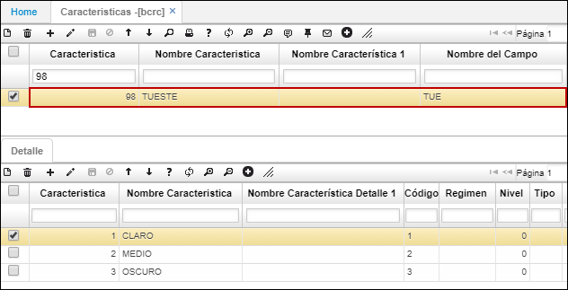
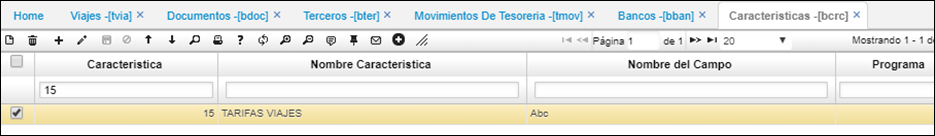
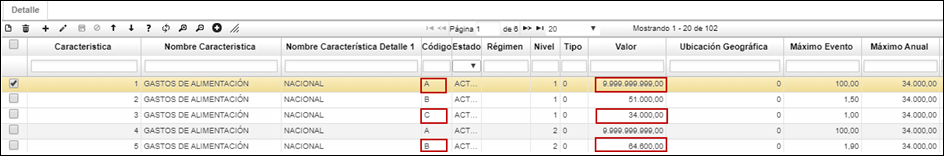

# Características - BCRC

En esta aplicación se parametrizan todas las características que queramos diligenciar por ejemplo si la empresa es de producción podemos diligenciar las características que definen nuestro producto como lo es talla, ancho, color, material, referencia, peso, entre otros.

> + [Parametrización características - Análisis de Calidad](http://docs.oasiscom.com/Operacion/common/bcomer/bcrc#parametrización-características---análisis-de-calidad)
> + [Parametrización características - Legalización Viáticos](http://docs.oasiscom.com/Operacion/common/bcomer/bcrc#parametrización-características---legalización-viáticos)

**Característica:** Consecutivo automático que arroja el sistema.  
**Nombre de la característica:** Nombre de la característica que queremos registrar.  

## [Parametrización características - Análisis de Calidad](http://docs.oasiscom.com/Operacion/common/bcomer/bcrc#parametrización-características---análisis-de-calidad)

En esta opción se parametrizan las características que estarán asociadas a cada campo del formulario dinámico previamente parametrizado en el detalle de la opción [**BMOT - Motivos**](http://docs.oasiscom.com/Operacion/common/bsistema/bmot#parametrización-formularios-dinámicos-opción-aana---análisis-de-calidad) para el proceso de Análisis de Calidad en la aplicación [**AANA - Análisis de Calidad**](http://docs.oasiscom.com/Operacion/utility/calidad/bregis/aana):  

En el maestro:  

**Característica** y **Nombre Característica:** ingresar el id de la característica y su nombre respectivamente.  

**Nombre del Campo:** ingresar el nemotécnico del campo previamente parametrizado en la opción [**BMOT - Motivos**](http://docs.oasiscom.com/Operacion/common/bsistema/bmot#parametrización-formularios-dinámicos-opción-aana---análisis-de-calidad). De esta manera se asocian las características aquí parametrizadas, a un campo de un formulario dinámico.  

En el detalle se deben parametrizar las características del campo, es decir, la información aquí ingresada será la misma que se mostrará al abrir el zoom de ayuda del campo en el detalle de la opción [**AANA - Análisis de Calidad**](http://docs.oasiscom.com/Operacion/utility/calidad/bregis/aana):  

**Característica** y **Nombre Característica:** ingresar el id de la característica y su nombre respectivamente.  
**Código:** se debe ingresar el código de la característica, por lo general es el mismo que el id.  

## [Parametrización características - Legalización Viáticos](http://docs.oasiscom.com/Operacion/common/bcomer/bcrc#parametrización-características---legalización-viáticos)

Para la validación de topes, en la aplicación **BCRC,** de acuerdo con las políticas o el procedimiento interno de la empresa se hace la parametrización de topes, si se quiere, teniendo en cuenta también una categorización. Dichas categorías son *A, B, o C* y con base a estas, al concepto y a los días se fijan los topes.

La característica creada para definir los topes es la número *15* correspondiente a tarifas de viajes: 

En el detalle de esta característica se define lo siguiente:

- **Código:** Categoría a la que aplica.  
- **Estado:** Si se encuentra activa o inactiva.  
- **Nivel:** Es 1 si el viaje es de un solo día y 2 si el viaje es de más días, esto es porque de acuerdo con la cantidad de días se determina el valor del concepto.  
- **Valor:** Se debe registrar el valor correspondiente.  
- **Máximo Evento:** Son las **UVT** requeridas lo cual debe corresponder al valor registrado anteriormente. Este campo es informativo.  
- **Concepto:** A que concepto aplica.  

