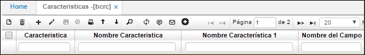

# Características - BCRC

En esta aplicación se parametrizan todas las características que queramos diligenciar por ejemplo si la empresa es de producción podemos diligenciar las características que definen nuestro producto como lo es talla, ancho, color, material, referencia, peso, entre otros.  

**Característica:** Consecutivo automático que arroja el sistema.  
**Nombre de la característica:** Nombre de la característica que queremos registrar.  

