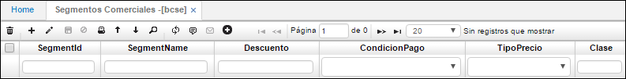

# Segmentos Comerciales - BCSE

En la aplicación segmentos comerciales se registran todos los posibles segmentos que tenemos en la organización.  

**Id Segmento:** Consecutivo automático que arroja el sistema.  
**Nombre del segmento:** El nombre para identificar el tipo de segmento, por ejemplo, empleados, pymes, grandes empresas, estudiantes, entre otros.  
**Condición de pago:** Se debe especificar la condición de pago que aplica al segmento previamente parametrizada en **BCND**, este campo es sugerido dado que podemos tener dos pymes con diferentes condiciones de pago.  
**Tipo de precio:** Al igual que el campo anterior se debe especificar el tipo de precio que aplica al segmento.  

