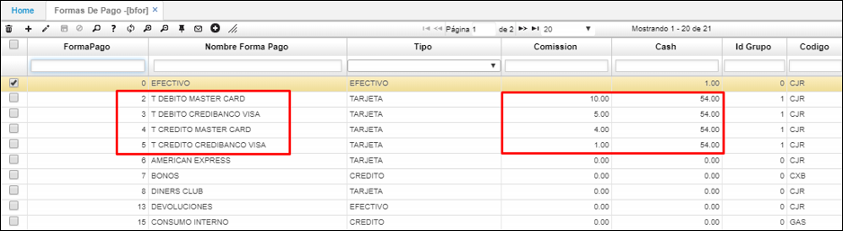
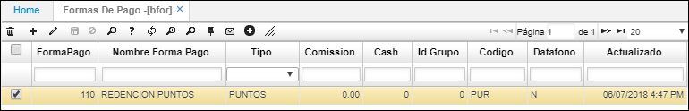

# Formas de Pago - BFOR

En esta aplicación se identifican las formas de pago que se pueden realizar bajo las políticas de la compañía.  

**Forma de pago:** Consecutivo automático que arroja el sistema.  
**Nombre forma de pago:** El nombre de la forma de pago que vamos a parametrizar, ejemplo: efectivo, tarjeta débito, tarjeta crédito, vale, entre otros.  
**Tipo:** Seleccionar de acuerdo a la lista que el sistema arroja, si es bonos, tarjetas, cheque, efectivo, puntos, crédito entre otros.  
**Código:** Se debe indicar el código previamente parametrizado en la aplicación **BCOD**.

## [Parametrización para las transferencias de dinero](http://docs.oasiscom.com/Operacion/common/bcomer/bfor#parametrización-para-las-transferencias-de-dinero)

En la aplicación BFOR, se debe parametrizar las formas de pago: tarjetas o efectivo según corresponda, en el campo _Comission_ el porcentaje (%) acordado y en el campo _Cash_ la caja asociada.  

El proceso de transferencias de dinero se realiza por la aplicación [**TPTR - Transferencias**](http://docs.oasiscom.com/Operacion/erp/tesoreria/tproceso/tptr). _(Ver aplicación)_

## [**Parametrización fidelización de clientes**](http://docs.oasiscom.com/Operacion/common/bcomer/bfor#parametrización-fidelización-de-clientes)

En la aplicación **BFOR** se debe parametrizar la forma de pago _Redención Puntos_, la cual se asignará como forma de pago en la compra del cliente que quiera usar sus puntos acumulados.  

**Forma Pago:** ingresar el consecutivo que corresponda teniendo en cuenta las formas de pago ya registradas.  
**Nombre forma pago:** asignar el nombre _Redención Puntos_.  
**Tipo:** seleccionar el tipo _Puntos_.  
**Código:** ingresar el código _PUR_.  

_Conoce todo el proceso de Fidelización de Clientes_ [**Aquí**](http://docs.oasiscom.com/Operacion/scm/pos/jcajero/jfac#fidelizaci%C3%B3n-de-clientes).  