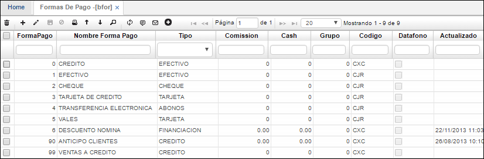

# Formas de Pago - BFOR

En esta aplicación se identifican las formas de pago que se pueden realizar bajo las políticas de la compañía.  

**Forma de pago:** Consecutivo automático que arroja el sistema.  
**Nombre forma de pago:** El nombre de la forma de pago que vamos a parametrizar, ejemplo: efectivo, tarjeta débito, tarjeta crédito, vale, entre otros.  
**Tipo:** Seleccionar de acuerdo a la lista que el sistema arroja, si es bonos, tarjetas, cheque, efectivo, puntos, crédito entre otros.  
**Código:** Se debe indicar el código previamente parametrizado en la aplicación **BCOD**.

