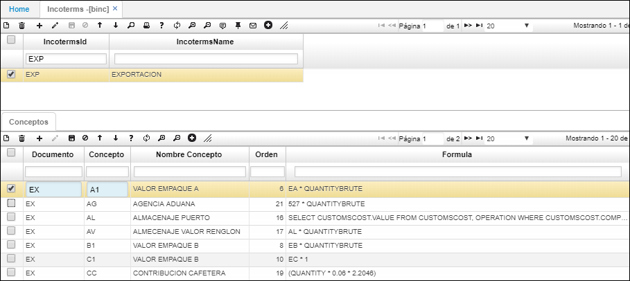

---
layout: default
title: Incoterms
permalink: /Operacion/common/bcomer/binc
editable: si
---

# BINC - Incoterms

Se permite agrupar los conceptos a liquidar en una exportación.  


En el maestro agregamos el tipo de Incoterns y en el detalle, se agrega un nuevo renglón y se ingresan las siglas del documento y el concepto de exportación.  



