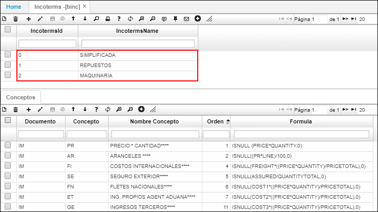

# BINC - Incoterms

### [Exportación](http://docs.oasiscom.com/Operacion/common/bcomer/binc#exportación)

Se permite agrupar los conceptos a liquidar en una exportación.  

En el maestro agregamos el tipo de Incoterms y en el detalle, se agrega un nuevo renglón y se ingresan las siglas del documento y el concepto de exportación.  

### [Importación](http://docs.oasiscom.com/Operacion/common/bcomer/binc#importación)

De acuerdo con el modelo de importación y de incoterms que maneje la empresa, se crean los conjuntos de conceptos en la aplicación _BINC - Incoterms_.  

Por cada registro que se cree en el maestro se deberá asociar el conjunto de conceptos en el detalle.  

