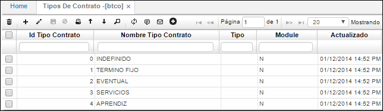

# Tipos de Contrato - BTCO

Esta aplicación permite parametrizar todos los tipos de contrato que se manejan a nivel comercial o a nivel de talento humano cuando ingresa una persona nueva.  

**Id Tipo de contrato:** Consecutivo automático que arroja el sistema.  
**Nombre tipo de contrato:** El tipo del contrato: Indefinido, fijo, de aprendiz, a prestaciones entre otros.  
**Module:** El módulo al que aplica, N si son contratos de talento humano.  

