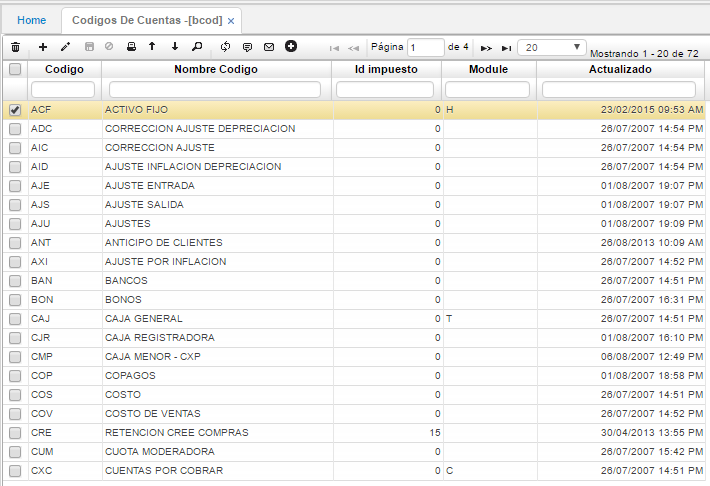

# Códigos de Cuentas - BCOD

En la aplicación **BCOD** se permite parametrizar los códigos que representarán las cuentas en las distintas aplicaciones.  

## [Parametrización ingreso de activo fijo por compras](http://docs.oasiscom.com/Operacion/common/bcuenta/bcod#parametrización-ingreso-de-activo-fijo-por-compras)

Para el proceso de Ingreso de Activo Fijo por Compras, se debe validar en la aplicación BCOD que el código **IVC** se encuentre creado, de no estarlo es necesario crearlo.  

