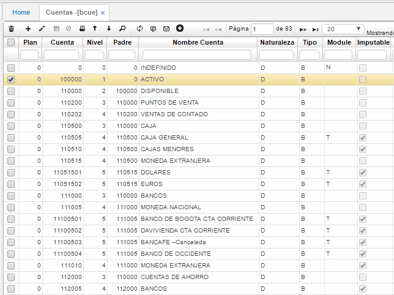

## Cuentas - BCUE

La aplicación **BCUE** permite parametrizar el Plan Único de Cuentas (PUC). En el cual se pueden ver todas sus cuentas y subcuentas, facilitando su búsqueda, puesto que, permite filtrar por cuenta, nivel, padre, nombre de cuenta, naturaleza, tipo, tipo de impuesto, entre otros.  

