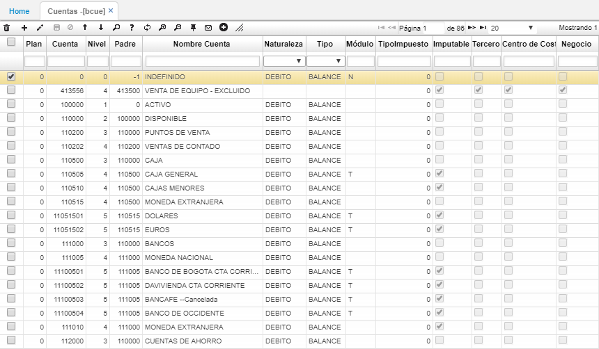

## Cuentas - BCUE

La aplicación **BCUE** permite parametrizar el Plan Único de Cuentas (PUC). En el cual se pueden ver todas sus cuentas y subcuentas, facilitando su búsqueda, puesto que, permite filtrar por cuenta, nivel, padre, nombre de cuenta, naturaleza, tipo, tipo de impuesto, entre otros.  

### [Parametrización cuenta importaciones](http://docs.oasiscom.com/Operacion/common/bcuenta/bcue#parametrización-cuenta-importaciones)

En la aplicación BCUE se debe crear la cuenta contable de importaciones como parametrización para el proceso de _Importaciones_.  

Es necesario que a la cuenta creada de importaciones se parametrice el módulo _Y_, se marque el flag como _Imputable_ y el flag _Project_ para que siempre se deba asociar un proyecto en cada importación.  

### [Parametrización cuenta importaciones]
